# 3.2.11 三点弯曲下无筋混凝土梁的切口

**产品：** Abaqus/Standard  Abaqus/Explicit

Abaqus提供了适用于开裂重要的脆性材料（如混凝土）的本构模型。这些模型适用于无筋以及钢筋混凝土结构。本问题说明了混凝土损伤塑性模型的使用，该模型在Abaqus/Standard和Abaqus/Explicit中都可用，用于分析三点弯曲下无筋混凝土切口梁。本问题被选择是因为它已被Petersson（1981）以及Rots等人（1984，1985）、de Borst（1986）和Meyer等人（1994）等人进行了广泛的实验和分析研究。主要行为是I型开裂，因此该示例对本构模型的这一方面提供了良好的验证。我们还具有优势是该梁实验已被许多不同研究人员重复，并且有关于重要参数（如I型断裂能）的良好材料信息。因此，我们可以以最小的确定性直接比较数值结果与实验结果。我们还研究了数值结果对有限元离散化以及开裂材料特性选择的敏感性。

Abaqus中的混凝土损伤塑性模型为单调、循环和/或动态加载应用中的素混凝土或钢筋混凝土建模提供了通用能力。该模型可用于模拟断裂过程中涉及的不可逆损伤以及载荷从拉伸变为压缩或反之时的刚度恢复。此外，该模型可包括应变率相关性。有关该模型的更多详情，请参阅["混凝土损伤塑性，" Abaqus分析用户指南第23.6.3节](../usb/usb-link.md#usb-mat-cconcretedamaged)。

除了混凝土损伤塑性模型外，Abaqus还在Abaqus/Standard中提供了 smeared 裂纹混凝土模型，在Abaqus/Explicit中提供了脆性裂纹模型。关于这些模型的描述，请参阅["混凝土 smeared 裂纹，" Abaqus分析用户指南第23.6.1节](../usb/usb-link.md#usb-mat-cconcrete)和["混凝土裂纹模型，" Abaqus分析用户指南第23.6.2节](../usb/usb-link.md#usb-mat-ccracking)。

### 问题描述

切口梁如图3.2.11-1所示。由于对称性，只对梁的一半进行建模。图3.2.11-2显示了该问题的三种网格：70个单元的粗网格、280个单元的中等网格和1120个单元的细网格。我们使用平面应力（CPS4R）单元和三维（C3D8R）单元对梁进行建模，以提供两种单元类型的验证。

梁的杨氏模量为30 GPa（4.35×10⁶ lb/in²），泊松比为0.20，密度为2400 kg/m³（0.225×10³ lb·s²/in⁴），开裂失效应力为3.33 MPa（482.96 lb/in²），I型断裂能为124 N/m（0.708 lb/in）。断裂能值定义了开裂后应力-位移曲线下的面积。不同开裂后软化行为的影响是本示例进行的其中一项研究的主题。

### 加载

通过对梁中心规定垂直位移进行加载，直到达到0.0015 m的值。

### 求解控制

由于梁在裂缝扩展时行为相当不稳定，因此在Abaqus/Standard中使用Riks方法。

Abaqus/Explicit是一个动态分析程序。在这种情况下，我们对静态解感兴趣；因此，必须注意使梁加载得足够慢以消除显著的惯性效应。对于涉及脆性失效的问题，这尤其重要，因为通常伴随脆性行为的承载能力突然下降通常会导致响应中动能内容的增加。因此，通过在0.05秒的时间段内将速度从0线性增加到0.06 m/s来对梁进行加载，以在梁中心获得0.0015 m的最终位移。这确保了准静态解（在整个响应过程中梁中的动能很小）以合理数量的时间增量实现。尽管如此主要由混凝土显著开裂之后，惯性效应引起的载荷-位移响应振荡仍然可见。

Abaqus/Explicit中加载的应用速度是本问题的另一项研究的主题。

### 结果与讨论

下面描述每个分析变化的结果。

#### 网格细化研究

使用前面描述的三种有限元网格来显示网格细化对混凝土梁载荷-位移响应的影响。

由于本问题中没有钢筋，后失效行为以应力-位移响应的形式规定以最小化网格敏感性。我们也可以直接以断裂能的形式规定后失效行为。断裂能方法假定开裂后强度线性损失。因此，如果我们规定应力与开裂位移的拉伸软化行为并假定线性曲线（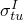，0）、（0，/），如图3.2.11-3所示，上述两种方法将给出相同结果。拉伸损伤以拉伸损伤变量与开裂位移的关系规定。本研究假定线性相关性——（0，0），（0.9，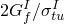），如图3.2.11-4所示。对于本构计算，Abaqus使用关系

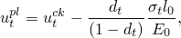

自动将开裂位移值转换为"塑性"位移值，其中样本长度假定为一单位（即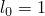）。在规定拉伸损伤时必须小心以确保计算的塑性应变（或位移）随开裂应变（或位移）增加而正单调增加。

对于三维模型，Abaqus/Standard对三种网格获得的切口梁载荷-位移响应如图3.2.11-5所示，对于平面应力模型如图3.2.11-6所示。Abaqus/Explicit获得的载荷-位移响应对于三维模型如图3.2.11-7所示，对于平面应力模型如图3.2.11-8所示。这些图显示Abaqus/Standard中的三维和平面应力模型紧密一致。Abaqus/Explicit获得的结果中观察到微小差异；这些可主要归因于动态效应。三维模型由于可能的平面外方向开裂的影响而具有相对较高水平的网格敏感性。对于二维模型，尽管粗网格与其他两个网格之间存在少量网格敏感性，但中等和细网格给出相似的结果。基于这些观察，所有后续研究都使用平面应力中等网格进行。所有显示的曲线都是平滑的。Abaqus/Standard对三种平面应力网格获得的变形形状如图3.2.11-9所示。三维网格和Abaqus/Explicit网格显示出基本相同的变形。在所有网格中一致地观察到预期的I型断裂模式。

#### 拉伸软化的影响

上述结果使用线性拉伸软化获得。这种软化选择导致响应与Petersson的实验观察相比太硬。在本研究中，我们使用三种不同的应力演化作为开裂位移的函数。我们比较先前使用的线性变化与两种拉伸软化函数，其中裂缝引发时应力降低更快。这些函数如图3.2.11-10所示：一种由两段软化表示组成，另一种是四段表示。软化曲线下的面积在所有情况下都相同，以保持材料的I型断裂能值。在本研究中对每种拉伸软化模型使用不同的线性拉伸损伤曲线，以确保对于所有三种拉伸软化曲线，塑性位移随开裂位移增加而正单调增加。

对于平面应力中等网格，Abaqus/Standard对三种拉伸软化表示获得的载荷-位移响应如图3.2.11-11所示。对于Abaqus/Explicit，响应如图3.2.11-12所示。很明显，初始开裂后应力降低越快，响应越不硬。拉伸软化的建模是峰值/失效响应的关键决定因素。两段和四段软化模型提供的峰值/失效响应与Petersson的实验观察良好吻合。计算结果的初始线性响应略软于实验结果。这个小差异是因为在本研究中使用相对钝的切口，而Petersson（1981）中使用的是尖锐得多的浇注切口。所有显示的曲线都已平滑。

#### Abaqus/Explicit中加载速度的影响和曲线平滑

在先前的Abaqus/Explicit研究中获得的准静态解仍然显示一些由于惯性效应引起的振荡，尽管曲线平滑的使用使其有些隐藏。这个额外的练习旨在显示在迄今为止使用的加载速度（0.06 m/s）下获得的未平滑与平滑响应之间的差异，以及以更低速度（0.005 m/s）施加加载的分析之间的差异。

图3.2.11-13显示了使用四段拉伸软化的平面应力中等网格获得的结果。较快载荷-位移响应（19635个分析增量）的平滑显示与较慢速度（235830个分析增量）获得的载荷-位移响应合理良好地匹配。由于较慢响应没有提供更多有用的信息，我们得出结论，我们有理由以更快的速度运行并使用平滑来呈现准静态响应。

### 输入文件

##### **Abaqus/Standard输入文件**

##### 三维网格：

[notchedconcbeam_3d_coarse_std.inp](../eif/notchedconcbeam_3d_coarse_std.inp)

粗网格响应。

[notchedconcbeam_3d_medium_std.inp](../eif/notchedconcbeam_3d_medium_std.inp)

中等网格响应。

[notchedconcbeam_3d_fine_std.inp](../eif/notchedconcbeam_3d_fine_std.inp)

细网格响应。

##### 平面应力网格：

[notchedconcbeam_2d_coarse_std.inp](../eif/notchedconcbeam_2d_coarse_std.inp)

粗网格响应。

[notchedconcbeam_2d_medium_std.inp](../eif/notchedconcbeam_2d_medium_std.inp)

中等网格响应。

[notchedconcbeam_2d_fine_std.inp](../eif/notchedconcbeam_2d_fine_std.inp)

细网格响应。

[notchedconcbeam_2d_gfi_std.inp](../eif/notchedconcbeam_2d_gfi_std.inp)

使用[*CONCRETE TENSION STIFFENING*](../key/key-link.md#usb-kws-mconcretetensstiff)，TYPE=GFI的中等网格响应。

[notchedconcbeam_2d_1seg_std.inp](../eif/notchedconcbeam_2d_1seg_std.inp)

使用[*TENSION STIFFENING*](../key/key-link.md#usb-kws-mtensionstiff)，TYPE=DISPLACEMENT的一段拉伸软化响应的中等网格。

[notchedconcbeam_2d_2seg_std.inp](../eif/notchedconcbeam_2d_2seg_std.inp)

使用[*TENSION STIFFENING*](../key/key-link.md#usb-kws-mtensionstiff)，TYPE=DISPLACEMENT的两段拉伸软化响应的中等网格。

[notchedconcbeam_2d_4seg_std.inp](../eif/notchedconcbeam_2d_4seg_std.inp)

使用[*TENSION STIFFENING*](../key/key-link.md#usb-kws-mtensionstiff)，TYPE=DISPLACEMENT的四段拉伸软化响应的中等网格。

##### **Abaqus/Explicit输入文件**

##### 三维网格：

[notchedconcbeam_3d_coarse_xpl.inp](../eif/notchedconcbeam_3d_coarse_xpl.inp)

粗网格响应。

[notchedconcbeam_3d_medium_xpl.inp](../eif/notchedconcbeam_3d_medium_xpl.inp)

中等网格响应。

[notchedconcbeam_3d_fine_xpl.inp](../eif/notchedconcbeam_3d_fine_xpl.inp)

细网格响应。

##### 平面应力网格：

[notchedconcbeam_2d_coarse_xpl.inp](../eif/notchedconcbeam_2d_coarse_xpl.inp)

粗网格响应。

[notchedconcbeam_2d_medium_xpl.inp](../eif/notchedconcbeam_2d_medium_xpl.inp)

中等网格响应。

[notchedconcbeam_2d_fine_xpl.inp](../eif/notchedconcbeam_2d_fine_xpl.inp)

细网格响应。

[notchedconcbeam_2d_1seg_xpl.inp](../eif/notchedconcbeam_2d_1seg_xpl.inp)

一段拉伸软化响应的中等网格。

[notchedconcbeam_2d_2seg_xpl.inp](../eif/notchedconcbeam_2d_2seg_xpl.inp)

两段拉伸软化响应的中等网格。

[notchedconcbeam_2d_4seg_xpl.inp](../eif/notchedconcbeam_2d_4seg_xpl.inp)

四段拉伸软化响应的中等网格。

[notchedconcbeam_2d_speed2_xpl.inp](../eif/notchedconcbeam_2d_speed2_xpl.inp)

0.005 m/s速度响应的中等网格。

### 参考文献

de Borst, R., Ph.D. thesis, Delft University of Technology, The Netherlands, 1986.

Meyer, R., H. Ahrens, and H. Duddeck, "Material Model for Concrete in Cracked and Uncracked States," Journal of Engineering Mechanics Division, ASCE, vol. 120, EM9, pp. 1877–1895, 1994.

Petersson, P. E., "Crack Growth and Development of Fracture Zones in Plain Concrete and Similar Materials," Report No. TVBM-1006, Division of Building Materials, University of Lund, Sweden, 1981.

Rots, J. G., G. M. A. Kusters, and J. Blaauwendraad, "The Need for Fracture Mechanics Options in Finite Element Models for Concrete Structures," Computer-Aided Analysis and Design of Concrete Structures, Pineridge Press, Swansea, United Kingdom, pp. 19–32, 1984.

Rots, J. G., P. Nauta, G. M. A. Kusters, and J. Blaauwendraad, "Smeared Crack Approach and Fracture Localization in Concrete," HERON, Delft University of Technology, The Netherlands, vol. 30, no.1, 1985.

### 图表

**图3.2.11-1** 切口梁：几何和尺寸。

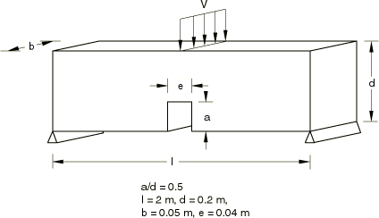

**图3.2.11-2** 切口梁一半的有限元网格。

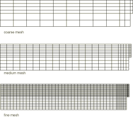

**图3.2.11-3** 网格细化研究使用的拉伸软化模型。

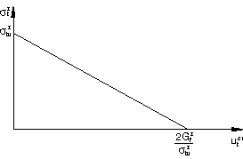

**图3.2.11-4** 网格细化研究使用的拉伸损伤曲线。

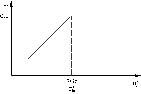

**图3.2.11-5** 三维Abaqus/Standard网格细化研究。

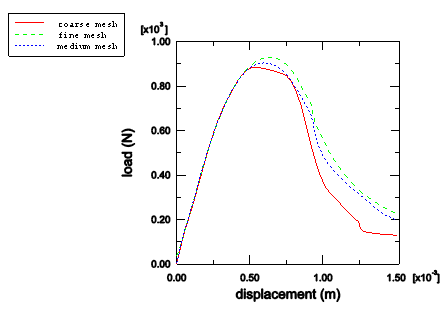

**图3.2.11-6** 平面应力Abaqus/Standard网格细化研究。

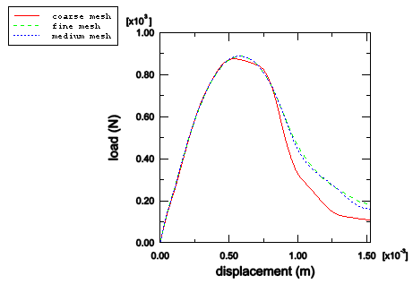

**图3.2.11-7** 三维Abaqus/Explicit网格细化研究。

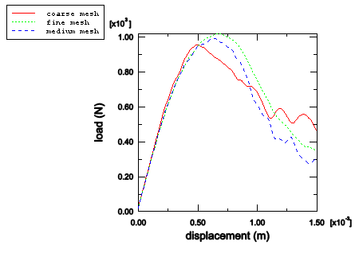

**图3.2.11-8** 平面应力Abaqus/Explicit网格细化研究。

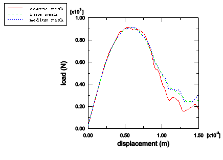

**图3.2.11-9** 平面应力Abaqus/Standard网格细化研究中获得的变形形状（放大倍数100）。

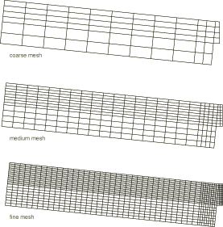

**图3.2.11-10** 拉伸软化模型。

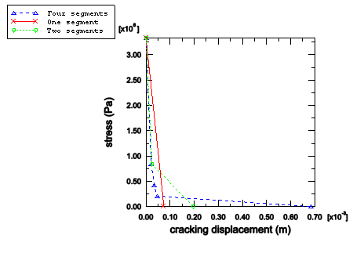

**图3.2.11-11** Abaqus/Standard拉伸软化研究：平面应力中等网格。

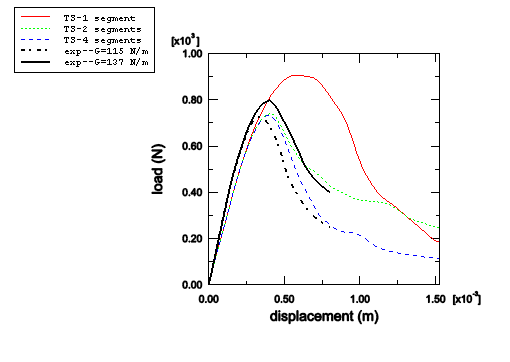

**图3.2.11-12** Abaqus/Explicit拉伸软化研究：平面应力中等网格。

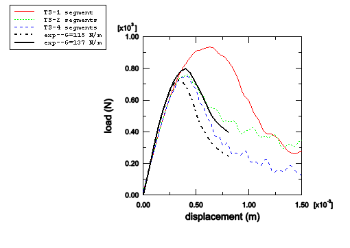

**图3.2.11-13** Abaqus/Explicit速度和曲线平滑研究：平面应力中等网格。

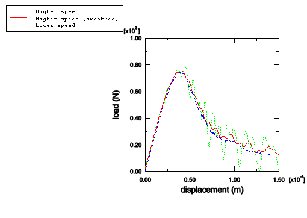

