# 3.2.12 无筋混凝土切口梁的混合模式失效

**产品：** Abaqus/Explicit

Abaqus/Explicit提供了一个适用于脆性材料（如混凝土）的裂纹本构模型（["混凝土裂纹模型，" Abaqus分析用户指南第23.6.2节](../usb/usb-link.md#usb-mat-ccracking)）。该模型适用于无筋以及钢筋混凝土结构，本指南包括两种类型应用的示例。本问题描述说明了该模型在承受导致混合模式开裂的加载的无筋混凝土切口梁分析中的应用。选择此问题是因为它已被Arrea和Ingraffea（1982）以及Rots等人（1984、1985、1987、1989、1991、1992）、de Borst（1986、1987）和Meyer等人（1994）等人进行了广泛的实验和分析研究。本问题中的行为是I型和II型开裂的组合。因此，它为一般混合模式加载的模型验证提供了依据。我们还具有优势是该梁实验已被许多不同研究人员重复，并且有关于重要参数（如I型断裂能）的良好材料信息。我们研究了数值结果对有限元离散化以及开裂材料特性选择的敏感性。

### 问题描述

切口梁如图3.2.12-1所示。图3.2.12-2显示了该问题的两种网格：210个单元的粗网格和840个单元的细网格。假定梁处于平面应力状态，因此使用CPS4R单元。梁中使用的基本混凝土材料属性见表3.2.12-1。断裂能值不能完全定义开裂后应力的演化；这是本示例进行的其中一项研究的主题。后面给出的剪切保持特性是另一项材料特性研究的主题。

### 加载和求解控制

由于Abaqus/Explicit是一个动态分析程序，而且本例中我们对静态解感兴趣，因此必须注意使梁加载得足够慢以消除任何显著的惯性效应。对于涉及脆性失效的问题，这尤其重要，因为通常伴随脆性行为的承载能力突然下降通常会导致响应中动能内容的增加。

通过在0.38秒的时间内将速度从零线性增加到0.75 mm/秒来对梁进行加载。速度施加在C点，并通过刚性梁AB传递到切口梁。梁本身没有建模，因为其运动学运动可以使用方程约束轻松建模。传递到D和B点的载荷分布在30 mm的长度上，以避免在传递最高载荷的这些点附近单元的沙漏。选择的速度确保获得准静态解。在裂缝贯穿梁的整个深度之前，梁中的动能很小。然而，主要是在混凝土显著开裂之后，惯性效应引起的载荷-位移响应振荡仍然可见。

### 结果与讨论

下面描述每个分析变化的结果。

#### 网格细化研究

使用两种有限元网格来显示网格细化对混凝土梁载荷-位移响应的影响。I型断裂能值可以直接为脆性裂纹特性规定，以定义给出近似网格不敏感结果的拉伸软化行为。然而，这里没有这样做有两个原因：首先，此规定将开裂后正应力演化限制为线性变化，我们希望在某些研究中更加灵活；其次，通过直接规定后失效应力-应变关系，我们展示了Abaqus/Explicit如何将断裂能数据转换为开裂应力与开裂应变数据。

如果我们规定应力与开裂应变的拉伸软化行为，并假定应力对开裂应变呈线性依赖关系，如图3.2.12-3所示，应力达到零值时的开裂应变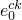可计算为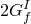 / (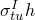)，其中是开裂失效应力，*h*是特征单元长度。该特征长度表示开裂的单元大小，对于粗网格和细网格分别为15 mm和7.5 mm。计算应力达到零值时的开裂应变的方法提供了将给出近似网格不敏感结果的材料数据，这基本上就是Abaqus/Explicit在使用参数TYPE=GFI时所做的。这在["混凝土裂纹模型，" Abaqus分析用户指南第23.6.2节](../usb/usb-link.md#usb-mat-ccracking)和["混凝土和其他脆性材料的裂纹模型，" Abaqus理论指南第4.5.3节](../stm/stm-link.md#stm-mat-cracking)中有更详细的讨论。

两种网格使用的剪切保持特性如图3.2.12-4所示。剪切保持因子的演化选择为使得一旦裂缝引发，材料的剪切阻力就急剧降低。

对于两种网格，获得的B点或D点传递的载荷与切口梁的裂缝口滑动位移（CMSD）的响应如图3.2.12-5所示。该图显示粗网格和细网格给出相似的结果。基于此观察，所有后续研究都仅使用细网格进行。在分析结束时获得的变形形状和裂缝模式对两种网格分别如图3.2.12-6和图3.2.12-7所示。裂缝扩展路径倾向于偏离原始裂缝尖端并向B点弯曲。这是承受混合模式加载的裂缝的典型行为。

#### 拉伸软化的影响

先前结果使用线性拉伸软化获得。梁的最大承载能力与Arrea和Ingraffea的实验观察相当。然而，开裂后行为与实验相比有些硬。在以下研究中，我们使用三种不同的应力演化作为开裂应变的函数。我们比较先前使用的线性变化与两种拉伸软化函数，其中裂缝引发时应力降低更快。这些函数如图3.2.12-8所示：一种由两段软化表示组成，另一种是四段表示。软化曲线下的面积在所有情况下都相同，以保持材料的I型断裂能值。

对于三种拉伸软化表示获得的载荷-CMSD响应如图3.2.12-9所示。尽管分析在相同持续时间（0.38秒）内进行，但裂缝口滑动位移的终值随拉伸软化的降低而增加。这是可以预期的，因为随拉伸软化的降低，裂缝面可能更多地相互滑动。在四段拉伸软化情况下，在CMSD值约0.15 mm处观察到的特殊行为只是表明响应不再是准静态的，因为裂缝已完全穿透梁的深度。很明显，初始开裂后应力降低越快，响应越不硬。尽管模拟预测了实验结果的趋势，但模拟的承载能力在软化区域的降低不如实验结果建议的那样大。因此，接下来研究剪切保持的影响，试图使数值结果更接近实验观察。

#### 剪切保持的影响

使用两种不同的剪切保持演化来显示剪切保持对梁的载荷-CMSD响应的影响。一种是在所有先前分析中使用的剪切保持演化。另一种是较低的剪切保持模型，如图3.2.12-10所示。这种较低的剪切保持模型对应于一旦裂缝引发，开裂单元几乎没有剪切承载能力。

对于两种情况获得的载荷-CMSD响应对于带有两段拉伸软化模型的细网格如图3.2.12-11所示，对于带有四段拉伸软化模型的细网格如图3.2.12-12所示。尽管我们在C点仍施加相同的线性变化速度（在0.38秒时为0.75 mm/秒），但对于具有两段和四段拉伸软化模型的网格，较低剪切保持模型的分析分别停止在0.36秒和0.34秒。这些时间大致对应于裂缝穿透梁整个深度的时间。在这些时间之后获得的响应在本题的背景下不再有意义，因为梁不再具有任何静态承载能力，施加的速度加载会导致梁动态响应。

结果表明，即使使用零剪切保持，数值模拟也无法预测实验观察到的约140 kN峰值载荷和该载荷的急剧降低。这可以用使用矩形网格引入的偏差来解释，该偏差倾向于促进裂缝沿单元的垂直线扩展，而不是实验观察到的更弯曲的裂缝路径。Rots等人（1989）确实显示了通过使用沿实验观察到的弯曲裂缝路径排列的单元设计的网格更好地匹配梁软化响应的数值结果。这可以在像这样存在良好实验数据的情况下完成，但通常不可能。因此，素混凝土获得的结果应该被视为只是对实际行为的相对粗略近似。

#### 单元移除的影响

Abaqus/Explicit提供了一个脆性失效准则，当任何局部直接开裂应变（或位移）达到失效应变（或位移）时，允许移除单元。此选项主要用于避免因开裂单元经历过度变形而提前终止的分析。然而，正如后面所讨论的，通过将用于单元移除的失效应变设置为相对较低的值，移除开裂单元也可以产生显著更弱的后失效行为。

图3.2.12-13和图3.2.12-14显示了单元移除的影响。在图3.2.12-13中，分别使用图3.2.12-8的两段和四段拉伸软化曲线，失效应变选择为0.4%。对于这两种模拟获得的载荷-CMSD响应与没有单元移除的相应响应进行绘图比较。在图3.2.12-14中，使用两段拉伸软化曲线。考虑两个级别的失效应变——即分别为0.2%和0.4%。结果载荷-CMSD响应与没有单元移除的相应响应一起绘图。正如预期的，使用此脆性失效模型在达到峰值载荷后产生大的载荷下降。

### 输入文件

[mixedmodeconcbeam_1.inp](../eif/mixedmodeconcbeam_1.inp)

用于获得图3.2.12-5中粗网格响应的输入数据。

[mixedmodeconcbeam_2.inp](../eif/mixedmodeconcbeam_2.inp)

用于获得图3.2.12-5中细网格响应的输入数据。

[mixedmodeconcbeam_2_subcyc.inp](../eif/mixedmodeconcbeam_2_subcyc.inp)

用于获得带子循环的图3.2.12-5中细网格响应的输入数据。

[mixedmodeconcbeam_3.inp](../eif/mixedmodeconcbeam_3.inp)

用于获得图3.2.12-9中细网格两段拉伸软化响应的输入数据。

[mixedmodeconcbeam_4.inp](../eif/mixedmodeconcbeam_4.inp)

用于获得图3.2.12-9中细网格四段拉伸软化响应的输入数据。

[mixedmodeconcbeam_5.inp](../eif/mixedmodeconcbeam_5.inp)

用于获得图3.2.12-11中细网格两段拉伸软化零剪切保持响应的输入数据。

[mixedmodeconcbeam_6.inp](../eif/mixedmodeconcbeam_6.inp)

用于获得图3.2.12-12中细网格四段拉伸软化零剪切保持响应的输入数据。

[mixedmodeconcbeam_7.inp](../eif/mixedmodeconcbeam_7.inp)

用于获得图3.2.12-13中细网格0.4%失效应变和四段拉伸软化响应的输入数据。

[mixedmodeconcbeam_8.inp](../eif/mixedmodeconcbeam_8.inp)

用于获得图3.2.12-13和图3.2.12-14中细网格0.4%失效应变和两段拉伸软化响应的输入数据。

[mixedmodeconcbeam_9.inp](../eif/mixedmodeconcbeam_9.inp)

用于获得图3.2.12-14中细网格0.2%失效应变和两段拉伸软化响应的输入数据。

### 参考文献

Arrea, M., and A. R. Ingraffea, "Mixed-Mode Crack Propagation in Mortar and Concrete," Report No. 81–13, Dept. of Structural Engineering, Cornell University, Ithaca, N.Y., 1982.

de Borst, R., Ph.D. thesis, Delft University of Technology, The Netherlands, 1986.

de Borst, R., "Computation of Post-Bifurcation and Post-Failure Behavior of Strain-Softening Solids," Computers and Structures, vol. 25, no.2, pp. 211–224, 1987.

Meyer, R., H. Ahrens, and H. Duddeck, "Material Model for Concrete in Cracked and Uncracked States," Journal of Engineering Mechanics Division, ASCE, vol. 120, EM9, pp. 1877–1895, 1994.

Rots, J. G., "Removal of Finite Elements in Smeared Crack Analysis," Proceeding of the Third Conference on Computational Plasticity, Fundamentals and Applications, Part I, Pineridge Press, Swansea, United Kingdom, pp. 669–680, 1992.

Rots, J. G., "Smeared and Discrete Representations of Localized Fracture," International Journal of Fracture, vol. 51, pp. 45–59, 1991.

Rots, J. G., and J. Blaauwendraad, "Crack Models for Concrete: Discrete or Smeared? Fixed, Multi-Directional or Rotating?," HERON, Delft University of Technology, The Netherlands, vol. 34, no.1, 1989.

Rots, J. G., and R. de Borst, "Analysis of Mixed-Mode Fracture in Concrete," ASCE Journal of Engineering Mechanic, vol. 113, EM11, pp. 1739–1758, 1987.

Rots, J. G., G. M. A. Kusters, and J. Blaauwendraad, "The Need for Fracture Mechanics Options in Finite Element Models for Concrete Structures," Computer-Aided Analysis and Design of Concrete Structures, Pineridge Press, Swansea, United Kingdom, pp. 19–32, 1984.

Rots, J. G., P. Nauta, G. M. A. Kusters, and J. Blaauwendraad, "Smeared Crack Approach and Fracture Localization in Concrete," HERON, Delft University of Technology, The Netherlands, vol. 30, no.1, 1985.

### 表格

**表3.2.12-1** 混凝土材料属性。
| 杨氏模量： | 24800 N/mm²（3.60×10⁶ lb/in²） |
| --- | --- |
| 泊松比： | 0.18 |
| 开裂失效应力： | 2.8 N/mm²（406.09 lb/in²） |
| I型断裂能： | 0.055 N/mm（0.314 lb/in） |
| 密度： | 2.4×10⁶ kg/mm³（0.225×10³ lb·s²/in⁴） |

### 图表

**图3.2.12-1** 切口混合模式梁：几何和尺寸。

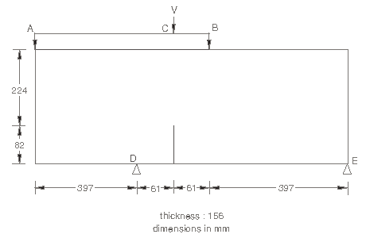

**图3.2.12-2** 切口混合模式混凝土梁使用的有限元网格。

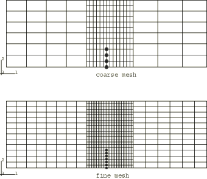

**图3.2.12-3** 网格细化研究使用的拉伸软化模型。

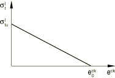

**图3.2.12-4** 网格细化研究使用的剪切保持模型。

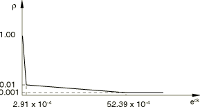

**图3.2.12-5** 网格细化研究：载荷-CMSD响应。

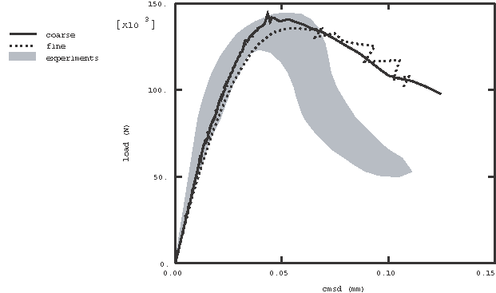

**图3.2.12-6** 网格细化研究中获得的变形形状（放大倍数200）。

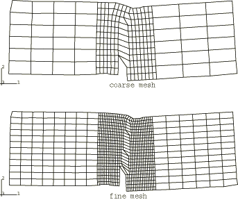

**图3.2.12-7** 网格细化研究中获得的裂缝模式（混凝土梁切口周围细节）。

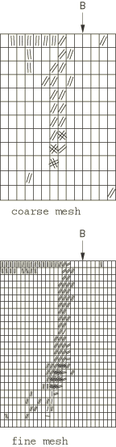

**图3.2.12-8** 拉伸软化模型。

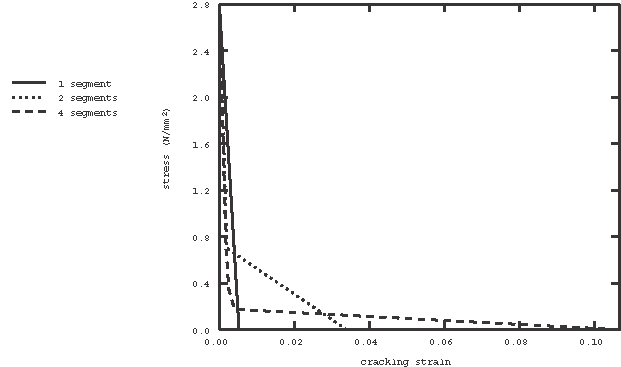

**图3.2.12-9** 拉伸软化研究；细网格。

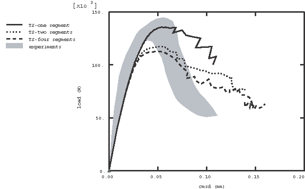

**图3.2.12-10** 剪切保持模型。

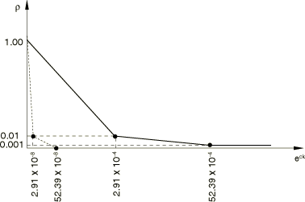

**图3.2.12-11** 剪切保持研究；带两段拉伸软化的细网格。

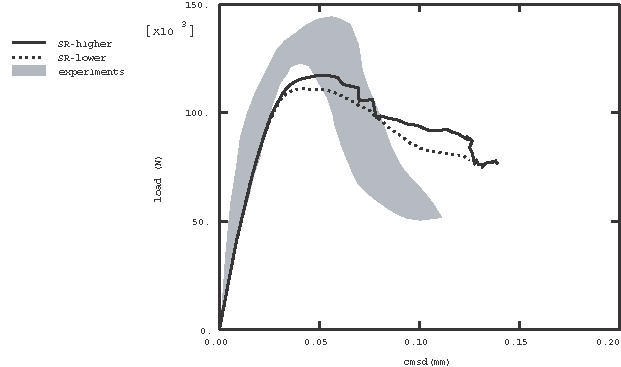

**图3.2.12-12** 剪切保持研究；带四段拉伸软化的细网格。

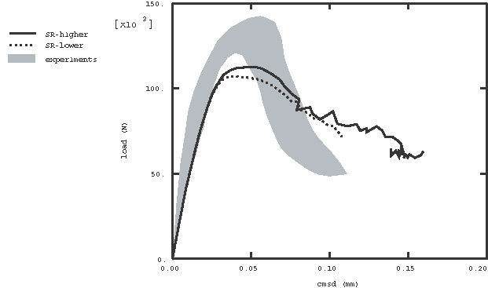

**图3.2.12-13** 单元移除：平面应力细网格拉伸软化研究。

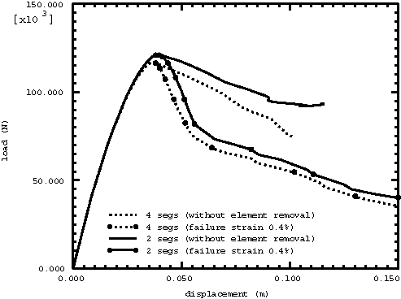

**图3.2.12-14** 单元移除：带两段拉伸软化曲线的平面应力细网格。

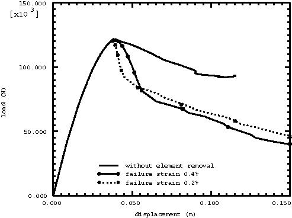

