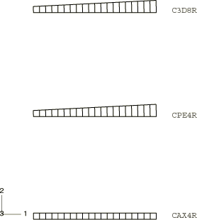
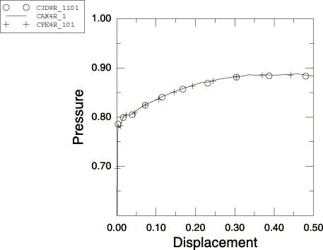
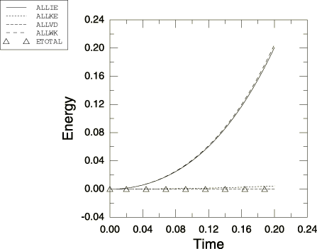

# 3.2.16 厚壁圆筒的加压

**产品：** Abaqus/Explicit

### 问题描述

厚壁圆筒承受超过圆筒极限载荷的内压。圆筒内半径为1.0，外半径为2.0。圆筒的材料特性假定为具有恒定各向同性硬化的弹塑性材料。材料属性为：杨氏模量=1000，泊松比=0.3，屈服应力=1，硬化斜率=3，密度=0.001。

本问题使用轴对称、平面应变和三维模型进行分析。分析中使用的网格如图3.2.16-1所示。每种情况在圆筒厚度方向都有20个单元。

加载形式是对圆筒内半径处节点位移控制。位移幅度足够大，使圆筒完全塑性化并超过结构的极限载荷。由于结构在载荷下的不稳定性，不可能使用压力加载来捕获压力与位移曲线。使用位移控制，可以在结构内半径的每个（规定）位移点处恢复压力。为了减轻本问题中的动态效应（它们无法完全消除），内半径节点的径向速度被规定为在步骤的0.2秒持续时间内从零速度到5的速度的线性斜坡。加载的时间周期比结构任何自然振动模式的周期长得多，峰值速度比材料的波速低两个数量级。

### 结果与讨论

本问题的准静态解见Nagtegaal和De Jong（1981）。Abaqus/Explicit将本问题建模为瞬态动态分析。图3.2.16-2显示了分析中使用的三种单元类型的压力与径向位移曲线。压力从每个网格中第一个单元的应力分量推断。所有三种情况在横截面完全塑性化时都显示一些动态效应。图3.2.16-3显示了本分析的能量平衡。

### 输入文件

[prcyl.inp](../eif/prcyl.inp)

用于本分析的输入数据。

### 参考文献

Nagtegaal, J. C., and J. E. De Jong, "Some Computational Aspects of Elastic-Plastic Large Strain Analysis," International Journal of Numerical Methods in Engineering, vol. 17, pp. 15–41, 1981.

### 图表

**图3.2.16-1** 加压圆筒问题的网格。

**图3.2.16-2** 内半径位移与压力。

**图3.2.16-3** 能量平衡随时间变化。

