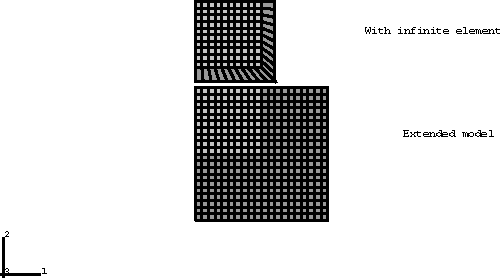
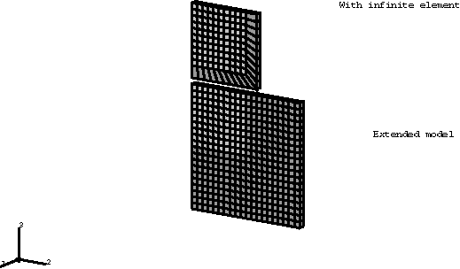
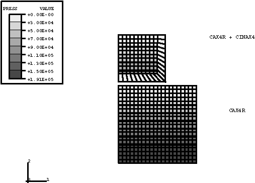
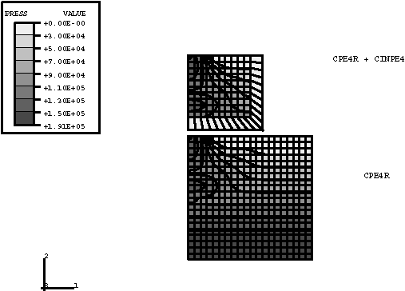
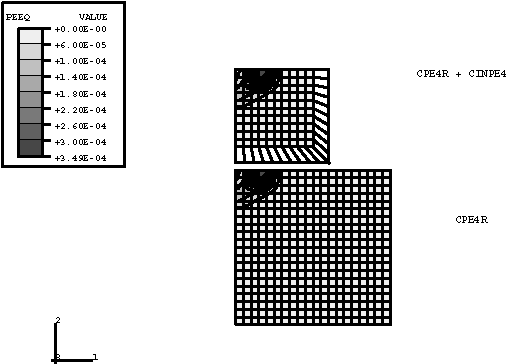
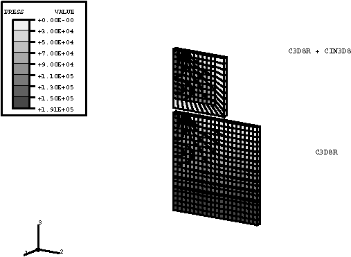
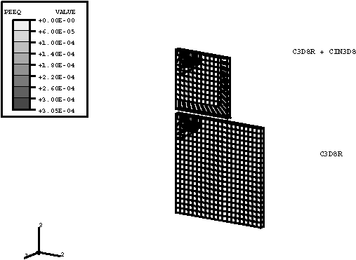
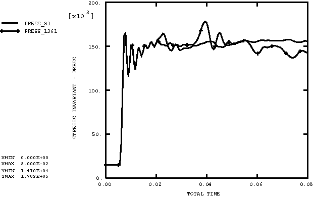
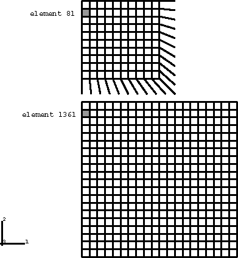

# 3.2.18 无限地质介质的压力

**产品：** Abaqus/Explicit

### 问题描述

本示例模拟承受初始地应力并承受突然施加于其部分表面的压力的半无限粒状介质。要对半无限半空间建模，一个选项是生成一个延伸至感兴趣区域足够远的网格，使得模型最远边界没有反射回感兴趣区域。然而，这计算成本高昂，因为必须在用户不感兴趣的大部分模型区域中计算解。无限元素允许使用合适的网格对感兴趣区域（内部）进行建模，而远场由添加到内部网格周长的无限元素集合模拟。

在每种考虑的情况（轴对称、平面应变和三维）中，使用两种网格：（1）定义内部的小网格，由无限元素包围；（2）更大的普通有限元模型，延伸至足够远的距离，使得在分析时间内没有波反射回内部。拥有这两种网格的目的是验证无限元素。较大的模型在内部区域具有与较小网格完全相同的离散化。如果无限元素正常工作，则解在两个网格的内部部分应该几乎相同。

初始地应力场使用初始条件定义。无限元素的特性之一是它们将在边界上施加适当的牵引力以维持初始平衡应力场。本问题的第一步持续5毫秒。只施加与地应力场对应的重力（自重）载荷。在此步骤期间应该没有加速度和应力变化。执行该步骤以验证无限元素确实维持应力平衡状态。

在分析的第二步中，压力在顶部表面的一部分上瞬时施加并在8毫秒的响应期间保持恒定。

粒状材料使用扩展Drucker-Prager模型模拟。摩擦角为40，而材料是不可膨胀的（膨胀角为0）。偏平面中的屈服面假定为非圆形的，参数*K*（定义第三应力不变量的依赖性）为0.9。假定为理想塑性，单轴压缩屈服应力为5×10³。杨氏模量为1×10⁹，泊松比为0.3。

研究了带有相应无限元素的轴对称、平面应变和三维模型。网格如图3.2.18-1和图3.2.18-2所示。在平面应变和三维情况中，模型假定关于中心平面对称。三维模型有一层单元，*x*方向的位移被约束以给出平面应变响应。

### 结果与讨论

图3.2.18-3至图3.2.18-5显示了第一步结束时的压力等值线。压力呈线性变化，对应于平衡地应力场。在第二步开始时压力脉冲施加后，弹性波开始穿过介质。一旦应力幅度超过屈服强度，随后是塑性波。偏屈服应力线性依赖于压力的大小，因此在高约束区域增加。

图3.2.18-6显示了第二步结束时轴对称情况中的静水压力。两个等值线图在加载区域非常相似。同样，图3.2.18-7中的塑性应变等值线几乎相同。在这种情况下，波是球形的。

图3.2.18-8显示了第二步结束时平面应变情况中的静水压力，图3.2.18-9显示了等效塑性应变。几乎再次观察到相同的模式。三维模型在第二步结束时的压力和塑性应变类似图如图3.2.18-10和图3.2.18-11所示。在这些平面应变情况中，波是平面的。

图3.2.18-12显示了平面应变情况中单元81和1361的压力应力时间历史。这些单元的位置如图3.2.18-13所示。这些单元在较小和较大模型中处于相同位置。结果显示了无限元素在消除来自边界波反射方面的效果。材料的膨胀波速为1160。在没有无限元素的网格中，预期波在施加压力后0.033秒返回单元1361，或在总时间0.041秒时返回。图3.2.18-12显示了波在此时间返回。带无限元素的网格没有显示像返回单元81的波那样大的波。

### 输入文件

[geostat_pe.inp](../eif/geostat_pe.inp)

本分析使用的平面应变模型的输入数据。

[geostat_ax.inp](../eif/geostat_ax.inp)

轴对称情况的输入数据。

[geostat_3d.inp](../eif/geostat_3d.inp)

三维情况的输入数据。

### 图表

**图3.2.18-1** 未变形的轴对称和平面应变网格。

**图3.2.18-2** 未变形的三维网格。

**图3.2.18-3** 压力等值线，轴对称情况，第1步结束。

**图3.2.18-4** 压力等值线，平面应变情况，第1步结束。

**图3.2.18-5** 压力等值线，三维情况，第1步结束。

**图3.2.18-6** 静水压力等值线，轴对称情况，第2步结束。

**图3.2.18-7** 等效塑性应变等值线，轴对称情况，第2步结束。

**图3.2.18-8** 静水压力等值线，平面应变情况，第2步结束。

**图3.2.18-9** 等效塑性应变等值线，平面应变情况，第2步结束。

**图3.2.18-10** 静水压力等值线，三维情况，第2步结束。

**图3.2.18-11** 等效塑性应变等值线，三维情况，第2步结束。

**图3.2.18-12** 平面应变情况中相同位置的压力应力时间历史。

**图3.2.18-13** 单元81和1361的位置。

