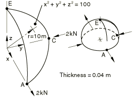
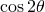

# 4.2.3 LE3：点载荷作用的半球壳

**产品：** Abaqus/Standard  Abaqus/Explicit  

### 测试单元

S3    S3R    S4    S4R    S4R5    S8R    S8R5    S9R5    STRI3    STRI65    SC6R    SC8R  

SAXA12    SAXA22  

### 问题描述

**模型：**

如上图所示的模型。此外，提供了两个连续壳单元模型的输入文件，用于说明使用STACK DIRECTION=ORIENTATION参数通过球面系统独立于节点连接性来定义单元厚度（堆积）方向的方法。

**材料：**

线弹性，弹性模量 = 68.25 GPa，泊松比 = 0.3。

**边界条件：**

在E点处 = 0。沿边缘AE，关于z-x平面对称。沿边缘CE，关于y-z平面对称。

**载荷：**

在A点处施加2 kN的集中径向向外载荷，在C点处施加向内载荷。

### 参考解

这是英国国家有限元方法与标准机构（NAFEMS）推荐的测试：NAFEMS出版物TNSB第3版"The Standard NAFEMS Benchmarks"（1990年10月）中的测试LE3。

目标解：A点处的 = 185 mm。

### 结果与讨论

括号中的值是相对于参考解的百分比差异。

| 单元 | A点处的（粗网格） | A点处的（细网格） |
| --- | --- | --- |
| S3/S3R | 0.080 (57%) | 0.161 (13%) |
| S4 | 0.083 (55%) | 0.175 (5%) |
| S4R | 0.180 (2.7%) | 0.180 (2.7%) |
| S4R* | 0.072 (61%) | 0.170 (8.1%) |
| S4R** | 0.058 (--68%) | 0.168 (--9.1%) |
| S4R5 | 0.190 (2.7%) | 0.183 (1.1%) |
| S8R | 0.101 (45%) | 0.178 (3.8%) |
| S8R5 | 0.179 (3.2%) | 0.185 (0.0%) |
| S9R5 | 0.179 (3.2%) | 0.185 (0.0%) |
| STRI3 | 0.173 (1.2%) | 0.185 (0.0%) |
| STRI65 | 0.169 (8.6%) | 0.182 (1.6%) |
| SC6R | 0.088 (52.4%) | 0.167 (9.7%) |
| SC8R | 0.210 (13.5%) | 0.188 (1.6%) |
| SC8R*** | 0.194(4.9%) | 0.185(0.0%) |
| SAXA12**** | 0.179 (3.2%) |  |
| SAXA22**** | 0.178 (3.8%) |  |

* 具有增强沙漏控制的Abaqus/Explicit有限应变单元。** 具有增强沙漏控制的Abaqus/Standard有限应变单元。*** 使用默认"松弛刚度"沙漏控制的Abaqus/Explicit连续壳单元。**** 由于载荷位置的原因，只能使用Mode 2和Mode 4单元。此外，由于问题的对称性，只有傅里叶插值器对解有贡献。因此，Mode 4单元产生相同的结果。由于Mode 4是提供的最高阶傅里叶项，因此无法进一步进行周向网格细化，只能获得粗网格结果。

使用STACK DIRECTION=ORIENTATION参数的连续壳单元网格与厚度方向由单元节点连接性定义的连续壳单元网格产生相同的结果。

### 输入文件

##### **Abaqus/Standard输入文件**

[nle3xf3x.inp](../eif/nle3xf3x.inp)

S3/S3R单元。

[nle3xe4x.inp](../eif/nle3xe4x.inp)

S4单元。

[nle3xf4x.inp](../eif/nle3xf4x.inp)

S4R单元。

[nle3xf4x_eh.inp](../eif/nle3xf4x_eh.inp)

具有增强沙漏控制的S4R单元。

[nle3x54x.inp](../eif/nle3x54x.inp)

S4R5单元。

[nle3x68x.inp](../eif/nle3x68x.inp)

S8R单元。

[nle3x58x.inp](../eif/nle3x58x.inp)

S8R5单元。

[nle3x59x.inp](../eif/nle3x59x.inp)

S9R5单元。

[nle3x63x.inp](../eif/nle3x63x.inp)

STRI3单元。

[nle3x56x.inp](../eif/nle3x56x.inp)

STRI65单元。

[nle3xntx.inp](../eif/nle3xntx.inp)

SAXA12单元。

[nle3xnxx.inp](../eif/nle3xnxx.inp)

SAXA22单元。

[nle3_std_sc6r.inp](../eif/nle3_std_sc6r.inp)

SC6R单元。

[nle3_std_sc8r.inp](../eif/nle3_std_sc8r.inp)

SC8R单元。

[nle3_std_sc6r_stackdir_sphori.inp](../eif/nle3_std_sc6r_stackdir_sphori.inp)

使用STACK DIRECTION=ORIENTATION参数和球面定向系统来定义单元厚度方向的SC6R单元。

[nle3_std_sc8r_stackdir_sphori.inp](../eif/nle3_std_sc8r_stackdir_sphori.inp)

使用STACK DIRECTION=ORIENTATION参数和球面定向系统来定义单元厚度方向的SC8R单元。

[nle3_std_sc8r_sgs.inp](../eif/nle3_std_sc8r_sgs.inp)

使用[*SHELL GENERAL SECTION](../key/key-link.md#usb-kws-mshellgensect)定义截面属性的SC8R单元。

##### **Abaqus/Explicit输入文件**

[le3_s4r.inp](../eif/le3_s4r.inp)

具有增强沙漏控制的S4R单元。

[le3_sc8r.inp](../eif/le3_sc8r.inp)

使用默认"松弛刚度"沙漏控制的SC8R单元。

