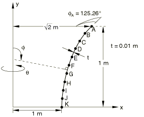
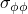

# 4.2.4 LE4：均匀内压作用下的轴对称双曲壳

**产品：** Abaqus/Standard  

### 测试单元

SAX1    SAX2    SAXA11    SAXA21  

### 问题描述

**网格：**

对每个单元分别测试粗网格和细网格。

**材料：**

线弹性，弹性模量 = 210 GPa，泊松比 = 0.3。

**边界条件：**

在B点处，。

**载荷：**

均匀内压1 MPa。

对于SAXA11单元，壳截面使用高斯积分。

### 参考解

这是英国国家有限元方法与标准机构（NAFEMS）推荐的测试：NAFEMS出版物TNSB第3版"The Standard NAFEMS Benchmarks"（1990年10月）中的测试LE4。

目标解：在K点处的中面上，子午向应力为50.0 MPa，环向应力为50.0 MPa。

### 结果与讨论

结果如下表所示。括号中的值是相对于参考解的百分比差异。

| 单元类型 |  |  |
| --- | --- | --- |
| SAX1（粗） | 49.69 (0.62%) | 49.99 (0.02%) |
| SAX1（细） | 49.99 (0.02%) | 49.92 (0.16%) |
| SAX2（粗） | 50.09 (0.18%) | 48.33 (3.3%) |
| SAX2（细） | 50.02 (0.04%) | 48.34 (3.3%) |
| SAXA11（粗） | 49.69 (0.62%) | 49.92 (0.16%) |
| SAXA11（细） | 49.99 (0.02%) | 49.20 (1.6%) |
| SAXA21（粗） | 50.09 (0.18%) | 48.33 (3.3%) |
| SAXA21（细） | 50.02 (0.04%) | 48.34 (3.3%) |

### 输入文件

#### 粗网格测试：

[esa2smsf.inp](../eif/esa2smsf.inp)

SAX1单元。

[esa3smsf.inp](../eif/esa3smsf.inp)

SAX2单元。

[esnssmsf.inp](../eif/esnssmsf.inp)

SAXA11单元。

[esnwsmsf.inp](../eif/esnwsmsf.inp)

SAXA21单元。

#### 细网格测试：

[esa2sfsf.inp](../eif/esa2sfsf.inp)

SAX1单元。

[esa3sfsf.inp](../eif/esa3sfsf.inp)

SAX2单元。

[esnssfsf.inp](../eif/esnssfsf.inp)

SAXA11单元。

[esnwsfsf.inp](../eif/esnwsfsf.inp)

SAXA21单元。

