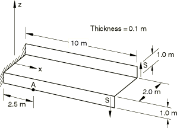
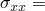

# 4.2.5 LE5：Z形截面悬臂梁

**产品：** Abaqus/Standard  Abaqus/Explicit  

### 测试单元

S3    S3R    S4R    S4R5    S4RS    S4RSW    S8R    S8R5    S9R5    STRI3    STRI65  

B31OS    B32OS  

### 问题描述

**模型：**

承受扭转载荷的Z形截面悬臂梁。

**材料：**

线弹性，弹性模量 = 210 GPa，泊松比 = 0.3，密度 = 7800 kg/m3。

**边界条件：**

在 = 0处，的所有位移均为零。

**载荷：**

在 = 10处施加1.2 MN-m的扭矩。当使用壳单元时，扭矩通过每个法兰上0.6 MN的均匀分布边缘剪力施加。在显式动态分析中，载荷施加速率使得可以获得准静态解。

### 参考解

这是英国国家有限元方法与标准机构（NAFEMS）推荐的测试：NAFEMS出版物TNSB第3版"The Standard NAFEMS Benchmarks"（1990年10月）中的测试LE5。

目标解：A点处中面上的轴向应力 = 108 MPa。

### 结果与讨论

结果如表4.2.5-1和表4.2.5-2所示。括号中的值是相对于参考解的百分比差异。可以看到，随着网格的细化，解缓慢收敛于目标解。

**表4.2.5-1** Abaqus/Standard分析。

| 单元 | ，粗网格 | ，细网格 |
| --- | --- | --- |
| S3/S3R | 24.266 MPa (78%) | 92.166 MPa (15%) |
| S4 | 110.36 MPa (2.2%) | 110.38 MPa (2.2%) |
| S4R | 50.480 MPa (53%) | 96.732 MPa (10%) |
| S4R5 | 50.116 MPa (54%) | 96.378 MPa (11%) |
| S8R | 109.85 MPa (1.7%) | --- |
| S8R5 | 109.72 MPa (1.6%) | --- |
| S9R5 | 109.72 MPa (1.6%) | --- |
| STRI3 | 30.389 MPa (72%) | 94.532 MPa (12%) |
| STRI65 | 107.32 MPa (0.63%) | --- |
| B31OS | 108.09 MPa (0.08%) | --- |
| B32OS | 107.34 MPa (0.61%) | --- |

**表4.2.5-2** Abaqus/Explicit分析。

| 单元 | ，粗网格 | ，细网格 |
| --- | --- | --- |
| S4R | 49.5 MPa (54%) | 100.3 MPa (7.1%) |
| S4RS | 87.5 MPa (19%) | 100.3 MPa (7.1%) |
| S4RSW | 87.7 MPa (19%) | 100.3 MPa (7.1%) |

### 输入文件

##### **Abaqus/Standard输入文件**

#### 粗网格测试：

[nle5xf3c.inp](../eif/nle5xf3c.inp)

S3/S3R单元。

[nle5xe4c.inp](../eif/nle5xe4c.inp)

S4单元。

[nle5xf4c.inp](../eif/nle5xf4c.inp)

S4R单元。

[nle5x54c.inp](../eif/nle5x54c.inp)

S4R5单元。

[nle5x68c.inp](../eif/nle5x68c.inp)

S8R单元。

[nle5x58c.inp](../eif/nle5x58c.inp)

S8R5单元。

[nle5x59c.inp](../eif/nle5x59c.inp)

S9R5单元。

[nle5x63c.inp](../eif/nle5x63c.inp)

STRI3单元。

[nle5x56c.inp](../eif/nle5x56c.inp)

STRI65单元。

[nle5xb2c.inp](../eif/nle5xb2c.inp)

B31OS单元。

[nle5xb3c.inp](../eif/nle5xb3c.inp)

B32OS单元。

#### 细网格测试：

[nle5xf3f.inp](../eif/nle5xf3f.inp)

S3/S3R单元。

[nle5xe4f.inp](../eif/nle5xe4f.inp)

S4单元。

[nle5xf4f.inp](../eif/nle5xf4f.inp)

S4R单元。

[nle5x54f.inp](../eif/nle5x54f.inp)

S4R5单元。

[nle5x63f.inp](../eif/nle5x63f.inp)

STRI3单元。

##### **Abaqus/Explicit输入文件**

#### 粗网格测试：

[le5_c.inp](../eif/le5_c.inp)

S4R单元。

[le5_c_s4rs.inp](../eif/le5_c_s4rs.inp)

S4RS单元。

[le5_c_s4rsw.inp](../eif/le5_c_s4rsw.inp)

S4RSW单元。

#### 细网格测试：

[le5_f.inp](../eif/le5_f.inp)

S4R单元。

[le5_f_s4rs.inp](../eif/le5_f_s4rs.inp)

S4RS单元。

[le5_f_s4rs_subcyc.inp](../eif/le5_f_s4rs_subcyc.inp)

S4RS单元和子循环。

[le5_f_s4rsw.inp](../eif/le5_f_s4rsw.inp)

S4RSW单元。

