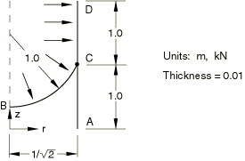
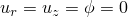

# 4.2.9 LE9：压力作用下的轴对称分支壳

**产品：** Abaqus/Standard  

### 测试单元

SAX2

### 问题描述

**网格：**

分别测试粗网格和细网格。

**材料：**

线弹性，弹性模量 = 210 GPa，泊松比 = 0.3。

**边界条件：**

在A点处 = 0。

**载荷：**

沿边缘BCD施加均匀内压1.0 MPa。

在输入文件[nle9xa3f.inp](../eif/nle9xa3f.inp)中使用高斯积分进行壳截面分析。

### 参考解

这是英国国家有限元方法与标准机构（NAFEMS）推荐的测试：NAFEMS出版物TNSB第3版"The Standard NAFEMS Benchmarks"（1990年10月）中的测试LE9。

目标解：C点处上部圆柱体外表面上的轴向应力 = 319.9 MPa。

### 结果与讨论

结果如下表所示。括号中的值是相对于参考解的百分比差异。

| 单元 | ，粗网格 | ，细网格 |
| --- | --- | --- |
| SAX2 | 307.24 MPa (4.0%) | 314.81 MPa (1.6%) |

### 输入文件

[nle9xa3c.inp](../eif/nle9xa3c.inp)

粗网格分析。

[nle9xa3f.inp](../eif/nle9xa3f.inp)

细网格分析。

