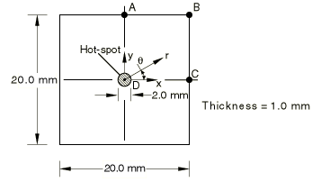

# 4.3.1 T1：平面应力单元——带热点的薄膜

### 4.3.1 T1：平面应力单元——带热点的薄膜

**产品：** Abaqus/Standard  

### 测试单元

CPS3    CPS4    CPS4I    CPS4R    CPS6    CPS6M    CPS8    CPS8R  

### 问题描述

**材料：**

线弹性，弹性模量 = 100 GPa，泊松比 = 0.3。

**边界条件：**

建模四分之一截面，在 = 0处有对称条件 = 0，在 = 0处有对称条件 = 0。

**载荷：**

在热点内，热应变（）= 1.0×10⁻³。在热点外，热应变（）= 0。

### 参考解

这是英国国家有限元方法与标准机构（NAFEMS）推荐的测试：NAFEMS出版物TNSB第3版"The Standard NAFEMS Benchmarks"（1990年10月）中的测试T1。

目标解：D点处（热点外）的 = 50.0 MPa。

### 结果与讨论

结果如下表所示。括号中的值是相对于参考解的百分比差异。

| 单元 | D点处的 |
| --- | --- |
| CPS3 | 54.25 MPa (8.4%) |
| CPS4 | 50.94 MPa (1.9%) |
| CPS4I | 46.29 MPa (7.4%) |
| CPS4R | 23.65 MPa (52.7%)* |
| CPS6 | 54.46 MPa (8.9%) |
| CPS6M | 54.25 MPa (8.5%) |
| CPS8 | 51.53 MPa (3.1%) |
| CPS8R | 44.06 MPa (11.9%)* |

*降阶积分单元与全积分单元的结果比较表明，对于此类应力集中问题，全积分单元的表现明显更好。

### 输入文件

[nt1xxf3x.inp](../eif/nt1xxf3x.inp)

CPS3单元。

[nt1xxf4x.inp](../eif/nt1xxf4x.inp)

CPS4单元。

[nt1xxf6x.inp](../eif/nt1xxf6x.inp)

CPS6单元。

[nt1xxf8x.inp](../eif/nt1xxf8x.inp)

CPS8单元。

[nt1xxi4x.inp](../eif/nt1xxi4x.inp)

CPS4I单元。

[nt1xxm6x.inp](../eif/nt1xxm6x.inp)

CPS6M单元。

[nt1xxr4x.inp](../eif/nt1xxr4x.inp)

CPS4R单元。

[nt1xxr8x.inp](../eif/nt1xxr8x.inp)

CPS8R单元。

