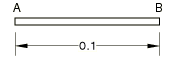

# 4.3.2 T2：带辐射的一维热传递

**产品：** Abaqus/Standard  Abaqus/Explicit  

### 测试单元

DC1D2    DC1D3  

DC2D3    DC2D4    DC2D6    DC2D8  

DCAX3    DCAX4    DCAX6    DCAX8  

CAX3T    CAX4RHT    CAX4RT    CAX4T  

CPE3T    CPE4RHT    CPE4RT    CPE4T    CPE6MHT    CPE6MT  

CPS3T    CPS4RT    CPS4T    CPS6MT  

C3D4T    C3D6T    C3D8RHT    C3D8RT    C3D8T    SC6RT    SC8RT  

EC3D8RT  

### 问题描述

**模型：**

几何形状如上图所示。沿杆件长度使用10个单元的均匀网格。杆件的厚度和宽度均为0.01 m。在Abaqus/Standard中进行稳态模拟，而在Abaqus/Explicit中进行瞬态模拟。后者的总模拟时间为2500秒。这为瞬态解达到该问题的稳态条件提供了足够的时间。

**材料：**

导热系数 = 55.6 W/m·℃，比热 = 460.0 J/kg·℃，密度 = 7850 kg/m³。在B端，发射率 = 0.98，斯蒂芬-玻尔兹曼常数 = 5.67×10⁻⁸ W/m²/K⁴。

对于耦合温度-位移单元，使用虚拟机械特性来完成材料定义。

**边界条件：**

在A端规定温度为1000 K。在B端辐射到环境温度300 K。没有垂直于AB的热通量。

**载荷：**

零内部热生成。

### 参考解

这是英国国家有限元方法与标准机构（NAFEMS）推荐的测试：NAFEMS出版物TNSB第3版"The Standard NAFEMS Benchmarks"（1990年10月）中的测试T2。

目标解：B处温度 = 927 K（653.85℃）。

### 结果与讨论

所有单元都得到精确解。

### 输入文件

##### **Abaqus/Standard输入文件**

[nt2xx12x.inp](../eif/nt2xx12x.inp)

DC1D2单元。

[nt2xx13x.inp](../eif/nt2xx13x.inp)

DC1D3单元。

[nt2xx23x.inp](../eif/nt2xx23x.inp)

DC2D3单元。

[nt2xx24x.inp](../eif/nt2xx24x.inp)

DC2D4单元。

[nt2xx26x.inp](../eif/nt2xx26x.inp)

DC2D6单元。

[nt2xx28x.inp](../eif/nt2xx28x.inp)

DC2D8单元。

[nt2xxa3x.inp](../eif/nt2xxa3x.inp)

DCAX3单元。

[nt2xxa4x.inp](../eif/nt2xxa4x.inp)

DCAX4单元。

[nt2xxa6x.inp](../eif/nt2xxa6x.inp)

DCAX6单元。

[nt2xxa8x.inp](../eif/nt2xxa8x.inp)

DCAX8单元。

[onedheattransrad_std_cpe3t.inp](../eif/onedheattransrad_std_cpe3t.inp)

CPE3T单元。

[onedheattransrad_std_cpe4rht.inp](../eif/onedheattransrad_std_cpe4rht.inp)

CPE4RHT单元。

[onedheattransrad_std_cpe4rt.inp](../eif/onedheattransrad_std_cpe4rt.inp)

CPE4RT单元。

[onedheattransrad_std_cpe4t.inp](../eif/onedheattransrad_std_cpe4t.inp)

CPE4T单元。

[onedheattransrad_std_cpe6mht.inp](../eif/onedheattransrad_std_cpe6mht.inp)

CPE6MHT单元。

[onedheattransrad_std_cpe6mt.inp](../eif/onedheattransrad_std_cpe6mt.inp)

CPE6MT单元。

[onedheattransrad_std_cps3t.inp](../eif/onedheattransrad_std_cps3t.inp)

CPS3T单元。

[onedheattransrad_std_cps4rt.inp](../eif/onedheattransrad_std_cps4rt.inp)

CPS4RT单元。

[onedheattransrad_std_cps4t.inp](../eif/onedheattransrad_std_cps4t.inp)

CPS4T单元。

[onedheattransrad_std_cps6mt.inp](../eif/onedheattransrad_std_cps6mt.inp)

CPS6MT单元。

[onedheattransrad_std_cax4rht.inp](../eif/onedheattransrad_std_cax4rht.inp)

CAX4RHT单元。

[onedheattransrad_std_cax3t.inp](../eif/onedheattransrad_std_cax3t.inp)

CAX3T单元。

[onedheattransrad_std_cax4rt.inp](../eif/onedheattransrad_std_cax4rt.inp)

CAX4RT单元。

[onedheattransrad_std_cax4t.inp](../eif/onedheattransrad_std_cax4t.inp)

CAX4T单元。

[onedheattransrad_std_cax6mht.inp](../eif/onedheattransrad_std_cax6mht.inp)

CAX6MHT单元。

[onedheattransrad_std_cax6mt.inp](../eif/onedheattransrad_std_cax6mt.inp)

CAX6MT单元。

[onedheattransrad_std_c3d4t.inp](../eif/onedheattransrad_std_c3d4t.inp)

C3D4T单元。

[onedheattransrad_std_c3d6t.inp](../eif/onedheattransrad_std_c3d6t.inp)

C3D6T单元。

[onedheattransrad_std_c3d8rht.inp](../eif/onedheattransrad_std_c3d8rht.inp)

C3D8RHT单元。

[onedheattransrad_std_c3d8rt.inp](../eif/onedheattransrad_std_c3d8rt.inp)

C3D8RT单元。

[onedheattransrad_std_c3d8t.inp](../eif/onedheattransrad_std_c3d8t.inp)

C3D8T单元。

##### **Abaqus/Explicit输入文件**

[onedheattransrad_xpl_cax3t.inp](../eif/onedheattransrad_xpl_cax3t.inp)

CAX3T单元。

[onedheattransrad_xpl_cax4rt.inp](../eif/onedheattransrad_xpl_cax4rt.inp)

CAX4RT单元。

[onedheattransrad_xpl_cpe3t.inp](../eif/onedheattransrad_xpl_cpe3t.inp)

CPE3T单元。

[onedheattransrad_xpl_cpe4rt.inp](../eif/onedheattransrad_xpl_cpe4rt.inp)

CPE4RT单元。

[onedheattransrad_xpl_cps3t.inp](../eif/onedheattransrad_xpl_cps3t.inp)

CPS3T单元。

[onedheattransrad_xpl_cps4rt.inp](../eif/onedheattransrad_xpl_cps4rt.inp)

CPS4RT单元。

[onedheattransrad_xpl_c3d4t.inp](../eif/onedheattransrad_xpl_c3d4t.inp)

C3D4T单元。

[onedheattransrad_xpl_c3d6t.inp](../eif/onedheattransrad_xpl_c3d6t.inp)

C3D6T单元。

[onedheattransrad_xpl_c3d8rt.inp](../eif/onedheattransrad_xpl_c3d8rt.inp)

C3D8RT单元。

[onedheattransrad_xpl_c3d8t.inp](../eif/onedheattransrad_xpl_c3d8t.inp)

C3D8T单元。

[onedheattransrad_xpl_ec3d8rt.inp](../eif/onedheattransrad_xpl_ec3d8rt.inp)

EC3D8RT单元。

[onedheattransrad_xpl_sc6rt.inp](../eif/onedheattransrad_xpl_sc6rt.inp)

SC6RT单元。

[onedheattransrad_xpl_sc8rt.inp](../eif/onedheattransrad_xpl_sc8rt.inp)

SC8RT单元。

