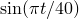

# 4.3.3 T3：一维瞬态热传递

**产品：** Abaqus/Standard  Abaqus/Explicit  

### 测试单元

DC1D2    DC1D3  

DC2D3    DC2D4    DC2D6    DC2D8  

DCAX3    DCAX4    DCAX6    DCAX8  

DS3    DS4    DS6    DS8  

CAX3T    CAX4T    CAX4RT    CAX4RHT    CAX6MT    CAX6MHT  

CPE3T    CPE4T    CPE4RT    CPE4RHT    CPE6MT    CPE6MHT  

CPS3T    CPS4T    CPS4RT    CPS6MT  

S3RT    S4RT  

### 问题描述

**模型：**

几何形状如上图所示。沿杆件长度使用5个单元的均匀网格。杆件的厚度和宽度均为0.01 m。执行瞬态模拟。总模拟时间为32秒。

**材料：**

导热系数 = 35.0 W/m·℃，比热 = 440.5 J/kg·℃，密度 = 7200 kg/m³。

对于耦合温度-位移单元，使用虚拟机械特性来完成材料定义。

**边界条件：**

在A端规定温度为0℃，在B端规定温度为100，其中t为时间（秒）。没有垂直于AB的热通量。

**载荷：**

零内部热生成。

**初始条件：**

所有温度 = 0℃。

### 参考解

这是英国国家有限元方法与标准机构（NAFEMS）推荐的测试：NAFEMS出版物TNSB第3版"The Standard NAFEMS Benchmarks"（1990年10月）中的测试T3。

目标解：在32秒时， = 0.08 m处的温度为36.6℃。

### 结果与讨论

Abaqus/Standard分析的结果如下表所示。括号中的值是相对于参考解的百分比差异。

| 单元 | T，粗网格 | T，细网格 |
| --- | --- | --- |
| DC1D2 | 34.54℃ (5.6%) | 35.51℃ (3.0%) |
| DC1D3 | 35.88℃ (2.0%) | 36.09℃ (1.4%) |
| DC2D3 | 34.54℃ (5.6%) | 35.51℃ (3.0%) |
| DC2D4 | 34.54℃ (5.6%) | 35.51℃ (3.0%) |
| DC2D6 | 36.27℃ (0.9%) | 36.14℃ (1.3%) |
| DC2D8 | 35.88℃ (2.0%) | 36.09℃ (1.4%) |
| DCAX3 | 34.54℃ (5.6%) | 35.51℃ (3.0%) |
| DCAX4 | 34.54℃ (5.6%) | 35.51℃ (3.0%) |
| DCAX6 | 35.91℃ (1.9%) | 36.10℃ (1.4%) |
| DCAX8 | 35.88℃ (2.0%) | 36.09℃ (1.4%) |
| DS3 | 34.54℃ (5.6%) | 36.20℃ (1.1%) |
| DS4 | 34.54℃ (5.6%) | 35.51℃ (3.0%) |
| DS6 | 35.37℃ (3.4%) | 36.14℃ (1.3%) |
| DS8 | 35.88℃ (2.0%) | 36.09℃ (1.4%) |
| CAX3T | 34.54℃ (5.6%) | 35.51℃ (3.0%) |
| CAX4T | 34.54℃ (5.6%) | 35.51℃ (3.0%) |
| CAX4RT | 34.54℃ (5.6%) | 35.51℃ (3.0%) |
| CAX4RHT | 34.54℃ (5.6%) | 35.51℃ (3.0%) |
| CAX6MHT | 35.37℃ (3.4%) | 35.85℃ (2.1%) |
| CAX6MT | 35.37℃ (3.4%) | 35.85℃ (2.1%) |
| CPE3T | 34.54℃ (5.6%) | 35.51℃ (3.0%) |
| CPE4T | 34.54℃ (5.6%) | 35.51℃ (3.0%) |
| CPE4RT | 34.54℃ (5.6%) | 35.51℃ (3.0%) |
| CPE4RHT | 34.54℃ (5.6%) | 35.51℃ (3.0%) |
| CPE6MT | 35.81℃ (2.2%) | 36.0℃ (1.6%) |
| CPE6MHT | 35.81℃ (2.2%) | 36.0℃ (1.6%) |
| CPS3T | 34.54℃ (5.6%) | 35.51℃ (3.0%) |
| CPS4T | 34.54℃ (5.6%) | 35.51℃ (3.0%) |
| CPS4RT | 34.54℃ (5.6%) | 35.51℃ (3.0%) |
| CPS6MT | 35.81℃ (2.2%) | 36.0℃ (1.6%) |

Abaqus/Explicit分析的结果如下表所示。括号中的值是相对于参考解的百分比差异。

| 单元 | T，粗网格 | T，细网格 |
| --- | --- | --- |
| CAX3T | 34.98℃ (4.4%) | 36.08℃ (1.4%) |
| CAX4RT | 34.99℃ (4.4%) | 36.10℃ (1.4%) |
| CPE3T | 35.08℃ (4.2%) | 36.16℃ (1.2%) |
| CPE4RT | 35.09℃ (4.1%) | 36.27℃ (0.9%) |
| CPS3T | 35.08℃ (4.2%) | 36.16℃ (1.2%) |
| CPS4RT | 35.09℃ (4.1%) | 36.27℃ (0.9%) |
| S3RT | 34.98℃ (4.4%) | 36.08℃ (1.4%) |
| S4RT | 35.09℃ (4.1%) | 36.27℃ (0.9%) |

### 输入文件

##### **Abaqus/Standard输入文件**

#### 粗网格测试：

[nt3xx12c.inp](../eif/nt3xx12c.inp)

DC1D2单元。

[nt3xx13c.inp](../eif/nt3xx13c.inp)

DC1D3单元。

[nt3xx23c.inp](../eif/nt3xx23c.inp)

DC2D3单元。

[nt3xx24c.inp](../eif/nt3xx24c.inp)

DC2D4单元。

[nt3xx26c.inp](../eif/nt3xx26c.inp)

DC2D6单元。

[nt3xx28c.inp](../eif/nt3xx28c.inp)

DC2D8单元。

[nt3xxa3c.inp](../eif/nt3xxa3c.inp)

DCAX3单元。

[nt3xxa4c.inp](../eif/nt3xxa4c.inp)

DCAX4单元。

[nt3xxa6c.inp](../eif/nt3xxa6c.inp)

DCAX6单元。

[nt3xxa8c.inp](../eif/nt3xxa8c.inp)

DCAX8单元。

[nt3xxs3c.inp](../eif/nt3xxs3c.inp)

DS3单元。

[nt3xxs4c.inp](../eif/nt3xxs4c.inp)

DS4单元。

[nt3xxs6c.inp](../eif/nt3xxs6c.inp)

DS6单元。

[nt3xxs8c.inp](../eif/nt3xxs8c.inp)

DS8单元。

[onedtransienthtc_std_cax3t.inp](../eif/onedtransienthtc_std_cax3t.inp)

CAX3T单元。

[onedtransienthtc_std_cax4t.inp](../eif/onedtransienthtc_std_cax4t.inp)

CAX4T单元。

[onedtransienthtc_std_cax4rt.inp](../eif/onedtransienthtc_std_cax4rt.inp)

CAX4RT单元。

[onedtransienthtc_std_cax4rht.inp](../eif/onedtransienthtc_std_cax4rht.inp)

CAX4RHT单元。

[onedtransienthtc_std_cax6mht.inp](../eif/onedtransienthtc_std_cax6mht.inp)

CAX6MHT单元。

[onedtransienthtc_std_cax6mt.inp](../eif/onedtransienthtc_std_cax6mt.inp)

CAX6MT单元

[onedtransienthtc_std_cpe3t.inp](../eif/onedtransienthtc_std_cpe3t.inp)

CPE3T单元。

[onedtransienthtc_std_cpe4t.inp](../eif/onedtransienthtc_std_cpe4t.inp)

CPE4T单元。

[onedtransienthtc_std_cpe4rt.inp](../eif/onedtransienthtc_std_cpe4rt.inp)

CPE4RT单元。

[onedtransienthtc_std_cpe4rht.inp](../eif/onedtransienthtc_std_cpe4rht.inp)

CPE4RHT单元。

[onedtransienthtc_std_cpe6mt.inp](../eif/onedtransienthtc_std_cpe6mt.inp)

CPE6MT单元。

[onedtransienthtc_std_cpe6mht.inp](../eif/onedtransienthtc_std_cpe6mht.inp)

CPE6MHT单元。

[onedtransienthtc_std_cps3t.inp](../eif/onedtransienthtc_std_cps3t.inp)

CPS3T单元。

[onedtransienthtc_std_cps4t.inp](../eif/onedtransienthtc_std_cps4t.inp)

CPS4T单元。

[onedtransienthtc_std_cps4rt.inp](../eif/onedtransienthtc_std_cps4rt.inp)

CPS4RT单元。

[onedtransienthtc_std_cps6mt.inp](../eif/onedtransienthtc_std_cps6mt.inp)

CPS6MT单元。

#### 细网格测试：

[nt3xx12f.inp](../eif/nt3xx12f.inp)

DC1D2单元。

[nt3xx13f.inp](../eif/nt3xx13f.inp)

DC1D3单元。

[nt3xx23f.inp](../eif/nt3xx23f.inp)

DC2D3单元。

[nt3xx24f.inp](../eif/nt3xx24f.inp)

DC2D4单元。

[nt3xx26f.inp](../eif/nt3xx26f.inp)

DC2D6单元。

[nt3xx28f.inp](../eif/nt3xx28f.inp)

DC2D8单元。

[nt3xxa3f.inp](../eif/nt3xxa3f.inp)

DCAX3单元。

[nt3xxa4f.inp](../eif/nt3xxa4f.inp)

DCAX4单元。

[nt3xxa6f.inp](../eif/nt3xxa6f.inp)

DCAX6单元。

[nt3xxa8f.inp](../eif/nt3xxa8f.inp)

DCAX8单元。

[nt3xxs3f.inp](../eif/nt3xxs3f.inp)

DS3单元。

[nt3xxs4f.inp](../eif/nt3xxs4f.inp)

DS4单元。

[nt3xxs6f.inp](../eif/nt3xxs6f.inp)

DS6单元。

[nt3xxs8f.inp](../eif/nt3xxs8f.inp)

DS8单元。

[onedtransienthtf_std_cax3t.inp](../eif/onedtransienthtf_std_cax3t.inp)

CAX3T单元。

[onedtransienthtf_std_cax4rt.inp](../eif/onedtransienthtf_std_cax4rt.inp)

CAX4RT单元。

[onedtransienthtf_std_cax4rht.inp](../eif/onedtransienthtf_std_cax4rht.inp)

CAX4RHT单元。

[onedtransienthtf_std_cax6mht.inp](../eif/onedtransienthtf_std_cax6mht.inp)

CAX6MHT单元。

[onedtransienthtf_std_cax6mt.inp](../eif/onedtransienthtf_std_cax6mt.inp)

CAX6MT单元。

[onedtransienthtf_std_cpe3t.inp](../eif/onedtransienthtf_std_cpe3t.inp)

CPE3T单元。

[onedtransienthtf_std_cpe4t.inp](../eif/onedtransienthtf_std_cpe4t.inp)

CPE4T单元。

[onedtransienthtf_std_cpe4rt.inp](../eif/onedtransienthtf_std_cpe4rt.inp)

CPE4RT单元。

[onedtransienthtf_std_cpe4rht.inp](../eif/onedtransienthtf_std_cpe4rht.inp)

CPE4RHT单元。

[onedtransienthtf_std_cpe6mt.inp](../eif/onedtransienthtf_std_cpe6mt.inp)

CPE6MT单元。

[onedtransienthtf_std_cpe6mht.inp](../eif/onedtransienthtf_std_cpe6mht.inp)

CPE6MHT单元。

[onedtransienthtf_std_cps3t.inp](../eif/onedtransienthtf_std_cps3t.inp)

CPS3T单元。

[onedtransienthtf_std_cps4t.inp](../eif/onedtransienthtf_std_cps4t.inp)

CPS4T单元。

[onedtransienthtf_std_cps4rt.inp](../eif/onedtransienthtf_std_cps4rt.inp)

CPS4RT单元。

[onedtransienthtf_std_cps6mt.inp](../eif/onedtransienthtf_std_cps6mt.inp)

CPS6MT单元。

##### **Abaqus/Explicit输入文件**

#### 粗网格测试：

[onedtransienthtc_xpl_cax3t.inp](../eif/onedtransienthtc_xpl_cax3t.inp)

CAX3T单元。

[onedtransienthtc_xpl_cax4rt.inp](../eif/onedtransienthtc_xpl_cax4rt.inp)

CAX4RT单元。

[onedtransienthtc_xpl_cpe3t.inp](../eif/onedtransienthtc_xpl_cpe3t.inp)

CPE3T单元。

[onedtransienthtc_xpl_cpe4rt.inp](../eif/onedtransienthtc_xpl_cpe4rt.inp)

CPE4RT单元。

[onedtransienthtc_xpl_cps3t.inp](../eif/onedtransienthtc_xpl_cps3t.inp)

CPS3T单元。

[onedtransienthtc_xpl_cps4rt.inp](../eif/onedtransienthtc_xpl_cps4rt.inp)

CPS4RT单元。

[onedtransienthtc_xpl_s4rt.inp](../eif/onedtransienthtc_xpl_s4rt.inp)

S4RT单元。

#### 细网格测试：

[onedtransienthtf_xpl_cax3t.inp](../eif/onedtransienthtf_xpl_cax3t.inp)

CAX3T单元。

[onedtransienthtf_xpl_cax4rt.inp](../eif/onedtransienthtf_xpl_cax4rt.inp)

CAX4RT单元。

[onedtransienthtf_xpl_cpe3t.inp](../eif/onedtransienthtf_xpl_cpe3t.inp)

CPE3T单元。

[onedtransienthtf_xpl_cpe4rt.inp](../eif/onedtransienthtf_xpl_cpe4rt.inp)

CPE4RT单元。

[onedtransienthtf_xpl_cps3t.inp](../eif/onedtransienthtf_xpl_cps3t.inp)

CPS3T单元。

[onedtransienthtf_xpl_cps4rt.inp](../eif/onedtransienthtf_xpl_cps4rt.inp)

CPS4RT单元。

[onedtransienthtf_xpl_s3rt.inp](../eif/onedtransienthtf_xpl_s3rt.inp)

S3RT单元。

