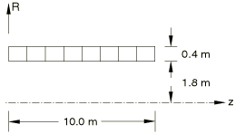
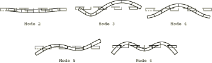

# 4.4.8 FV41：自由圆柱体：轴对称振动

**产品：** Abaqus/Standard  

### 测试单元

CAX4    CAX4I    CAX6    CAX6M    CAX8  

### 问题描述

**模型：**

壁厚 = 0.4 m。

**材料：**

弹性模量 = 200 GPa，泊松比 = 0.3，密度 = 8000 kg/m³。

**边界条件：**

无约束。

### 参考解

这是英国国家有限元方法与标准机构（NAFEMS）推荐的测试：NAFEMS出版物TNSB第3版"The Standard NAFEMS Benchmarks"（1990年10月）中的测试FV41。

### Abaqus预测的振型

### 结果与讨论

结果如下表所示。括号中的值是相对于参考解的百分比差异。

|  | 模态 |
| --- | --- |
| 1 | 2 | 3 | 4 | 5 | 6 |
| NAFEMS | 刚体模态 | 243.53 | 377.41 | 394.11 | 397.72 | 405.28 |
| CAX4 | 刚体模态 | 243.05 (0.20) | 368.41 (2.38) | 378.05 (4.08) | 384.00 (3.45) | 389.02 (4.01) |
| CAX4I | 刚体模态 | 243.17 (0.15) | 370.80 (1.75)) | 379.28 (3.76) | 385.92 (2.06) | 389.54 (3.88) |
| CAX6 | 刚体模态 | 243.50 (0.01) | 377.41 (0.00) | 394.26 (0.04) | 397.90 (0.05) | 406.42 (0.28) |
| CAX6M | 刚体模态 | 243.37 (0.07) | 376.19 (0.32) | 392.80 (0.33) | 394.48 (0.81) | 399.76 (1.36) |
| CAX8 | 刚体模态 | 243.50 (0.01) | 377.46 (0.01) | 394.30 (0.05) | 397.97 (0.06) | 406.44 (0.29) |

### 备注

与CAX6和CAX8单元类型相比，CAX4、CAX4I和CAX6M单元类型需要更细的网格来准确捕捉更高阶模态。

### 输入文件

[nfv41f4f.inp](../eif/nfv41f4f.inp)

CAX4单元。

[nfv41i4f.inp](../eif/nfv41i4f.inp)

CAX4I单元。

[nfv41f6f.inp](../eif/nfv41f6f.inp)

CAX6单元。

[nfv41m6f.inp](../eif/nfv41m6f.inp)

CAX6M单元。

[nfv41f8c.inp](../eif/nfv41f8c.inp)

CAX8单元。

