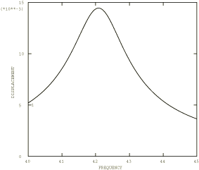

# 4.5.2 测试5H：深简支梁：谐波强迫振动

**产品：** Abaqus/Standard  

### 测试单元

B21    B22    B23    B31    B32    B33  

C3D4    C3D4H    C3D6    C3D6H    C3D8    C3D8H    C3D8I    C3D8R    C3D8RH  

C3D10    C3D10H    C3D10I    C3D10M    C3D10MH    C3D15    C3D15H    C3D15V    C3D15VH  

C3D20    C3D20H    C3D20R    C3D20RH    C3D27    C3D27H    C3D27R    C3D27RH  

### 问题描述

材料和规范与["测试5：深简支梁：频率提取，"第4.5.1节](ch04s05anf26.md)中给出的相同。

**激励函数：**

稳态谐波。

 

 1 MN/m，作用于梁全长。

 40至45 Hz

**阻尼：**

 2%

**响应：**

和极限纤维弯曲应力。

### 参考解

这是英国国家有限元方法与标准机构（NAFEMS）推荐的测试：NAFEMS"Selected Benchmarks for Forced Vibration"（R0016，1993年3月）中的测试5H。

### Abaqus预测的响应

### 结果与讨论

结果如表4.5.2-1和表4.5.2-2所示。括号中的值是相对于参考解的百分比差异。

**表4.5.2-1** 模态解。

|  | 峰值位移 (mm) | 峰值应力 (N/mm²) | 频率 (Hz) |
| --- | --- | --- | --- |
| 参考解 | 13.45 | 241.9 | 42.65 |
| B32 | 13.48 (0.22%) | 238.6 (1.36%) | 42.70 (0.12%) |

**表4.5.2-2** 直接解。

|  | 峰值位移 (mm) | 峰值应力 (N/mm²) | 频率 (Hz) |
| --- | --- | --- | --- |
| 参考解 | 13.45 | 241.9 | 42.65 |
| B21 | 13.87 (3.12%) | 247.83 (2.45%) | 42.63 (0.05%) |
| B22 | 13.97 (3.87%) | 249.25 (3.04%) | 42.63 (0.05%) |
| B23 | 12.19 (9.37%) | 243.46 (0.64%) | 45.33 (6.28%) |
| B31 | 13.99 (4.01%) | 248.08 (2.55%) | 42.68 (0.07%) |
| B32 | 13.98 (3.94%) | 249.25 (3.04%) | 42.63 (0.05%) |
| B33 | 12.19 (9.37%) | 243.46 (0.64%) | 45.33 (6.28%) |
| C3D4 | 12.89 (4.16%) | 235.83 (2.51%) | 43.06 (0.96%) |
| C3D4H | 12.89 (4.16%) | 235.23 (2.76%) | 43.06 (0.96%) |
| C3D6 | 11.43 (13.93%) | 204.56 (15.44%) | 45.76 (7.29%) |
| C3D6H | 11.43 (13.93%) | 204.08 (15.63%) | 45.76 (7.29%) |
| C3D8 | 13.54 (0.68%) | 214.94 (11.15%) | 42.55 (0.23%) |
| C3D8H | 13.54 (0.68%) | 214.93 (11.15%) | 42.55 (0.23%) |
| C3D8I | 13.00 (3.34%) | 235.82 (2.51%) | 42.65 (0%) |
| C3D8IH | 13.00 (3.34%) | 235.80 (2.52%) | 42.65 (0%) |
| C3D8R | 14.62 (8.70%) | 209.11 (13.56%) | 41.02 (3.82%) |
| C3D8RH | 14.62 (8.70%) | 209.01 (13.60%) | 41.02 (3.82%) |
| C3D10 | 13.13 (2.38%) | 243.66 (0.73%) | 42.75 (0.23%) |
| C3D10H | 14.12 (4.98%) | 238.68 (1.33%) | 41.43 (2.86%) |
| C3D10I | 13.13 (2.38%) | 242.29 (0.16%) | 42.76 (0.26%) |
| C3D10M | 13.66 (1.56%) | 259.82 (7.41%) | 41.94 (1.66%) |
| C3D10MH | 13.66 (1.56%) | 259.86 (7.42%) | 41.94 (1.66%) |
| C3D15 | 13.31 (1.04%) | 242.08 (0.07%) | 42.76 (0.26%) |
| C3D15V | 13.31 (1.04%) | 242.08 (0.07%) | 42.76 (0.26%) |
| C3D15VH | 13.30 (1.12%) | 244.53 (1.09%) | 42.76 (0.26%) |
| C3D15H | 13.31 (1.04%) | 241.35 (--0.23%) | 42.76 (0.26%) |
| C3D20 | 13.38 (0.52%) | 242.62 (0.30%) | 42.65 (0%) |
| C3D20H | 13.43 (0.15%) | 238.13 (--1.56%) | 42.55 (0.23%) |
| C3D20R | 13.51 (0.45%) | 237.53 (1.81%) | 42.45 (0.46%) |
| C3D20RH | 13.59 (1.04%) | 236.71 (2.15%) | 42.35 (0.70%) |
| C3D27 | 13.37 (0.59%) | 242.37 (0.19%) | 42.65 (0%) |
| C3D27H | 13.53 (0.59%) | 241.44 (0.19%) | 42.24 (0.96%) |
| C3D27R | 13.48 (0.22%) | 237.58 (1.79%) | 42.55 (0.23%) |
| C3D27RH | 13.77 (2.37%) | 241.11 (0.33%) | 42.04 (1.43%) |

### 输入文件

[nfh5x21x.inp](../eif/nfh5x21x.inp)

B21单元。

[nfh5x22x.inp](../eif/nfh5x22x.inp)

B22单元。

[nfh5x23x.inp](../eif/nfh5x23x.inp)

B23单元。

[nfh5x31x.inp](../eif/nfh5x31x.inp)

B31单元。

[nfh5x32x.inp](../eif/nfh5x32x.inp)

B32单元。

[nfh5x33x.inp](../eif/nfh5x33x.inp)

B33单元。

[nfh5xf4x.inp](../eif/nfh5xf4x.inp)

C3D4单元。

[nfh5xh4x.inp](../eif/nfh5xh4x.inp)

C3D4H单元。

[nfh5xf6x.inp](../eif/nfh5xf6x.inp)

C3D6单元。

[nfh5xh6x.inp](../eif/nfh5xh6x.inp)

C3D6H单元。

[nfh5xf8x.inp](../eif/nfh5xf8x.inp)

C3D8单元。

[nfh5xi8x.inp](../eif/nfh5xi8x.inp)

C3D8I单元。

[nfh5xj8x.inp](../eif/nfh5xj8x.inp)

C3D8IH单元。

[nfh5xr8x.inp](../eif/nfh5xr8x.inp)

C3D8R单元。

[nfh5xy8x.inp](../eif/nfh5xy8x.inp)

C3D8RH单元。

[nfh5xfax.inp](../eif/nfh5xfax.inp)

C3D10单元。

[nfh5xhax.inp](../eif/nfh5xhax.inp)

C3D10H单元。

[nfh5xiax.inp](../eif/nfh5xiax.inp)

C3D10I单元。

[nfh5xkax.inp](../eif/nfh5xkax.inp)

C3D10M单元。

[nfh5xlax.inp](../eif/nfh5xlax.inp)

C3D10MH单元。

[nfh5xffx.inp](../eif/nfh5xffx.inp)

C3D15单元。

[nfh5xffv.inp](../eif/nfh5xffv.inp)

C3D15V单元。

[nfh5xhfv.inp](../eif/nfh5xhfv.inp)

C3D15VH单元。

[nfh5xhfx.inp](../eif/nfh5xhfx.inp)

C3D15H单元。

[nfh5xfkx.inp](../eif/nfh5xfkx.inp)

C3D20单元。

[nfh5xhkx.inp](../eif/nfh5xhkx.inp)

C3D20H单元。

[nfh5xrkx.inp](../eif/nfh5xrkx.inp)

C3D20R单元。

[nfh5xykx.inp](../eif/nfh5xykx.inp)

C3D20RH单元。

[nfh5xfrv.inp](../eif/nfh5xfrv.inp)

C3D27单元。

[nfh5xhrv.inp](../eif/nfh5xhrv.inp)

C3D27H单元。

[nfh5xrrv.inp](../eif/nfh5xrrv.inp)

C3D27R单元。

[nfh5xyrv.inp](../eif/nfh5xyrv.inp)

C3D27RH单元。

