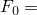
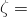
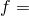
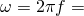
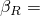
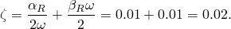
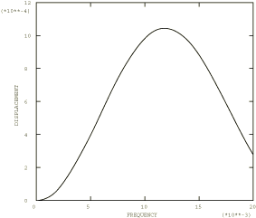
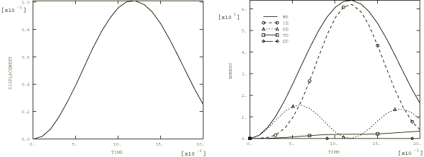
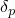
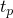

# 4.5.3 测试5T：深简支梁：瞬态强迫振动

**产品：** Abaqus/Standard  Abaqus/Explicit  

### 测试单元

B21    B22    B31    B32  

### 问题描述

材料和规范与["测试5：深简支梁：频率提取，"第4.5.1节](ch04s05anf26.md)中给出的相同。

**网格：**

在Abaqus/Explicit分析中测试粗网格和细网格。

**激励函数：**

突然施加的步进载荷，垂直于梁。

 1 MN/m，作用于梁全长。

**阻尼：**

 2%[主导第一模态下临界阻尼的2%，解析频率值 = 42.650 (Hz)或 = 267.98 (sec⁻¹)]。

阻尼因子选择为 = 5.36 (sec⁻¹)和 = 7.46×10⁵ (sec)，使得

**响应：**

和极限纤维弯曲应力。

### 参考解

这是英国国家有限元方法与标准机构（NAFEMS）推荐的测试：NAFEMS"Selected Benchmarks for Forced Vibration"（R0016，1993年3月）中的测试5T。

### Abaqus/Standard预测的响应

### Abaqus/Explicit预测的响应

### 结果与讨论

结果如表4.5.3-1至表4.5.3-5所示。括号中的值是相对于参考解的百分比差异。静位移是通过运行第二步分析获得的，时间周期为10秒。

**表4.5.3-1** 单元类型：B21，Abaqus/Explicit分析。

|  | 峰值位移 | 峰值应力 | 静位移 |
| --- | --- | --- | --- |
|  (mm) |  (sec) |  (N/mm²) |  (mm) |
| 参考解 | 1.043 | 0.0117 | 18.76 | 0.538 |
| 粗网格 | 0.991 | 0.0120 | 17.35 | 0.510 |
| (4.99%) | (2.56%) | (7.52%) | (5.20%) |
| 细网格 | 1.009 | 0.0120 | 18.04 | 0.520 |
| (3.24%) | (2.56%) | (3.84%) | (3.35%) |

**表4.5.3-2** 单元类型：B22，Abaqus/Explicit分析。

|  | 峰值位移 | 峰值应力 | 静位移 |
| --- | --- | --- | --- |
|  (mm) |  (sec) |  (N/mm²) |  (mm) |
| 参考解 | 1.043 | 0.0117 | 18.76 | 0.538 |
| 粗网格 | 1.042 | 0.0119 | 17.80 | 0.532 |
| (0.09%) | (1.70%) | (5.12%) | (1.12%) |
| 细网格 | 1.043 | 0.0116 | 18.17 | 0.537 |
| (0.00%) | (0.85%) | (3.14%) | (0.19%) |

**表4.5.3-3** 单元类型：B31，Abaqus/Explicit分析。

|  | 峰值位移 | 峰值应力 | 静位移 |
| --- | --- | --- | --- |
|  (mm) |  (sec) |  (N/mm²) |  (mm) |
| 参考解 | 1.043 | 0.0117 | 18.76 | 0.538 |
| 粗网格 | 0.991 | 0.0120 | 17.37 | 0.510 |
| (4.99%) | (2.56%) | (7.41%) | (5.20%) |
| 细网格 | 1.010 | 0.0120 | 18.06 | 0.518 |
| (3.16%) | (2.56%) | (3.73%) | (3.72%) |

**表4.5.3-4** 单元类型：B32，Abaqus/Explicit分析。

|  | 峰值位移 | 峰值应力 | 静位移 |
| --- | --- | --- | --- |
|  (mm) |  (sec) |  (N/mm²) |  (mm) |
| 参考解 | 1.043 | 0.0117 | 18.76 | 0.538 |
| 粗网格 | 1.042 | 0.0117 | 17.80 | 0.535 |
| (0.09%) | (0.00%) | (5.11%) | (0.56%) |
| 细网格 | 1.043 | 0.0116 | 18.17 | 0.539 |
| (0.00%) | (0.85%) | (3.14%) | (0.19%) |

**表4.5.3-5** 单元类型：B32，Abaqus/Standard分析。

|  | 峰值位移 | 峰值应力 | 静位移 |
| --- | --- | --- | --- |
|  (mm) |  (sec) |  (N/mm²) |  (mm) |
| 参考解 | 1.043 | 0.0117 | 18.76 | 0.538 |
| 直接解 | 1.043 | 0.0118 | 18.29 | 0.536 |
|  | (0.85%) | (2.50%) | (0.37%) |
| 模态解 | 1.041 | 0.0116 | 18.09 | 0.507 |
| (0.19%) | (0.85%) | (5.57%) | (5.76%) |

### 输入文件

##### **Abaqus/Standard输入文件**

[nft5x32x.inp](../eif/nft5x32x.inp)

B32单元。

Abaqus/Standard中的模态解来自[nfm5x32x.inp](../eif/nfm5x32x.inp)中的步骤3和4。

##### **Abaqus/Explicit输入文件**

[fv5t_b21_c.inp](../eif/fv5t_b21_c.inp)

B21单元，粗网格。

[fv5t_b21_f.inp](../eif/fv5t_b21_f.inp)

B21单元，细网格。

[fv5t_b22_c.inp](../eif/fv5t_b22_c.inp)

B22单元，粗网格。

[fv5t_b22_f.inp](../eif/fv5t_b22_f.inp)

B22单元，细网格。

[fv5t_b31_c.inp](../eif/fv5t_b31_c.inp)

B31单元，粗网格。

[fv5t_b31_f.inp](../eif/fv5t_b31_f.inp)

B31单元，细网格。

[fv5t_b32_c.inp](../eif/fv5t_b32_c.inp)

B32单元，粗网格。

[fv5t_b32_f.inp](../eif/fv5t_b32_f.inp)

B32单元，细网格。

