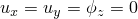
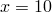
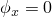
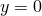
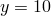
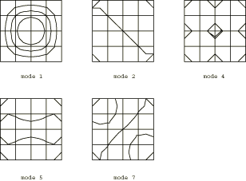

# 4.5.5 测试13：简支薄方形板：频率提取

**产品：** Abaqus/Standard  

### 测试单元

S8R5

### 问题描述

**模型：**

板厚度 = 0.05 m。

**材料：**

弹性模量 = 200 GPa，泊松比 = 0.3，密度 = 8000 kg/m³。

**边界条件：**

在所有节点处 = 0。沿所有四条边缘 = 0。沿边缘和施加 = 0，沿边缘和施加 = 0。

在步骤1中执行频率提取。

### 参考解

这是英国国家有限元方法与标准机构（NAFEMS）推荐的测试：NAFEMS"Selected Benchmarks for Forced Vibration"（R0016，1993年3月）中的测试13。

### Abaqus预测的振型

等值线图是通过将最大和最小等值线水平设置接近于零来生成的。当等值线水平与单元边界重合时，适当增加最大等值线水平并减小最小等值线水平。

### 结果与讨论

结果如下表所示。

| 模态 | Abaqus结果 | NAFEMS参考结果 | 差异% |
| --- | --- | --- | --- |
| 1 | 2.377 | 2.377 | 0.00 |
| 2, 3 | 5.961 | 5.942 | 0.32 |
| 4 | 9.483 | 9.507 | 0.25 |
| 5, 6 | 12.133 | 11.884 | 2.10 |
| 7, 8 | 15.468 | 15.449 | 0.12 |

### 输入文件

[nfm1358x.inp](../eif/nfm1358x.inp)

S8R5单元。

