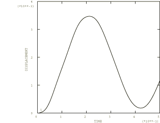
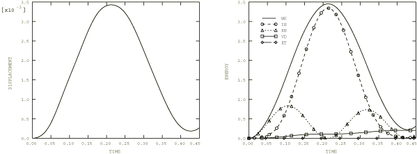

# 4.5.7 测试13T：简支薄方形板：瞬态强迫振动

**产品：** Abaqus/Standard  Abaqus/Explicit  

### 测试单元

S3R    S3RS    S4R    S4RS    S4RSW    S8R5    

### 问题描述

材料和规范与["测试13：简支薄方形板：频率提取，"第4.5.5节](ch04s05anf30.md)中给出的相同。

**网格：**

在Abaqus/Explicit中对S3R、S3RS、S4R、S4RS和S4RSW单元测试四分之一板的粗网格、细网格和极细网格。对于四边形单元类型，粗网格、细网格和极细网格的网格密度分别为2×2、3×3和4×4；对于三角形单元类型，网格密度分别为2×2×4、3×3×4和4×4×4。

**激励函数：**

突然施加的压力。

 100 N/m²，作用于全板。

**阻尼：**

 2%[主导第一模态下临界阻尼的2%，解析频率值 2.377 (Hz)或 14.935 (sec⁻¹)]。

阻尼因子选择为 0.299 (sec⁻¹)和 1.339×10³ (sec)，使得

**响应位置：**

板中心处的和。

在输入文件[nft1358x.inp](../eif/nft1358x.inp)中，壳截面使用高斯积分。

### 参考解

这是英国国家有限元方法与标准机构（NAFEMS）推荐的测试：NAFEMS"Selected Benchmarks for Forced Vibration"（R0016，1993年3月）中的测试13T。

### Abaqus/Standard预测的响应

### Abaqus/Explicit预测的响应

### 结果与讨论

结果如表4.5.7-1至表4.5.7-6所示。括号中的值是相对于参考解的百分比差异。静位移是通过创建时间周期为23秒的第二步分析获得的。

**表4.5.7-1** 单元类型：S3R，Abaqus/Explicit分析。
|  | 峰值位移 | 峰值应力 | 静位移 |
| --- | --- | --- | --- |
|  (mm) |  (sec) |  (N/mm²) |  (mm) |
| 参考解 | 3.523 | 0.210 | 2.484 | 1.817 |
| 粗网格 | 3.147 | 0.210 | 2.079 | 1.616 |
| (10.67%) | (0.0%) | (16.30%) | (11.06%) |
| 细网格 | 3.313 | 0.210 | 2.207 | 1.701 |
| (5.96%) | (0.0%) | (11.15%) | (6.38%) |
| 极细网格 | 3.370 | 0.210 | 2.239 | 1.732 |
| (4.34%) | (0.0%) | (9.86%) | (4.68%) |

**表4.5.7-2** 单元类型：S3RS，Abaqus/Explicit分析。
|  | 峰值位移 | 峰值应力 | 静位移 |
| --- | --- | --- | --- |
|  (mm) |  (sec) |  (N/mm²) |  (mm) |
| 参考解 | 3.523 | 0.210 | 2.484 | 1.817 |
| 粗网格 | 3.263 | 0.210 | 2.028 | 1.679 |
| (7.38%) | (0.0%) | (18.36%) | (7.59%) |
| 细网格 | 3.391 | 0.210 | 2.188 | 1.742 |
| (3.75%) | (0.0% | (11.92%) | (4.13%) |
| 极细网格 | 3.429 | 0.210 | 2.244 | 1.762 |
| (2.67%) | (0.0%) | (9.66%) | (3.01%) |

**表4.5.7-3** 单元类型：S4R，Abaqus/Explicit分析。
|  | 峰值位移 | 峰值应力 | 静位移 |
| --- | --- | --- | --- |
|  (mm) |  (sec) |  (N/mm²) |  (mm) |
| 参考解 | 3.523 | 0.210 | 2.484 | 1.817 |
| 粗网格 | 3.366 | 0.225 | 1.889 | 1.760 |
| (4.46%) | (7.14%) | (23.95%) | (3.14%) |
| 细网格 | 3.414 | 0.215 | 2.105 | 1.756 |
| (3.09%) | (2.38%) | (15.26%) | (3.36%) |
| 极细网格 | 3.427 | 0.215 | 2.186 | 1.762 |
| (2.72%) | (2.38%) | (12.00%) | (3.03%) |

**表4.5.7-4** 单元类型：S4RS，Abaqus/Explicit分析。
|  | 峰值位移 | 峰值应力 | 静位移 |
| --- | --- | --- | --- |
|  (mm) |  (sec) |  (N/mm²) |  (mm) |
| 参考解 | 3.523 | 0.210 | 2.484 | 1.817 |
| 粗网格 | 3.495 | 0.240 | 1.974 | 1.797 |
| (0.79%) | (14.3%) | (20.53%) | (1.1%) |
| 细网格 | 3.477 | 0.220 | 2.185 | 1.783 |
| (1.31%) | (4.8%) | (12.04%) | (1.87%) |
| 极细网格 | 3.461 | 0.215 | 2.236 | 1.785 |
| (1.76%) | (2.4%) | (9.98%) | (1.76%) |

**表4.5.7-5** 单元类型：S4RSW，Abaqus/Explicit分析。
|  | 峰值位移 | 峰值应力 | 静位移 |
| --- | --- | --- | --- |
|  (mm) |  (sec) |  (N/mm²) |  (mm) |
| 参考解 | 3.523 | 0.210 | 2.484 | 1.817 |
| 粗网格 | 2.486 | 0.205 | 1.400 | 1.759 |
| (29.44%) | (2.4%) | (43.64%) | (3.19%) |
| 细网格 | 3.254 | 0.215 | 2.015 | 1.759 |
| (7.64%) | (2.4%) | (18.88%) | (3.19%) |
| 极细网格 | 3.395 | 0.215 | 2.181 | 1.774 |
| (3.63%) | (2.4%) | (12.20%) | (2.24%) |

**表4.5.7-6** 单元类型：S8R5，Abaqus/Standard分析。
|  | 峰值位移 | 峰值应力 | 静位移 |
| --- | --- | --- | --- |
|  |  (mm) |  (sec) |  (N/mm²) |  (mm) |
| 参考解 | 3.523 | 0.210 | 2.484 | 1.817 |
| 直接解 | 3.467 (1.59%) | 0.212 (0.95%) | 2.476 (2.50%) | 1.780 (2.04%) |
| 模态解 | 3.456 (1.93%) | 0.214 (1.90%) | 2.426 (2.33%) | 1.775 (2.37%) |

### 输入文件

[fv13t_s3r_c.inp](../eif/fv13t_s3r_c.inp)

S3R单元，粗网格。

[fv13t_s3r_f.inp](../eif/fv13t_s3r_f.inp)

S3R单元，细网格。

[fv13t_s3r_vf.inp](../eif/fv13t_s3r_vf.inp)

S3R单元，极细网格。

[fv13t_s3rs_c.inp](../eif/fv13t_s3rs_c.inp)

S3RS单元，粗网格。

[fv13t_s3rs_f.inp](../eif/fv13t_s3rs_f.inp)

S3RS单元，细网格。

[fv13t_s3rs_vf.inp](../eif/fv13t_s3rs_vf.inp)

S3RS单元，极细网格。

[fv13t_s4r_c.inp](../eif/fv13t_s4r_c.inp)

S4R单元，粗网格。

[fv13t_s4r_f.inp](../eif/fv13t_s4r_f.inp)

S4R单元，细网格。

[fv13t_s4r_vf.inp](../eif/fv13t_s4r_vf.inp)

S4R单元，极细网格。

[fv13t_s4rs_c.inp](../eif/fv13t_s4rs_c.inp)

S4RS单元，粗网格。

[fv13t_s4rs_f.inp](../eif/fv13t_s4rs_f.inp)

S4RS单元，细网格。

[fv13t_s4rs_vf.inp](../eif/fv13t_s4rs_vf.inp)

S4RS单元，极细网格。

[fv13t_s4rsw_c.inp](../eif/fv13t_s4rsw_c.inp)

S4RSW单元，粗网格。

[fv13t_s4rsw_f.inp](../eif/fv13t_s4rsw_f.inp)

S4RSW单元，细网格。

[fv13t_s4rsw_vf.inp](../eif/fv13t_s4rsw_vf.inp)

S4RSW单元，极细网格。

[nft1358x.inp](../eif/nft1358x.inp)

S8R5单元。

Abaqus/Standard中的模态解来自步骤3和步骤4（见[nfm1358x.inp](../eif/nfm1358x.inp)）。

