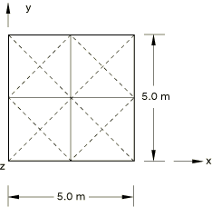
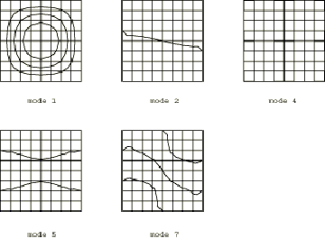

# 4.5.9 测试21：简支厚方形板：频率提取

**产品：** Abaqus/Standard  

### 测试单元

S4    S4R    S4R5    S8R  

### 问题描述

**模型：**

板厚度 = 0.05 m。

**材料：**

弹性模量 = 200 GPa，泊松比 = 0.3，密度 = 8000 kg/m³。

**边界条件：**

在所有节点处 = 0。沿所有四条边缘 = 0。沿边缘和施加 = 0，沿边缘和施加 = 0。

在步骤1中执行频率提取。

### 参考解

这是英国国家有限元方法与标准机构（NAFEMS）推荐的测试：NAFEMS"Selected Benchmarks for Forced Vibration"（R0016，1993年3月）中的测试21。

### Abaqus预测的振型（对于S4R5单元）

等值线图是通过将最大和最小等值线水平设置接近于零来生成的。当等值线水平与单元边界重合时，适当增加最大等值线水平并减小最小等值线水平。

### 结果与讨论

结果如表4.5.9-1至表4.5.9-4所示。

**表4.5.9-1** 单元类型：S4。

| 模态 | Abaqus结果 | NAFEMS参考结果 | % 差异 |
| --- | --- | --- | --- |
| 1 | 46.667 | 45.897 | 1.68 |
| 2, 3 | 115.92 | 109.41 | 5.95 |
| 4 | 178.00 | 167.89 | 6.02 |
| 5, 6 | 233.73 | 204.51 | 14.28 |
| 7, 8 | 285.20 | 256.50 | 11.19 |

**表4.5.9-2** 单元类型：S4R。

| 模态 | Abaqus结果 | NAFEMS参考结果 | % 差异 |
| --- | --- | --- | --- |
| 1 | 46.485 | 45.897 | 1.28 |
| 2, 3 | 115.24 | 109.41 | 5.33 |
| 4 | 175.47 | 167.89 | 4.51 |
| 5, 6 | 232.39 | 204.51 | 13.63 |
| 7, 8 | 280.08 | 256.50 | 9.19 |

**表4.5.9-3** 单元类型：S4R5。

| 模态 | Abaqus结果 | NAFEMS参考结果 | % 差异 |
| --- | --- | --- | --- |
| 1 | 46.514 | 45.897 | 1.34 |
| 2, 3 | 115.55 | 109.41 | 5.61 |
| 4 | 177.26 | 167.89 | 5.29 |
| 5, 6 | 233.66 | 204.51 | 14.25 |
| 7, 8 | 285.99 | 256.50 | 11.48 |

**表4.5.9-4** 单元类型：S8R。

| 模态 | Abaqus结果 | NAFEMS参考结果 | % 差异 |
| --- | --- | --- | --- |
| 1 | 45.936 | 45.897 | 0.08 |
| 2, 3 | 110.41 | 109.41 | 0.91 |
| 4 | 170.38 | 167.89 | 1.48 |
| 5, 6 | 212.81 | 204.51 | 4.06 |
| 7, 8 | 269.96 | 256.50 | 5.25 |

### 输入文件

[nfm21e4x.inp](../eif/nfm21e4x.inp)

S4单元。

[nfm21f4x.inp](../eif/nfm21f4x.inp)

S4R单元。

[nfm2154x.inp](../eif/nfm2154x.inp)

S4R5单元。

[nfm2168x.inp](../eif/nfm2168x.inp)

S8R单元。

