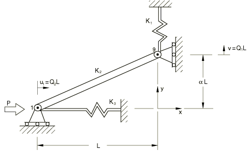

# 4.6.3 NL3：载荷控制下具有两个变量的硬化

**产品：** Abaqus/Standard  

### 测试单元

T2D2

### 问题描述

**模型：**

AE = 5.0×10⁷，L = 2500，L = 25，K1 = 1.5，K2 = AE/L(1 + )^(1/2) = 19999.0，K3 = 2.0。

**边界条件：**

在节点1处， = 0；在节点9处， = 0。

**载荷：**

载荷沿x方向施加到节点1。

### 参考解

这是英国国家有限元方法与标准机构（NAFEMS）推荐的测试：NAFEMS出版物NNB，Rev. 1"NAFEMS Non-Linear Benchmarks"（1989年10月）中的测试NL3。

| 步骤 | P |  | v |
| --- | --- | --- | --- |
| 1 | 1100 | 0.1803 | 10.37 |
| 2 | 2200 | 0.7160 | 35.45 |
| 3 | 3300 | 8.515 | 180.7 |
| 4 | 4400 | 1339 | 2189 |
| 5 | 5500 | 3468 | 2280 |
| 6 | 6600 | 4986 | 236.3 |

### 结果与讨论

结果如下表所示。括号中的值是相对于参考解的百分比差异。

| 步骤 | P |  | v |
| --- | --- | --- | --- |
| 1 | 1100 | 0.1802 (0.06%) | 10.37 (0.0%) |
| 2 | 2200 | 0.7157 (0.0%) | 35.44 (0.03%) |
| 3 | 3300 | 8.564 (+0.58%) | 181.3 (+0.33%) |
| 4 | 4400 | 1339 (0.0%) | 2189 (0.0%) |
| 5 | 5500 | 3469 (+0.03%) | 2280 (0.0%) |
| 6 | 6600 | 4985 (0.02%) | 244.7 (+3.55%) |

### 输入文件

[nnl3xf2x.inp](../eif/nnl3xf2x.inp)

T2D2单元。

