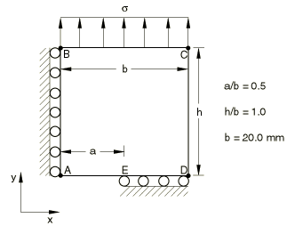
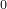

# 4.7.1 测试1.1：受拉中心裂纹板

**产品：** Abaqus/Standard  

### 测试单元

CPE8    CPE8R    

### 问题描述

**网格：**

在裂纹尖端使用带有1/4点中间节点的收缩单元。建模了测试几何体的四分之一。测试了粗网格和细网格。

**材料：**

弹性模量 = 207 GPa，泊松比 = 0.3。

**边界条件：**

沿AB边施加，沿DE边施加。

**载荷：**

均匀应力， = 100 N/mm²。

### 参考解

这是英国国家有限元方法与标准机构（NAFEMS）推荐的测试：NAFEMS出版物"2D Test Cases in Linear Elastic Fracture Mechanics"，R0020中的测试1.1。

目标解：K/K = 1.325，K = 

### 结果与讨论

结果如下表所示。括号中的值是相对于参考解的百分比差异。

| 单元类型 | K/K (粗) | K/K (细) |
| --- | --- | --- |
| CPE8 | 1.325 (0.0%) | 1.333 (+0.63%) |
| CPE8R | 1.329 (+0.3%) | 1.334 (+0.63%) |

### 备注

K = 。报告中使用了Abaqus计算的J值的平均值，不包括第一个轮廓。经验表明，裂纹尖端单元没有给出足够准确的结果，无法为第一个轮廓的J积分提供良好的估计。

### 输入文件

[nlf11f8c.inp](../eif/nlf11f8c.inp)

CPE8单元，粗网格。

[nlf11f8f.inp](../eif/nlf11f8f.inp)

CPE8单元，细网格。

[nlf11r8c.inp](../eif/nlf11r8c.inp)

CPE8R单元，粗网格。

[nlf11r8f.inp](../eif/nlf11r8f.inp)

CPE8R单元，细网格。

