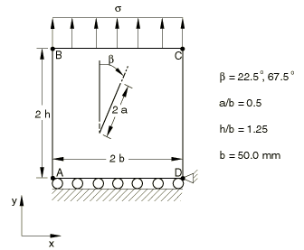
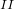
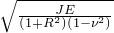
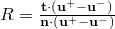

# 4.7.4 测试3：嵌入板中的角度裂纹

**产品：** Abaqus/Standard  

### 测试单元

CPE8    CPE8R    

### 问题描述

**网格：**

在裂纹尖端使用带有1/4点中间节点的收缩单元。建模了完整的测试几何体。

**材料：**

弹性模量 = 207 GPa，泊松比 = 0.3。

**边界条件：**

沿AD边施加，在D点施加。

**载荷：**

均匀应力， = 100 N/mm²。

### 参考解

这是英国国家有限元方法与标准机构（NAFEMS）推荐的测试：NAFEMS出版物"2D Test Cases in Linear Elastic Fracture Mechanics"，R0020中的测试3.1和3.2。

目标解（ = 22.5°）：K/K = 0.190，K/K = 0.405，K = 

目标解（ = 67.5°）：K/K = 1.030，K/K = 0.370，K = 

### 结果与讨论

结果如下表所示。括号中的值是相对于参考解的百分比差异。

|  | 单元类型 | K/K | K/K |
| --- | --- | --- | --- |
| 22.5 | CPE8 | 0.185 (2.9%) | 0.405 (+0.1%) |
| 22.5 | CPE8R | 0.184 (2.9%) | 0.407 (+0.4%) |
| 67.5 | CPE8 | 1.035 (+0.2%) | 0.364 (1.7%) |
| 67.5 | CPE8R | 1.038 (+0.8%) | 0.368 (0.5%) |

### 备注

K = ，K = RK，。

报告中使用了Abaqus计算的J值的平均值，不包括第一个轮廓。经验表明，裂纹尖端单元没有给出足够准确的结果，无法为第一个轮廓的J积分提供良好的估计。和分别是裂纹正面和负面节点在未变形状态下最初位于相同位置的位移。计算中使用了基于裂纹尖端后面（不包括尖端）前五个节点位置的平均值R。和分别是裂纹扩展方向的切线和法线。

### 输入文件

[nlf31f8x.inp](../eif/nlf31f8x.inp)

CPE8单元，测试3.1。

[nlf31r8x.inp](../eif/nlf31r8x.inp)

CPE8R单元，测试3.1。

[nlf32f8x.inp](../eif/nlf32f8x.inp)

CPE8单元，测试3.2。

[nlf32r8x.inp](../eif/nlf32r8x.inp)

CPE8R单元，测试3.2。

