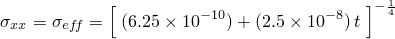
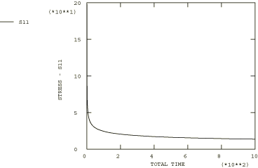

# 4.8.2 测试1B：2D平面应力——单轴位移，二次蠕变

### 4.8.2 测试1B：2D平面应力——单轴位移，二次蠕变

**产品：** Abaqus/Standard  

### 测试单元

CPS8R

### 问题描述

**材料：**

弹性模量 = 200×10³ N/mm²，泊松比 = 0.3，蠕变定律： = A，A = 3.125×10⁻¹⁴/小时（单位为N/mm²），n = 5。

**边界条件：**

在AD线上施加，在AD线的中点施加，在BC线上施加。

### 参考解

这是英国国家有限元方法与标准机构（NAFEMS）推荐的测试：NAFEMS出版物Ref: R0027"NAFEMS Fundamental Tests of Creep Behaviour"（1993年6月）中的测试1(b)。

### 结果与讨论

结果如下表所示。括号中的值是相对于参考解的百分比差异。

| Abaqus结果 |
| --- |
| t |  |
| 0.00 | 200.00 (0.00%) |
| 0.1359 | 127.35 (1.41%) |
| 1.2918 | 75.71(1.98%) |
| 6.3455 | 51.27 (2.42%) |
| 48.736 | 30.94 (2.80%) |
| 372.67 | 18.71 (3.38%) |
| 1000.00 | 14.67 (3.75%) |

### 备注

此测试的总蠕变时间为1000小时。上表中列出的时间是由Abaqus自动时间步长算法计算的时间，CETOL = 5×10⁻⁶。

### 输入文件

[ncr1br8x.inp](../eif/ncr1br8x.inp)

CPS8R单元。

