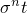
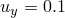
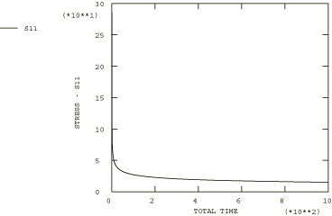

# 4.8.4 测试2B：2D平面应力——双轴位移，二次蠕变

### 4.8.4 测试2B：2D平面应力——双轴位移，二次蠕变

**产品：** Abaqus/Standard  

### 测试单元

CPS8R

### 问题描述

**材料：**

弹性模量 = 200×10³ N/mm²，泊松比 = 0.3，蠕变定律： = A，A = 3.125×10⁻¹⁴/小时（单位为N/mm²），n = 5。

**边界条件：**

在AD线上施加，在AD线上施加，在BC线上施加，在CD线上施加。

### 参考解

这是英国国家有限元方法与标准机构（NAFEMS）推荐的测试：NAFEMS出版物Ref: R0027"NAFEMS Fundamental Tests of Creep Behaviour"（1993年6月）中的测试2(b)。

NAFEMS出版物附录B中提供的时间步进程序可用于获得应力随时间的变化。

### 结果与讨论

结果如下表所示。括号中的值是相对于参考解的百分比差异。

| Abaqus结果 |
| --- |
| t |  |
| 0.00 | 285.71 (0.00%) |
| 0.13 | 138.46 (0.74%) |
| 5.31 | 55.40 (1.34%) |
| 15.80 | 42.15 (0.52%) |
| 74.52 | 28.42 (0.04%) |
| 544.28 | 17.05 (1.69%) |
| 1000.00 | 14.68 (2.56%) |

### 备注

此测试的总蠕变时间为1000小时。上表中列出的时间是由Abaqus自动时间步长算法计算的时间，CETOL = 1×10⁻⁵。

### 输入文件

[ncr2br8x.inp](../eif/ncr2br8x.inp)

CPS8R单元。

