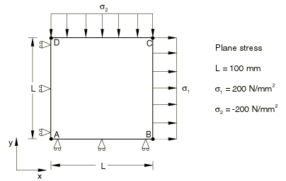
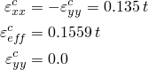
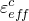
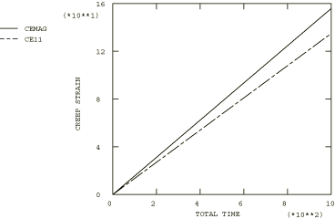

# 4.8.5 测试3A：2D平面应力——双轴（负）载荷，二次蠕变

### 4.8.5 测试3A：2D平面应力——双轴（负）载荷，二次蠕变

**产品：** Abaqus/Standard  

### 测试单元

CPS8R

### 问题描述

**材料：**

弹性模量 = 200×10³ N/mm²，泊松比 = 0.3，蠕变定律： = A，A = 3.125×10⁻¹⁴/小时（单位为N/mm²），n = 5。

**边界条件：**

在AD线上施加，在AB线上施加。

**载荷：**

在BC线上规定拉伸应力 = 200 N/mm²，在CD线上规定拉伸应力 = 200 N/mm²。

### 参考解

这是英国国家有限元方法与标准机构（NAFEMS）推荐的测试：NAFEMS出版物Ref: R0027"NAFEMS Fundamental Tests of Creep Behaviour"（1993年6月）中的测试3(a)。

### 结果与讨论

结果如下表所示。括号中的值是相对于参考解的百分比差异。

| Abaqus结果 |
| --- |
| t |  |  |
| 0.00 | 0.000 (0.00%) | 0.000 (0.00%) |
| 1.05 | 0.142 (0.00%) | 0.163 (0.01%) |
| 16.78 | 2.265 (0.00%) | 2.615 (0.01%) |
| 67.11 | 9.060 (0.00%) | 10.461 (0.01%) |
| 134.22 | 18.120 (0.00%) | 20.92 (0.01%) |
| 536.87 | 72.478 (0.00%) | 83.690 (0.01%) |
| 1000.00 | 135.000 (0.00%) | 155.880 (0.01%) |

### 备注

此测试的总蠕变时间为1000小时。上表中列出的时间是由Abaqus自动时间步长算法计算的时间，CETOL = 5×10⁻⁴。

### 输入文件

[ncr3ar8x.inp](../eif/ncr3ar8x.inp)

CPS8R单元。

