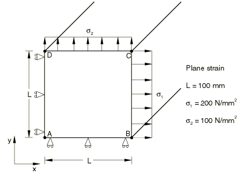
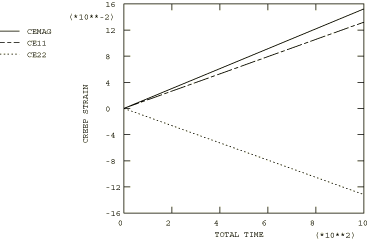

# 4.8.10 测试5A：2D平面应变——双轴载荷，二次蠕变

### 4.8.10 测试5A：2D平面应变——双轴载荷，二次蠕变

**产品：** Abaqus/Standard  

### 测试单元

CPE8R

### 问题描述

**材料：**

弹性模量 = 200×10³ N/mm²，泊松比 = 0.3，蠕变定律： = A，A = 3.125×10⁻¹⁴/小时（单位为N/mm²），n = 5。

**边界条件：**

在AD线上施加，在AB线上施加。

**载荷：**

在BC线上规定拉伸应力 = 200 N/mm²，在CD线上规定 = 100 N/mm²。

### 参考解

这是英国国家有限元方法与标准机构（NAFEMS）推荐的测试：NAFEMS出版物Ref: R0027"NAFEMS Fundamental Tests of Creep Behaviour"（1993年6月）中的测试5(a)。

NAFEMS出版物附录A中提供的时间步进程序可用于获得应力随时间的变化。

### 结果与讨论

结果如下表所示。括号中的值是相对于参考解的百分比差异。

| Abaqus结果 |
| --- |
| t |  |  |
| 0.00 | 0.0000 (0.00%) | 0.0000 (0.00%) |
| 8.46 | 0.0014 (1.04%) | 0.0010 (0.60%) |
| 43.01 | 0.0059 (0.17%) | 0.0056 (0.19%) |
| 107.58 | 0.0145 (0.08%) | 0.0142 (0.09%) |
| 365.86 | 0.0485 (0.02%) | 0.0482 (0.02%) |
| 710.23 | 0.0939 (0.00%) | 0.0936 (0.00%) |
| 1000.00 | 0.1321 (0.00%) | 0.1318 (0.00%) |

### 备注

此测试的总蠕变时间为1000小时。上表中列出的时间是由Abaqus自动时间步长算法计算的时间，CETOL = 5×10⁻⁴。

### 输入文件

[ncr5ar8x.inp](../eif/ncr5ar8x.inp)

CPE8R单元。

