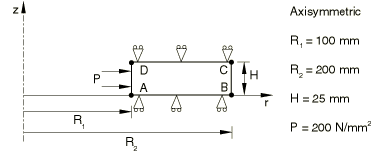
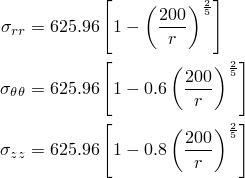
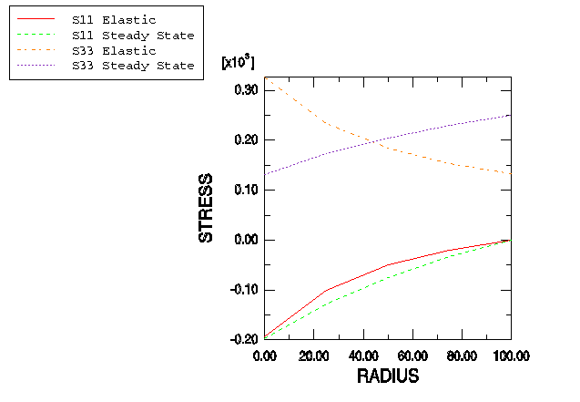
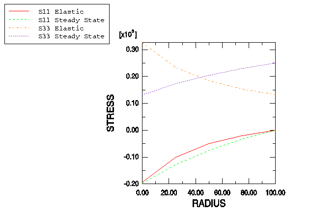

# 4.8.14 测试7：轴对称——加压圆柱筒，二次蠕变

### 4.8.14 测试7：轴对称——加压圆柱筒，二次蠕变

**产品：** Abaqus/Standard  

### 测试单元

CAX8R    CCL24R    

### 问题描述

**材料：**

弹性模量 = 200×10³ N/mm²，泊松比 = 0.3，蠕变定律： = A，A = 3.125×10⁻¹⁴/小时（单位为N/mm²），n = 5。

**边界条件：**

在AB线上施加，在CD线上施加。

**载荷：**

在AD线上规定压力 P = 200 N/mm²。

### 参考解

这是英国国家有限元方法与标准机构（NAFEMS）推荐的测试：NAFEMS出版物Ref: R0027"NAFEMS Fundamental Tests of Creep Behaviour"（1993年6月）中的测试7。

### 结果与讨论

结果如下表所示。括号中的值是相对于参考解的百分比差异。每个表格后面的图形给出了圆柱厚度方向上不同应力的表示。

| CAX8R单元的Abaqus结果 |
| --- |
| 半径 |  |  |
|  | （稳态） | （稳态） |
| 100.0 | 197.95 (1.02%) | 131.68 (1.00%) |
| 125.0 | 128.03 (1.11%) | 173.55 (0.49%) |
| 150.0 | 75.416 (1.21%) | 205.12 (0.27%) |
| 175.0 | 33.708 (1.84%) | 230.15 (0.16%) |
| 200.0 | 0.499 | 250.67 (0.11%) |

| CCL24R单元的Abaqus结果 |
| --- |
| 半径 |  |  |
|  | （稳态） | （稳态） |
| 100.0 | 197.95 (1.02%) | 130.38 (1.00%) |
| 125.0 | 128.03 (1.11%) | 172.70 (0.49%) |
| 150.0 | 75.417 (1.21%) | 204.12 (0.26%) |
| 175.0 | 33.707 (1.85%) | 230.15 (0.16%) |
| 200.0 | 0.505 | 250.67 (0.11%) |

### 备注

此测试的总蠕变时间为1000小时。在使用CAX8R单元的情况下，建模圆柱筒使用了四个单元。在使用CCL24R单元的情况下，径向使用四个单元，周向使用八个单元建模完整的圆柱筒；即总共32个单元。

### 输入文件

[ncr7xr8x.inp](../eif/ncr7xr8x.inp)

CAX8R单元。

[ncr7xrccl24.inp](../eif/ncr7xrccl24.inp)

CCL24R单元。

