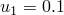
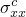
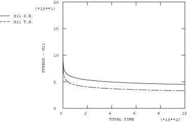

# 4.8.16 测试8B：2D平面应力——单轴位移，一次蠕变

### 4.8.16 测试8B：2D平面应力——单轴位移，一次蠕变

**产品：** Abaqus/Standard  

### 测试单元

CPS8R

### 问题描述

**材料：**

弹性模量 = 200×10³ N/mm²，泊松比 = 0.3，蠕变定律： = A，A = 3.125×10⁻¹⁴/小时（单位为N/mm²），n = 5，m = 0.5。

**边界条件：**

在AD线上施加，在AD线的中点施加，在BC线上施加。

### 参考解

这是英国国家有限元方法与标准机构（NAFEMS）推荐的测试：NAFEMS出版物Ref: R0027"NAFEMS Fundamental Tests of Creep Behaviour"（1993年6月）中的测试8(b)。

NAFEMS出版物附录B中提供的时间步进程序可用于获得应力随时间的变化。

### 结果与讨论

结果如下表所示。括号中的值是相对于参考解的百分比差异。

| Abaqus结果 |
| --- |
| 时间硬化 | 应变硬化 |
| t |  | t |  |
| 0.00 | 200.00 (0.00%) | 0.00 | 200.00 (0.00%) |
| 0.56 | 95.09 (4.41%) | 0.57 | 99.60 (4.46%) |
| 6.38 | 63.78 (0.77%) | 6.29 | 76.80 (0.71%) |
| 30.96 | 51.34 (4.55%) | 57.42 | 60.92 (1.39%) |
| 235.76 | 39.42 (5.78%) | 285.71 | 51.27 (0.49%) |
| 628.98 | 34.75 (2.61%) | 666.19 | 46.80 (1.99%) |
| 1000.00 | 32.79 (1.80%) | 1000.00 | 44.91 (0.92%) |

### 备注

此测试的总蠕变时间为1000小时。上表中列出的时间是由Abaqus自动时间步长算法计算的时间，CETOL = 5×10⁻⁶。

### 输入文件

[ncr8br8t.inp](../eif/ncr8br8t.inp)

时间硬化。

[ncr8br8s.inp](../eif/ncr8br8s.inp)

应变硬化。

