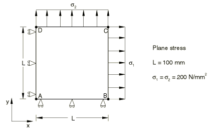
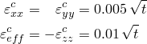
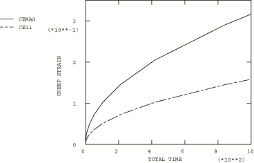

# 4.8.18 测试9A：2D平面应力——双轴载荷，一次蠕变

### 4.8.18 测试9A：2D平面应力——双轴载荷，一次蠕变

**产品：** Abaqus/Standard  

### 测试单元

CPS8R

### 问题描述

**材料：**

弹性模量 = 200×10³ N/mm²，泊松比 = 0.3，蠕变定律： = A，A = 3.125×10⁻¹⁴/小时（单位为N/mm²），n = 5，m = 0.5。

**边界条件：**

在AD线上施加，在AB线上施加。

**载荷：**

在BC线上规定拉伸应力 = 200 N/mm²。

在DC线上规定拉伸应力 = 200 N/mm²。

### 参考解

这是英国国家有限元方法与标准机构（NAFEMS）推荐的测试：NAFEMS出版物Ref: R0027"NAFEMS Fundamental Tests of Creep Behaviour"（1993年6月）中的测试9(a)。

### 结果与讨论

结果如下表所示。括号中的值是相对于参考解的百分比差异。

| Abaqus结果 |
| --- |
| t |  |  |
| 0.00 | 0.0000 (0.00%) | 0.0000 (0.00%) |
| 0.83 | 0.0045 (0.11%) | 0.0091 (0.11%) |
| 6.56 | 0.0128 (0.04%) | 0.0256 (0.04%) |
| 52.44 | 0.0362 (0.01%) | 0.0724 (0.01%) |
| 104.86 | 0.0512 (0.01%) | 0.1024 (0.01%) |
| 419.44 | 0.1024 (0.00%) | 0.2048 (0.01%) |
| 1000.00 | 0.1581 (0.00%) | 0.3162 (0.00%) |

### 备注

此测试的总蠕变时间为1000小时。上表中列出的时间是由Abaqus自动时间步长算法计算的时间，CETOL = 5×10⁻³。

### 输入文件

[ncr9ar8x.inp](../eif/ncr9ar8x.inp)

CPS8R单元。

