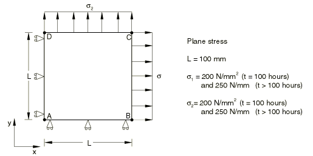
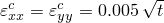
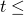
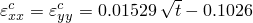
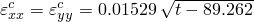
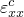
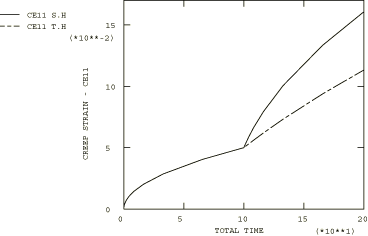

# 4.8.20 测试9C：2D平面应力——双轴阶梯载荷，一次蠕变

### 4.8.20 测试9C：2D平面应力——双轴阶梯载荷，一次蠕变

**产品：** Abaqus/Standard   

### 测试单元

CPS8R

### 问题描述

**材料：**

弹性模量 = 200×10³ N/mm²，泊松比 = 0.3，蠕变定律： = A，A = 3.125×10⁻¹⁴/小时（单位为N/mm²），n = 5，m = 0.5。

**边界条件：**

在AD线上施加，在AB线上施加。

**载荷：**

在t < 100小时时， = 200 N/mm²；在t > 100小时时， = 250 N/mm²；

在t < 100小时时， = 200 N/mm²；在t > 100小时时， = 250 N/mm²。

### 参考解

这是英国国家有限元方法与标准机构（NAFEMS）推荐的测试：NAFEMS出版物Ref: R0027"NAFEMS Fundamental Tests of Creep Behaviour"（1993年6月）中的测试9(c)。

|  |  | 在 < 100小时时 |
| --- | --- | --- |
| 时间硬化： |  | 在 > 100小时时 |
| 应变硬化： |  | 在 > 100小时时 |

### 结果与讨论

结果如下表所示。括号中的值是相对于参考解的百分比差异。

| Abaqus结果 |
| --- |
| 时间硬化 | 应变硬化 |
| t |  | t |  |
| 0.00 | 0.0000 (0.00%) | 0.00 | 0.0000 (0.00%) |
| 0.55 | 0.0037 (0.13%) | 0.55 | 0.0037 (0.01%) |
| 8.23 | 0.0143 (0.03%) | 8.23 | 0.0143 (0.00%) |
| 65.58 | 0.0405 (0.01%) | 65.58 | 0.0405 (0.00%) |
| 116.39 | 0.0620 (0.53%) | 116.39 | 0.0795 (0.21%) |
| 165.54 | 0.0937 (0.42%) | 165.54 | 0.1333 (0.21%) |
| 200.00 | 0.1132 (0.00%) | 200.00 | 0.1606 (0.00%) |

### 备注

此测试的总蠕变时间为200小时。上表中列出的时间是由Abaqus自动时间步长算法计算的时间，CETOL = 5×10⁻³。

### 输入文件

[ncr9cr8t.inp](../eif/ncr9cr8t.inp)

时间硬化。

[ncr9cr8s.inp](../eif/ncr9cr8s.inp)

应变硬化。

