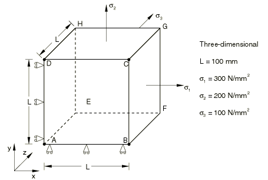
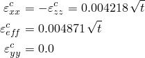
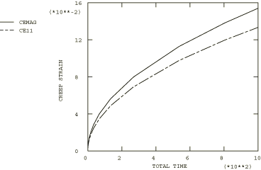

# 4.8.24 测试11：3D——三轴载荷，一次蠕变

### 4.8.24 测试11：3D——三轴载荷，一次蠕变

**产品：** Abaqus/Standard   

### 测试单元

C3D20R

### 问题描述

**材料：**

弹性模量 = 200×10³ N/mm²，泊松比 = 0.3，蠕变定律： = A，A = 3.125×10⁻¹⁴/小时（单位为N/mm²），n = 5，m = 0.5。

**边界条件：**

在面ADHE上施加，在面ABFE上施加，在面ABCD上施加。

**载荷：**

在面BCGF上规定拉伸应力 = 300 N/mm²，在面CDHG上规定拉伸应力 = 200 N/mm²，在面EFGH上规定拉伸应力 = 100 N/mm²。

### 参考解

这是英国国家有限元方法与标准机构（NAFEMS）推荐的测试：NAFEMS出版物Ref: R0027"NAFEMS Fundamental Tests of Creep Behaviour"（1993年6月）中的测试11。

### 结果与讨论

结果如下表所示。括号中的值是相对于参考解的百分比差异。

| Abaqus结果 |
| --- |
| t |  |  |
| 0.00 | 0.0000 (0.00%) | 0.0000 (0.00%) |
| 8.39 | 0.0122 (0.02%) | 0.0141 (0.03%) |
| 67.11 | 0.0346 (0.01%) | 0.0399 (0.00%) |
| 134.22 | 0.0489 (0.01%) | 0.0564 (0.00%) |
| 536.87 | 0.0977 (0.01%) | 0.1129 (0.01%) |
| 805.31 | 0.1197 (0.02%) | 0.1382 (0.01%) |

### 备注

此测试的总蠕变时间为1000小时。上表中列出的时间是由Abaqus自动时间步长算法计算的时间，CETOL = 5×10⁻⁷。

### 输入文件

[ncrbxrkx.inp](../eif/ncrbxrkx.inp)

C3D20R单元。

