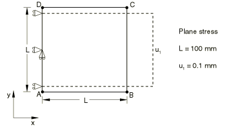
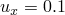
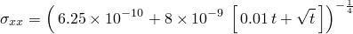
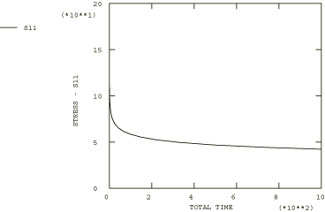

# 4.8.26 测试12B：2D平面应力——单轴位移，一次-二次蠕变

### 4.8.26 测试12B：2D平面应力——单轴位移，一次-二次蠕变

**产品：** Abaqus/Standard   

### 测试单元

CPS8R

### 问题描述

**材料：**

弹性模量 = 200×10³ N/mm²，泊松比 = 0.3，蠕变定律： = A + A，A = 10⁻¹⁶，A = 10⁻¹⁴， = 5.0，m = 0.5。

**边界条件：**

在AD线上施加，在AD线的中点施加，在BC线上施加。

### 参考解

这是英国国家有限元方法与标准机构（NAFEMS）推荐的测试：NAFEMS出版物Ref: R0027"NAFEMS Fundamental Tests of Creep Behaviour"（1993年6月）中的测试12(b)。

### 结果与讨论

结果如下表所示。括号中的值是相对于参考解的百分比差异。

| Abaqus结果 |
| --- |
| t |  |
| 0.00 | 200.00 (0.00%) |
| 1.64 | 97.44 (0.18%) |
| 14.23 | 74.39 (0.55%) |
| 68.75 | 60.47 (0.79%) |
| 270.08 | 49.94 (1.12%) |
| 538.51 | 45.08 (1.35%) |

### 备注

此测试的总蠕变时间为1000小时。上表中列出的时间是由Abaqus自动时间步长算法计算的时间，CETOL = 1×10⁻⁵。蠕变定律通过用户子程序[`CREEP`](../sub/sub-link.md#sub-xsl-creep)定义。

### 输入文件

[ncrcbr8x.inp](../eif/ncrcbr8x.inp)

CPS8R单元。

[ncrcbr8x.f](../eif/ncrcbr8x.f)

在ncrcbr8x.inp中使用的用户子程序[`CREEP`](../sub/sub-link.md#sub-xsl-creep)。

