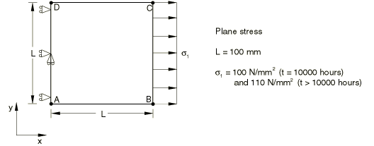
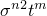
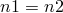
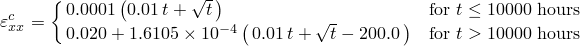
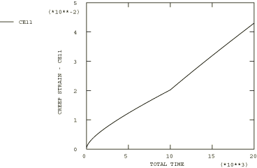

# 4.8.27 测试12C：2D平面应力——阶梯载荷，一次-二次蠕变

### 4.8.27 测试12C：2D平面应力——阶梯载荷，一次-二次蠕变

**产品：** Abaqus/Standard   

### 测试单元

CPS8R

### 问题描述

**材料：**

弹性模量 = 200×10³ N/mm²，泊松比 = 0.3，蠕变定律： = A + A，A = 10⁻¹⁶，A = 10⁻¹⁴， = 5.0，m = 0.5。

**边界条件：**

在AD线上施加，在AD线的中点施加。

**载荷：**

在t < 10000小时时， = 100 N/mm²；在t > 10000小时时， = 110 N/mm²。

### 参考解

这是英国国家有限元方法与标准机构（NAFEMS）推荐的测试：NAFEMS出版物Ref: R0027"NAFEMS Fundamental Tests of Creep Behaviour"（1993年6月）中的测试12(c)。

### 结果与讨论

结果如下表所示。括号中的值是相对于参考解的百分比差异。

| Abaqus结果 |
| --- |
| t |  |
| 0.00 | 0.0000 (0.00%) |
| 147.21 | 0.0013 (5.29%) |
| 1580.80 | 0.0055 (1.62%) |
| 8800.00 | 0.0181 (0.54%) |
| 15028.00 | 0.0316 (0.32%) |
| 18438.00 | 0.0393 (0.26%) |
| 20000.00 | 0.0427 (0.23%) |

### 备注

此测试的总蠕变时间为20000小时。上表中列出的时间是由Abaqus自动时间步长算法计算的时间，CETOL = 0.1。蠕变定律通过用户子程序[`CREEP`](../sub/sub-link.md#sub-xsl-creep)定义。

### 输入文件

[ncrccr8x.inp](../eif/ncrccr8x.inp)

CPS8R单元。

[ncrccr8x.f](../eif/ncrccr8x.f)

在ncrccr8x.inp中使用的用户子程序[`CREEP`](../sub/sub-link.md#sub-xsl-creep)。

