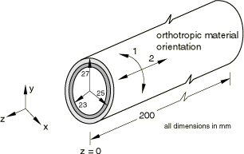
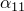

# 4.9.2 R0031(2)：压力和热载荷作用下的缠绕厚壁圆柱筒

**产品：** Abaqus/Standard  Abaqus/Explicit  

### 测试单元

C3D8R    C3D20    S4R    S8R    SC8R    

### 问题描述

**网格：**

建模了圆柱横截面的四分之一和一半长度。同一问题使用不同网格进行分析。线性实体和壳的网格沿径向和轴向各包含八个单元。二次实体和通用壳的网格沿径向和轴向各包含四个单元。使用连续单元的模型在Abaqus/Standard中沿厚度方向叠加两个单层单元，在Abaqus/Explicit中叠加四个单层单元。使用S4R和S8R单元的模型采用复合截面定义。连续壳模型使用两种建模技术来模拟厚度方向的圆柱：（1）具有复合截面的单个单元；（2）沿厚度方向叠加的四个单层单元。

**材料：**

内各向同性圆柱筒：E = 2.1E5 MPa， = 0.3， = 2.0×10⁻⁵/°C。

外周向缠绕圆柱筒： = 130 GPa， = 5 GPa， = 5 GPa， = 0.25， = 0.25， = 0， = 10 GPa， = 10 GPa， = 5 GPa， = 3.0×10⁻⁶/°C， = 2.0×10⁻⁵/°C， = 2.0×10⁻⁵/°C。

**边界条件：**

在z = 0处， = 0。

**载荷：**

情况1：200 MPa的内压。

情况2（仅Abaqus/Standard）：200 MPa的内压 + 130°C的温升。

### 参考解

这是英国国家有限元方法与标准机构（NAFEMS）推荐的测试：NAFEMS出版物R0031"Composites Benchmarks"，Issue 2（2001年2月5日）中的测试R0031/2。

### 结果与讨论

结果如表4.9.2-1和表4.9.2-2所示。所有结果均在处。括号中的值是相对于参考解的百分比差异。

**表4.9.2-1** Abaqus/Standard分析。
| 分析 | 情况1 | 情况2 |
| --- | --- | --- |
| 内圆柱筒 | 外圆柱筒 | 内圆柱筒 | 外圆柱筒 |
| 在r = 23处 | 在r = 25处 | 在r = 25处 | 在r = 27处 | 在r = 23处 | 在r = 25处 | 在r = 25处 | 在r = 27处 |
| 复合S8R | 1421 (9.2%) | 1421 (--0.6%) | 878 (0.4%) | 878 (15.7%) | 1241 (10.1%) | 1241 (1.5%) | 1056 (--3.7%) | 1056 (12.8%) |
| 叠加C3D20 | 1567 (0.1%) | 1432 (0.2%) | 880 (0.6%) | 756 (0.4%) | 1382 (0.1%) | 1262 (0.2%) | 1062 (--3.1%) | 933 (0.3%) |
| 复合SC8R | 1477 (5.6%) | 1477 (3.3%) | 900 (2.9%) | 900 (18.6%) | 1299 (5.9%) | 1299 (3.1%) | 1078 (-1.6%) | 1078 (15.2%) |
| 叠加SC8R | 1552 (--0.9 %) | 1470 (2.8%) | 849 (2.9%) | 787 (3.7%) | 1450 (5.0%) | 1319 (4.7%) | 1011 (7.8%) | 935 (0.1%) |
| 复合SC8R* | 1477 (--5.6%) | 1477 (3.3%) | 900 (2.9%) | 900 (18.6%) | 1299 (--5.9%) | 1299 (3.1%) | 1078 (--1.6%) | 1078 (15.2%) |
| 叠加SC8R* | 1587 (1.4%) | 1491 (4.3%) | 848 (--3.1%) | 785 (3.4%) | 1452 (5.1%) | 1318 (4.6%) | 1011 (--7.8%) | 935 (--0.1%) |
| 参考解 | 1565 | 1430 | 875 | 759 | 1381 | 1260 | 1096 | 936 |

* 采用增强沙漏控制的Abaqus/Standard结果。

**表4.9.2-2** Abaqus/Explicit分析。
| 分析 | 情况1 |
| --- | --- |
| 内圆柱筒 | 外圆柱筒 |
| 在r = 23处 | 在r = 25处 | 在r = 25处 | 在r = 27处 |
| 复合S4R | 1417 (9.5%) | 1427 (--0.2%) | 879 (0.5%) | 879 (15.8%) |
| 叠加C3D8R | 1548 (1.1%) | 1479 (3.5%) | 850 (2.8%) | 788 (3.8%) |
| 参考解 | 1565 | 1430 | 875 | 759 |

### 输入文件

##### **Abaqus/Standard输入文件**

[nco2s8rx.inp](../eif/nco2s8rx.inp)

复合S8R模型。

[nco2c3d2.inp](../eif/nco2c3d2.inp)

叠加C3D20模型。

[r312_std_sc8r_composite.inp](../eif/r312_std_sc8r_composite.inp)

复合SC8R模型。

[r312_std_sc8r_stacked.inp](../eif/r312_std_sc8r_stacked.inp)

叠加SC8R模型。

[r312_std_sc8r_composite_eh.inp](../eif/r312_std_sc8r_composite_eh.inp)

采用增强沙漏控制的复合SC8R模型。

[r312_std_sc8r_stacked_eh.inp](../eif/r312_std_sc8r_stacked_eh.inp)

采用增强沙漏控制的叠加SC8R模型。

##### **Abaqus/Explicit输入文件**

[r312shl.inp](../eif/r312shl.inp)

复合S4R模型。

[r312sol.inp](../eif/r312sol.inp)

叠加C3D8R模型。

