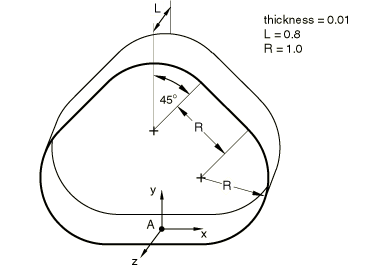
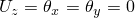
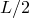
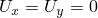
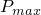
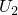
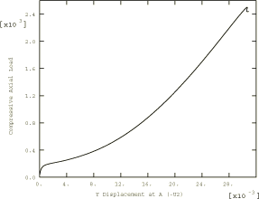

# 4.10.2 3DNLG-2：端部缩短下梨形圆柱体的弹性大挠度响应

**产品：** Abaqus/Standard   

### 测试单元

S3R    S4    S4R    S4R5    S8R    S8R5    S9R5    

STRI3    STRI65    

SC6R    SC8R    

### 问题描述

**模型：**

由于对称性，使用四分之一模型。

**材料：**

弹性模量 = 1.0×10⁷，泊松比 = 0.3。

**边界条件：**

在x = 0平面上对称（）。在z = 0平面上对称（）。在z =  = 0.4平面上简支（）。

**载荷：**

均匀的端部缩短。采用RIKS算法对z = 0.4平面处圆柱体一端的所有节点增量施加0.0016的位移。

### 参考解

这是英国国家有限元方法与标准机构（NAFEMS）推荐的测试：NAFEMS出版物R0024"A Review of Benchmark Problems for Geometric Non-linear Behaviour of 3D Beams and Shells (SUMMARY)"中的测试3DNLG-2。

此问题的已发布结果由Abaqus获得。因此，Abaqus与NAFEMS结果的比较不是对Abaqus的独立验证。NAFEMS研究包括来自其他来源的比较结果，这些结果可能为此问题提供验证依据。

### 结果与讨论

所有单元均使用相同节点间距的网格进行测试。

屈曲载荷定义为变形路径上进一步变形而载荷不再增加的点。该点之后的路径称为后屈曲路径。后屈曲路径显示载荷随进一步变形而减小；屈曲后的结构只能在低于屈曲载荷的水平上获得平衡。

| 屈曲载荷 |
| --- |
| 单元 |  |  |
| S3R | 2708 | 0.03168 |
| S4R | 2626 | 0.03124 |
| S4 | 2619 | 0.03116 |
| S4R5 | 2604 | 0.03127 |
| S8R | 2490 | 0.03072 |
| S8R5 | 2472 | 0.03063 |
| S9R5 | 2474 | 0.03034 |
| STRI3 | 2596 | 0.03096 |
| STRI65 | 2460 | 0.03051 |
| SC6R | 2653 | -0.03166 |
| SC8R | 2601 | -0.03155 |

### Abaqus预测的响应（单元S8R5）

### 输入文件

[n3g2x58x_s3r.inp](../eif/n3g2x58x_s3r.inp)

S3R单元。

[n3g2x58x_s4.inp](../eif/n3g2x58x_s4.inp)

S4单元。

[n3g2x58x_s4r.inp](../eif/n3g2x58x_s4r.inp)

S4R单元。

[n3g2x58x_s4r5.inp](../eif/n3g2x58x_s4r5.inp)

S4R5单元。

[n3g2x58x_s8r.inp](../eif/n3g2x58x_s8r.inp)

S8R单元。

[n3g2x58x_s8r5.inp](../eif/n3g2x58x_s8r5.inp)

S8R5单元。

[n3g2x58x_s9r5.inp](../eif/n3g2x58x_s9r5.inp)

S9R5单元。

[n3g2x58x_stri3.inp](../eif/n3g2x58x_stri3.inp)

STRI3单元。

[n3g2x58x_stri65.inp](../eif/n3g2x58x_stri65.inp)

STRI65单元。

[nlg2_std_sc6r.inp](../eif/nlg2_std_sc6r.inp)

SC6R单元。

[nlg2_std_sc8r.inp](../eif/nlg2_std_sc8r.inp)

SC8R单元。

