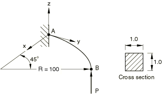
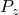
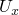
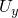
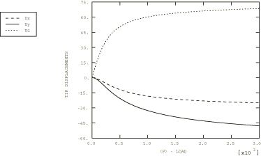

# 4.10.5 3DNLG-5：横向端部载荷作用下曲线弹性悬臂的大挠度

**产品：** Abaqus/Standard   

### 测试单元

B31    B31H    B32    B32H    B33    B33H    

### 问题描述

**材料：**

弹性模量 = 1.0×10⁷，泊松比 = 0.0。

**边界条件：**

在A处所有自由度被约束。

**载荷：**

在B处施加集中载荷（ = 3000）。

### 参考解

这是英国国家有限元方法与标准机构（NAFEMS）推荐的测试：NAFEMS出版物R0024"A Review of Benchmark Problems for Geometric Non-linear Behaviour of 3D Beams and Shells (SUMMARY)"中的测试3DNLG-5。

此问题的已发布结果由Abaqus获得。因此，Abaqus与NAFEMS结果的比较不是对Abaqus的独立验证。NAFEMS研究包括来自其他来源的比较结果，这些结果可能为此问题提供验证依据。

### 结果与讨论

所有单元均使用相同节点间距的网格进行测试。

不同单元类型的结果略有不同。报告的位移分量的最大差异为1.3%。混合单元结果与其非混合对应单元的结果在此处报告的精度下相同。尖端位移分量在下表中进行比较。

| 载荷 | 尖端位移（） |
| --- | --- |
|  | B31(H) | B32(H) | B33(H) |
| 300.0 | 7.097 | 7.173 | 7.188 |
| 450.0 | 10.82 | 10.92 | 10.93 |
| 600.0 | 13.62 | 13.73 | 13.74 |
| 3000.0 | 24.99 | 25.06 | 25.04 |

| 载荷 | 尖端位移（） |
| --- | --- |
|  | B31(H) | B32(H) | B33(H) |
| 300.0 | 12.13 | 12.17 | 12.19 |
| 450.0 | 18.70 | 18.74 | 18.76 |
| 600.0 | 23.78 | 23.81 | 23.85 |
| 3000.0 | 47.70 | 47.70 | 47.78 |

| 载荷 | 尖端位移（） |
| --- | --- |
|  | B31(H) | B32(H) | B33(H) |
| 300.0 | 40.43 | 40.47 | 40.50 |
| 450.0 | 48.67 | 48.70 | 48.73 |
| 600.0 | 53.58 | 53.60 | 53.63 |
| 3000.0 | 68.55 | 68.46 | 68.52 |

### Abaqus预测的响应（单元B31）

### 输入文件

[n3g5x32x_b31.inp](../eif/n3g5x32x_b31.inp)

B31单元。

[n3g5x32x_b31h.inp](../eif/n3g5x32x_b31h.inp)

B31H单元。

[n3g5x32x_b32.inp](../eif/n3g5x32x_b32.inp)

B32单元。

[n3g5x32x_b32h.inp](../eif/n3g5x32x_b32h.inp)

B32H单元。

[n3g5x32x_b33.inp](../eif/n3g5x32x_b33.inp)

B33单元。

[n3g5x32x_b33h.inp](../eif/n3g5x32x_b33h.inp)

B33H单元。

