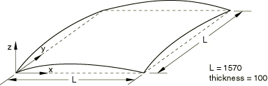
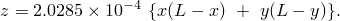
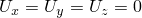
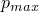
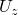
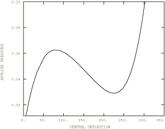

# 4.10.7 3DNLG-7：压力载荷作用下铰接球壳的弹性大挠度响应

**产品：** Abaqus/Standard   

### 测试单元

S3    S3R    S4    S4R    S4R5    S8R    S8R5    S9R5    

STRI3    STRI65    

SC6R    SC8R    

### 问题描述

**模型：**

壳中面用全局笛卡尔坐标定义为：

**材料：**

弹性模量 = 69，泊松比 = 0.3。

**边界条件：**

所有边缘简支（）。

**载荷：**

垂直于壳表面的均匀分布跟随压力载荷。 = 0.1。

### 参考解

这是英国国家有限元方法与标准机构（NAFEMS）推荐的测试：NAFEMS出版物R0024"A Review of Benchmark Problems for Geometric Non-linear Behaviour of 3D Beams and Shells (SUMMARY)"中的测试3DNLG-7。

此问题的已发布结果由Abaqus获得。因此，Abaqus与NAFEMS结果的比较不是对Abaqus的独立验证。NAFEMS研究包括来自其他来源的比较结果，这些结果可能为此问题提供验证依据。

### 结果与讨论

在下表中，极限点1和2分别对应载荷-位移曲线的峰值和局部最小值。所有网格共享相同的节点间距。

| 单元 | 极限点1 | 极限点2 |
| --- | --- | --- |
|  | 压力 | 中心处 | 压力 | 中心处 |
| S3/S3R | 0.06639 | 78.15 | 0.03300 | 220.9 |
| S4 | 0.06581 | 78.84 | 0.03133 | 223.5 |
| S4R | 0.06581 | 78.98 | 0.03134 | 223.5 |
| S4R5 | 0.06281 | 79.62 | 0.02956 | 224.4 |
| S8R | 0.06263 | 79.14 | 0.02849 | 223.6 |
| S8R5 | 0.06261 | 79.21 | 0.02882 | 223.7 |
| S9R5 | 0.06261 | 79.08 | 0.02883 | 223.4 |
| STRI3 | 0.06397 | 78.61 | 0.03175 | 221.9 |
| STRI65 | 0.06244 | 79.26 | 0.02886 | 224.0 |
| SC6R | 0.06749 | 81.0 | 0.03388 | 217.1 |
| SC8R | 0.06679 | 81.9 | 0.03213 | 217.6 |

### Abaqus预测的响应

所有测试用例获得相似的载荷-位移曲线。使用S8R5单元预测的响应如下图所示。

### 输入文件

[n3g7xf3x.inp](../eif/n3g7xf3x.inp)

S3/S3R单元。

[n3g7xe4x.inp](../eif/n3g7xe4x.inp)

S4单元。

[n3g7xf4x.inp](../eif/n3g7xf4x.inp)

S4R单元。

[n3g7x54x.inp](../eif/n3g7x54x.inp)

S4R5单元。

[n3g7x68x.inp](../eif/n3g7x68x.inp)

S8R单元。

[n3g7x58x.inp](../eif/n3g7x58x.inp)

S8R5单元。

[n3g7x59x.inp](../eif/n3g7x59x.inp)

S9R5单元。

[n3g7x63x.inp](../eif/n3g7x63x.inp)

STRI3单元。

[n3g7x56x.inp](../eif/n3g7x56x.inp)

STRI65单元。

[nlg7_std_sc6r.inp](../eif/nlg7_std_sc6r.inp)

SC6R单元。

[nlg7_std_sc8r.inp](../eif/nlg7_std_sc8r.inp)

SC8R单元。

