# 4.10.6 3DNLG-6：平面内剪切作用下平板的屈曲

**产品：** Abaqus/Standard   

### 测试单元

S3    S3R    S4    S4R    S4R5    S8R    S8R5    S9R5    

STRI3    STRI65    

SC6R    SC8R    

### 问题描述

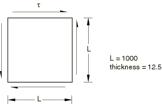

**材料：**

弹性模量 = 6.4×10⁶，泊松比 = 0.3。

**边界条件：**

所有边缘施加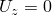。中心节点施加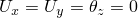。

**载荷：**

边缘均匀剪切载荷。使用RIKS算法将剪切载荷增加到每边缘最大2.12×10⁸。

**初始缺陷：**

板的中面位置定义为：

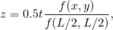

其中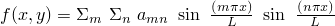，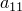 = 1.0， = 0.2897，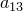 = 0.0706，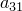 = 0.0691，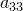 = 0.0384，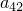 = 0.0032。

### 参考解

这是英国国家有限元方法与标准机构（NAFEMS）推荐的测试：NAFEMS出版物R0024"A Review of Benchmark Problems for Geometric Non-linear Behaviour of 3D Beams and Shells (SUMMARY)"中的测试3DNLG-6。

此问题的已发布结果由Abaqus获得。因此，Abaqus与NAFEMS结果的比较不是对Abaqus的独立验证。NAFEMS研究包括来自其他来源的比较结果，这些结果可能为此问题提供验证依据。

### 结果与讨论

所有测试用例获得非常相似的载荷-挠度曲线。SC6R模型比其他单元显示稍硬的响应。所有测试单元的响应如下图所示。

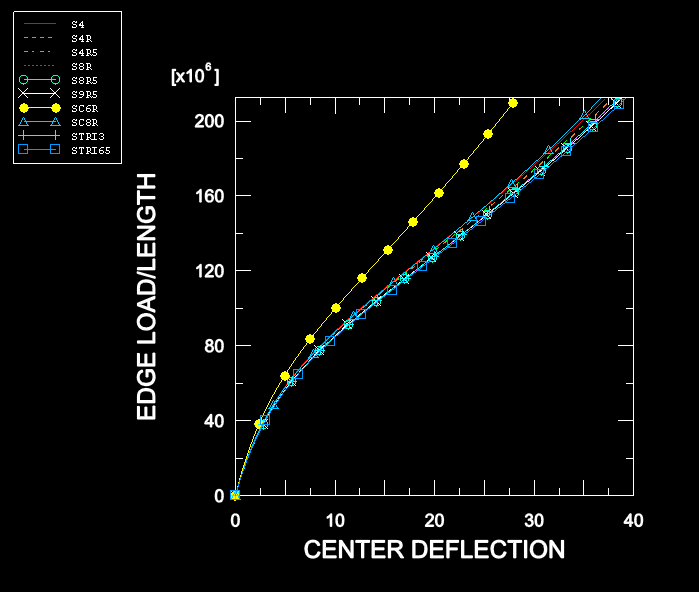

### 输入文件

[n3g6xf3x.inp](../eif/n3g6xf3x.inp)

S3/S3R单元。

[n3g6xe4x.inp](../eif/n3g6xe4x.inp)

S4单元。

[n3g6xf4x.inp](../eif/n3g6xf4x.inp)

S4R单元。

[n3g6x54x.inp](../eif/n3g6x54x.inp)

S4R5单元。

[n3g6x68x.inp](../eif/n3g6x68x.inp)

S8R单元。

[n3g6x58x.inp](../eif/n3g6x58x.inp)

S8R5单元。

[n3g6x59x.inp](../eif/n3g6x59x.inp)

S9R5单元。

[n3g6x63x.inp](../eif/n3g6x63x.inp)

STRI3单元。

[n3g6x56x.inp](../eif/n3g6x56x.inp)

STRI65单元。

[nlg6_std_sc6r.inp](../eif/nlg6_std_sc6r.inp)

SC6R单元。

[nlg6_std_sc8r.inp](../eif/nlg6_std_sc8r.inp)

SC8R单元。

