# 1.1.7 Pressurized rubber disc

**Products: **Abaqus/Standard  Abaqus/Explicit  

In this example a rubber disc, pinned around its outside edge, is subjected to pressure so that it bulges into a spherical shape. The example is an illustration of a rubber elasticity problem involving finite strains on a membrane-like structure. The published results of Oden (1972) and Hughes and Carnoy (1981) are used to verify the Abaqus quasi-static solution.

The example shows that Abaqus can solve this type of problem. The Abaqus/Standard results also demonstrate that, because of the treatment of the pinned-edge condition, the load stiffness matrix associated with the pressure loading is not symmetric at the outer edge of the pressurized face of the disc. It is found that, after a small amount of straining, these nonsymmetric terms must be included in the stiffness matrix for the solution to be numerically efficient.

Both a thick and a thin disc are tested. The solutions obtained using Abaqus/Explicit show dynamic effects when compared to the quasi-static solution found by Abaqus/Standard. The thin disc model in Abaqus/Explicit demonstrates the ability of Abaqus/Explicit to handle volume expansion of membrane-like structures; the application of fluid cavity elements in Abaqus/Explicit is also demonstrated.

### Problem description

The radius of the thick disc analyzed in both Abaqus/Standard and Abaqus/Explicit is 190.5 mm (7.5 in), and its thickness is 12.7 mm (0.5 in). The thin disc analyzed in Abaqus/Explicit has the same radius and a thickness of 1.270 mm.

The mesh used for the Abaqus/Standard analysis is shown in [Figure 1.1.7--1](ch01s01ach07.md#sxmrubdisk-mesh). The mesh uses 5 axisymmetric continuum elements (type CAX8H) along the radial direction and one element through the thickness. These are 8-node, second-order, mixed formulation elements. Other elements are also used in the Abaqus/Standard analysis, particularly the lower-order incompatible mode elements, which perform comparatively as well as the second-order elements. When the modified elements, CAX6MH and C3D10MH, are used for this problem, a greater refinement of the mesh is required to ensure good performance. These elements are not used in the validation against published results. Since the maximum extension is expected to be at the center of the disc, the length of the elements in the radial direction decreases from the circumference to the center so that the element that is adjacent to the centerline is nearly square. This element size gradient is obtained by defining a parabola between the two end nodes and placing the third point (which defines the parabola) at a position between one-quarter and one-half of the distance from the centerline to the other end of the line of nodes, thus weighting the nodal generation toward the centerline of the disc.

The problem is analyzed in two and three dimensions in Abaqus/Explicit, using different element types: continuum, shell, and membrane elements for the thick disc and shell and membrane elements for the thin disc. All cases use 10 elements in the radial direction and two elements through the thickness, twice as many as in the Abaqus/Standard analysis; hence, roughly the same number of degrees of freedom are used in both the dynamic solution and the quasi-static solution with a similar element grading in the radial direction.

No attempt has been made at a mesh convergence study. The agreement with published results (Oden, 1972, and Hughes and Carnoy, 1981) for the quasi-static case suggests that the mesh used is adequate to predict the overall response accurately.

The material is modeled as a Mooney-Rivlin material, with the constants (for the polynomial strain energy function)  0.55 MPa (80 lb/in2) and  0.138 MPa (20 lb/in2): these are the values used by Oden (1972) and Hughes and Carnoy (1981). In the Abaqus/Standard analysis it is an incompressible material. For the Ogden strain energy function, the equivalent material constants used are 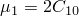, 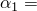2, 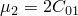, and 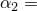2. Abaqus/Explicit requires some compressibility for hyperelastic materials. In the input files used here,  is not given. Hence, a default value of  is chosen. This gives an initial bulk modulus (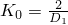) that is 20 times higher than the initial shear modulus 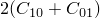. This ratio is much lower than the ratio exhibited by most rubberlike materials, but the results are not particularly sensitive to this value because the material is unconfined. Decreasing  by an order of magnitude has little effect on the overall results but causes a reduction in the stable time increment by a factor of  due to the increase in the bulk modulus.

For the continuum element cases the pinned condition at the outside of the disc requires special treatment. In the axisymmetric cases the central node on that edge (node 31) is fixed in both directions. The edge is constrained to remain straight, while still being able to change length, and is free to rotate about the pinned node. For simplicity these constraints are imposed by requiring that the displacement of the node at the top of the outer edge (node 51) be equal and opposite to that of the node at the bottom of the edge (node 11). Two equations are required: 

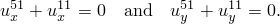

These constraints are imposed by using an equation constraint. The three-dimensional continuum case in Abaqus/Explicit (C3D8R) is treated in a similar manner by adding two more equations. Since only a wedge is actually modeled for the Abaqus/Standard three-dimensional analyses, the CYCLSYM MPC (["General multi-point constraints," Section 35.2.2 of the Abaqus Analysis User's Guide](../usb/usb-link.md#usb-cni-pmpc)) is used to impose the appropriate constraints. No constraints are required for the shell element cases.

### Loading and solution method

The loading consists of a uniform pressure applied to the bottom surface of the disc. The modified Riks method is used in Abaqus/Standard since the loading is proportional and because the solution may exhibit instability. A pressure magnitude of 1.38 MPa (200 lb/in2) is specified: this magnitude is somewhat arbitrary since the Riks method is chosen. From other studies we expect that an initial pressure of about 0.014 MPa (2 lb/in2) should take the disc a reasonable way into the nonlinear regime. Hence, an initial increment of 0.01 and a period of 1 are specified in the static analysis to achieve this level of pressure in the initial increment. (Since the Riks algorithm is used, the actual pressure magnitude at the end of the first increment will differ somewhat from the initial value of 0.014 MPa, depending on the extent of nonlinearity in that increment. See the descriptions of the Riks option in ["Unstable collapse and postbuckling analysis," Section 6.2.4 of the Abaqus Analysis User's Guide](../usb/usb-link.md#usb-anl-apostbuckling), and ["Modified Riks algorithm," Section 2.3.2 of the Abaqus Theory Guide](../stm/stm-link.md#stm-anl-modifiedriks), for more details.)

Since the surface to which the pressure is applied rotates and stretches, there is a stiffness contribution associated with the pressure (a “load stiffness matrix”). Because of the treatment of the pinned outer edge, the perimeter of the surface to which the pressure is applied is not fully constrained and, hence, gives rise to a nonsymmetric contribution in the local stiffness matrix (see Hibbitt, 1979). During that part of the solution where strains and rotations are not very large, it makes little difference to the number of iterations needed to solve the equilibrium equations if this nonsymmetric contribution is ignored. However, to continue the analysis beyond a pressure of about 0.07 MPa (10 lb/in2)—when the displacement at the center of the disc is about half the radius—it is essential that these terms are included. This requires that the Abaqus/Standard analysis use the unsymmetric equation solver. In practical cases, if the unsymmetric equation solver is not used in the initial run, it can be introduced on a restarted run if necessary. An example using S4R elements with enhanced hourglass control is also included.

The effect of uniform tensile prestress in Abaqus/Standard is also investigated. The prestress is applied as equal radial and circumferential stresses. Prestress values of 0.35, 0.7, and 1.4 MPa (50, 100, and 200 lb/in2) are investigated.

In the explicit dynamic analysis the pressure is ramped up over the duration of the step. The maximum applied pressure for the thick disc case is 0.317 MPa (46 psi) and is applied by using a distributed load or by prescribing the pressure directly to a fluid cavity reference node. In the fluid-driven case the fluid cavity is modeled using the surface-based fluid cavity capability (see ["Fluid cavity definition," Section 11.5.2 of the Abaqus Analysis User's Guide](../usb/usb-link.md#usb-anl-afluidcavities)). The fluid cavity surface is defined underneath the disc so that the initial volume of the fluid cavity is zero. For both load cases the 0.317 MPa pressure value was chosen based on the final value obtained in the quasi-static simulation via Abaqus/Standard utilizing the Riks method for incrementation control. The maximum pressure for the thin disc is 0.036 MPa (4.5 psi) and is prescribed at a fluid cavity reference node as in the thick disc case. The rate of loading was observed to affect the simulation for all cases in Abaqus/Explicit.

A thick disc example for the two-dimensional axisymmetric continuum case in Abaqus/Explicit illustrates controlling the duration of the analysis and forcing output when an extreme value criterion is reached. When nodal variables are monitored, the end of the analysis is specified to occur when the center of the plate has bulged out to twice its initial radius. Thickness strain is monitored in the bottom row of elements, and an output state is written when the strain falls below the specified value. Additional examples using S4R and M3D4R elements with enhanced hourglass control are included.

### Results and discussion

Plots of the deformed shape of the disc at various stages in the Abaqus/Standard analysis are shown in [Figure 1.1.7--2](ch01s01ach07.md#sxmrubdisk-disp). A plot of the deformed shape of the thick disc at the end of the step for the two-dimensional Abaqus/Explicit axisymmetric continuum case is shown in [Figure 1.1.7--3](ch01s01ach07.md#exxdisc-dispshapes). This result was obtained using a load duration of 0.01 sec. In both analyses, at the end of the loading the center of the plate has bulged out to a position approximately twice the initial radius. At this point element 1 has deformed so much that it would be difficult to continue the analysis without rezoning, and the solution beyond this point is of little practical interest.

The thickness of the disc at the centerline is plotted against the *z*-displacement of the center of the disc for the Abaqus/Standard analysis in [Figure 1.1.7--4](ch01s01ach07.md#sxmrubdisk-th-v-disp). To produce a smoother curve, a slightly modified input file with smaller and more time increments was used. The slight bump at the right end of the curve suggests some localization in the plate slightly away from the center.

[Figure 1.1.7--5](ch01s01ach07.md#exxdisc-strain-v-disp) shows a plot of thinning strain at the center of the disc versus the normalized displacement of the centerline node of the disc for the Abaqus/Explicit analysis. The results in [Figure 1.1.7--5](ch01s01ach07.md#exxdisc-strain-v-disp) are purely kinematic (the near incompressibility of the hyperelastic constitutive model dictates the thinning as a function of the membrane stretching) and agree with the results obtained with Abaqus/Standard.

A comparison between the Abaqus/Standard results and those obtained by Oden (1972) and Hughes and Carnoy (1981) is shown in [Figure 1.1.7--6](ch01s01ach07.md#sxmrubdisk-results), where the applied pressure is plotted against the *z*-displacement at the center of the disc. All three solutions agree quite closely. Abaqus/Standard gives identical results for the Mooney-Rivlin and Ogden models with corresponding parameters.

[Figure 1.1.7--7](ch01s01ach07.md#exxdisc-p-v-defl-dload-01) shows a plot of pressure versus displacement of the centerline node of the disc for all the Abaqus/Explicit element cases considered here for a step duration of 0.01 sec. These results show significant dynamic effects compared to the quasi-static results obtained with Abaqus/Standard at the initial times. The early time response is dictated by the inertia of the disc—it simply takes some time to get the disc moving. This is manifested by the steep initial slope of the pressure versus displacement curves in [Figure 1.1.7--7](ch01s01ach07.md#exxdisc-p-v-defl-dload-01). During the early part of the response, the center part of the disc is moving as a rigid body until the effect of the pinned boundary condition causes the disc to begin to bulge. As the deformed shape evolves, the Abaqus/Explicit results in [Figure 1.1.7--7](ch01s01ach07.md#exxdisc-p-v-defl-dload-01) are closer to the quasi-static results. The membrane and shell models using the ENHANCED hourglass control option produce the same solutions as the ones using the default hourglass control option.

Abaqus/Standard pressure-displacement curves for different values of initial tensile prestress in the rubber plate are also shown in [Figure 1.1.7--6](ch01s01ach07.md#sxmrubdisk-results). As expected, the stiffening effect of the tensile prestress requires a higher pressure for the disc to displace a certain amount. Models using the hybrid CAXA elements produce the same axisymmetric solutions when axisymmetric boundary conditions are imposed.

The pressure-displacement curves for loading using the fluid cavity elements in Abaqus/Explicit are shown in [Figure 1.1.7--8](ch01s01ach07.md#exxdisc-p-v-defl-fluid-thick). The results approximately match those obtained using the distributed load curves shown in [Figure 1.1.7--7](ch01s01ach07.md#exxdisc-p-v-defl-dload-01). The pressure-displacement curve for the thin disc (load applied using fluid cavity elements) is shown in [Figure 1.1.7--9](ch01s01ach07.md#exxdisc-p-v-defl-fluid-thin). The results approximately match those obtained with an implicit dynamic analysis of these models in Abaqus/Standard.

The axisymmetric continuum case is reanalyzed in Abaqus/Explicit by increasing the duration of the load to 0.10 sec. This case demonstrates some of the inherent difficulties of trying to solve static problems with a dynamic simulation. Increasing the duration of the step by an order of magnitude should decrease the dynamic effects and give results that are closer to the quasi-static results obtained with Abaqus/Standard. [Figure 1.1.7--10](ch01s01ach07.md#exxdisc-p-v-defl-dload-10), which is a plot of pressure versus centerline displacement for this slower case, shows that there are still significant dynamic effects in the solution. Some of the early inertia-dominated “lag” in the solution has been eliminated, at the expense of exciting the response of the structure in the lowest structural mode. In the faster case (step duration of 0.01 sec) the loading rate was at a higher frequency than the frequency of the structural mode, and the disc is driven into the bulged shape faster than it can respond by vibration in a structural mode. In the slower case the loading is at a low enough frequency that the structure has time to respond and is vibrating about the static equilibrium configuration. The pressure versus displacement curve of [Figure 1.1.7--10](ch01s01ach07.md#exxdisc-p-v-defl-dload-10) is oscillating about the curve defined by the quasi-static results.

### Input files

##### **Abaqus/Standard input files**

#### Polynomial energy function:

[rubberdisk_c3d8ih_poly.inp](../eif/rubberdisk_c3d8ih_poly.inp)

C3D8IH elements.

[rubberdisk_c3d10mh_poly.inp](../eif/rubberdisk_c3d10mh_poly.inp)

C3D10MH elements.

[rubberdisk_cax4ih_poly.inp](../eif/rubberdisk_cax4ih_poly.inp)

CAX4IH elements.

[rubberdisk_cax6h_poly.inp](../eif/rubberdisk_cax6h_poly.inp)

CAX6H elements.

[rubberdisk_cax6mh_poly.inp](../eif/rubberdisk_cax6mh_poly.inp)

CAX6MH elements.

[rubberdisk_cax8h_poly.inp](../eif/rubberdisk_cax8h_poly.inp)

CAX8H elements.

[rubberdisk_caxa8h1_poly.inp](../eif/rubberdisk_caxa8h1_poly.inp)

CAXA8H1 elements.

[rubberdisk_postoutput.inp](../eif/rubberdisk_postoutput.inp)

Data for postprocessing the restart file.

[rubberdisk_max1_poly.inp](../eif/rubberdisk_max1_poly.inp)

MAX1 elements.

[rubberdisk_max2_poly.inp](../eif/rubberdisk_max2_poly.inp)

MAX2 elements.

[rubberdisk_mgax1_poly.inp](../eif/rubberdisk_mgax1_poly.inp)

MGAX1 elements.

[rubberdisk_s4r_poly.inp](../eif/rubberdisk_s4r_poly.inp)

S4R elements.

[rubberdisk_sax1_poly.inp](../eif/rubberdisk_sax1_poly.inp)

SAX1 elements.

[rubberdisk_saxa11_poly.inp](../eif/rubberdisk_saxa11_poly.inp)

SAXA11 elements.

#### Ogden strain energy function:

[rubberdisk_c3d8ih_ogden.inp](../eif/rubberdisk_c3d8ih_ogden.inp)

C3D8IH elements.

[rubberdisk_c3d10mh_ogden.inp](../eif/rubberdisk_c3d10mh_ogden.inp)

C3D10MH elements.

[rubberdisk_cax4ih_ogden.inp](../eif/rubberdisk_cax4ih_ogden.inp)

CAX4IH elements.

[rubberdisk_cax6h_ogden.inp](../eif/rubberdisk_cax6h_ogden.inp)

CAX6H elements.

[rubberdisk_cax6mh_ogden.inp](../eif/rubberdisk_cax6mh_ogden.inp)

CAX6MH elements.

[rubberdisk_cax8h_ogden.inp](../eif/rubberdisk_cax8h_ogden.inp)

CAX8H elements.

[rubberdisk_caxa8h1_ogden.inp](../eif/rubberdisk_caxa8h1_ogden.inp)

CAXA8H1 elements.

#### Tensile prestress:

[rubberdisk_c3d8ih_prestress.inp](../eif/rubberdisk_c3d8ih_prestress.inp)

C3D8IH elements.

[rubberdisk_c3d10mh_prestress.inp](../eif/rubberdisk_c3d10mh_prestress.inp)

C3D10MH elements.

[rubberdisk_cax4ih_prestress.inp](../eif/rubberdisk_cax4ih_prestress.inp)

CAX4IH elements.

[rubberdisk_cax6h_prestress.inp](../eif/rubberdisk_cax6h_prestress.inp)

CAX6H elements.

[rubberdisk_cax6mh_prestress.inp](../eif/rubberdisk_cax6mh_prestress.inp)

CAX6MH elements.

[rubberdisk_cax8h_prestress.inp](../eif/rubberdisk_cax8h_prestress.inp)

CAX8H elements.

[rubberdisk_caxa8h1_prestress.inp](../eif/rubberdisk_caxa8h1_prestress.inp)

CAXA8H1 elements.

[rubberdisk_s4r_ogden.inp](../eif/rubberdisk_s4r_ogden.inp)

S4R elements.

[rubberdisk_s4r_ogden_eh.inp](../eif/rubberdisk_s4r_ogden_eh.inp)

S4R elements with enhanced hourglass control.

[rubberdisk_sax1_ogden.inp](../eif/rubberdisk_sax1_ogden.inp)

SAX1 elements.

[rubberdisk_saxa11_ogden.inp](../eif/rubberdisk_saxa11_ogden.inp)

SAXA11 elements.

The DIRECTIONS=YES parameter is used with the [*EL FILE](../key/key-link.md#usb-kws-helfile) option in the input file [rubberdisk_c3d8ih_poly.inp](../eif/rubberdisk_c3d8ih_poly.inp).

##### **Abaqus/Explicit input files**

[disccax4r.inp](../eif/disccax4r.inp)

Thick disc, CAX4R elements, with [*DLOAD](../key/key-link.md#usb-kws-hdload) loading.

[discc3d8r.inp](../eif/discc3d8r.inp)

Thick disc, C3D8R elements, with [*DLOAD](../key/key-link.md#usb-kws-hdload) loading.

[discs4r.inp](../eif/discs4r.inp)

Thick disc, S4R elements, with [*DLOAD](../key/key-link.md#usb-kws-hdload) loading.

[discs4r_enh.inp](../eif/discs4r_enh.inp)

Thick disc, S4R elements, with [*DLOAD](../key/key-link.md#usb-kws-hdload) loading and enhanced hourglass control.

[discsax1.inp](../eif/discsax1.inp)

Thick disc, SAX1 elements, with [*DLOAD](../key/key-link.md#usb-kws-hdload) loading.

[discm3d4r.inp](../eif/discm3d4r.inp)

Thick disc, M3D4R elements, with [*DLOAD](../key/key-link.md#usb-kws-hdload) loading.

[discm3d4r_enh.inp](../eif/discm3d4r_enh.inp)

Thick disc, M3D4R elements, with [*DLOAD](../key/key-link.md#usb-kws-hdload) loading and enhanced hourglass control.

[discflcax4r_surfcav.inp](../eif/discflcax4r_surfcav.inp)

 Thick disc,  CAX4R elements, with fluid pressure loading. The surface-based fluid cavity capability is used to model the fluid cavity.

[discflc3d8r_surfcav.inp](../eif/discflc3d8r_surfcav.inp)

 Thick disc,  C3D8R elements, with fluid pressure loading. The surface-based fluid cavity capability is used to model the fluid cavity.

[discflsax1_surfcav.inp](../eif/discflsax1_surfcav.inp)

 Thick disc,  SAX1 elements, with fluid pressure loading. The surface-based fluid cavity capability is used to model the fluid cavity.

[discfls4r_surfcav.inp](../eif/discfls4r_surfcav.inp)

 Thick disc,  S4R elements, with fluid pressure loading. The surface-based fluid cavity capability is used to model the fluid cavity.

[discflm3d4r_surfcav.inp](../eif/discflm3d4r_surfcav.inp)

 Thick disc,  M3D4R elements, with fluid pressure loading. The surface-based fluid cavity capability is used to model the fluid cavity.

[discthinflsax1_surfcav.inp](../eif/discthinflsax1_surfcav.inp)

 Thin disc,  SAX1 elements, with fluid pressure loading. The surface-based fluid cavity capability is used to model the fluid cavity.

[discthinfls4r_surfcav.inp](../eif/discthinfls4r_surfcav.inp)

 Thin disc,  S4R elements, with fluid pressure loading. The surface-based fluid cavity capability is used to model the fluid cavity.

[discflm3d4r_surfcav.inp](../eif/discflm3d4r_surfcav.inp)

 Thick disc,  M3D4R elements, with fluid pressure loading. The surface-based fluid cavity capability is used to model the fluid cavity.

[disccax4r_extreme.inp](../eif/disccax4r_extreme.inp)

Thick disc, CAX4R elements, with [*DLOAD](../key/key-link.md#usb-kws-hdload) loading and [*EXTREME VALUE](../key/key-link.md#usb-kws-hextremevalue) criterion.

[disccax4r_mr.inp](../eif/disccax4r_mr.inp)

Thick disc, CAX4R elements, with Mooney-Rivlin strain energy potential.

### References

Hibbitt,  H. D., “Some Follower Forces and Load Stiffness,” International Journal for Numerical Methods in Engineering, pp. 937–941, 1979.

Hughes,  T. J. R., and E. Carnoy, “Nonlinear Finite Element Shell Formulation Accounting for Large Membrane Strains,” Nonlinear Finite Element Analysis of Plates and Shells, AMD, vol. 48, pp. 193–208, 1981.

Oden,  J. T., *Finite Elements of Nonlinear Continua, *McGraw-Hill, 1972.

### Figures

**Figure 1.1.7–1** Mesh for pressurized rubber disk.

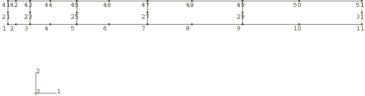

**Figure 1.1.7–2** Displaced shapes of pressurized rubber disk, Abaqus/Standard analysis.

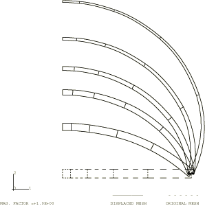

**Figure 1.1.7–3** Displaced shapes for the axisymmetric continuum mesh, thick disc model, Abaqus/Explicit analysis.

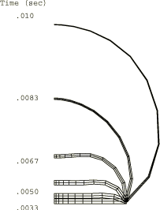

**Figure 1.1.7–4** Central thickness versus central displacement, Abaqus/Standard analysis.

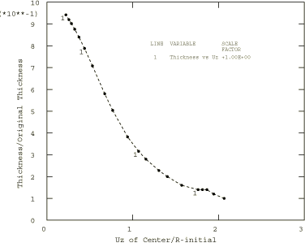

**Figure 1.1.7–5** Thickness strain versus central displacement for the axisymmetric continuum mesh, thick disc model, Abaqus/Explicit analysis.

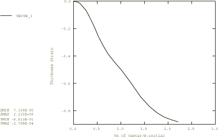

**Figure 1.1.7–6** Comparison of pressure-deflection results, Abaqus/Standard analysis.

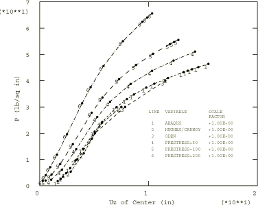

**Figure 1.1.7–7** Pressure versus deflection results for load ramp duration of 0.01 sec, thick disc model with distributed loading, Abaqus/Explicit analysis.

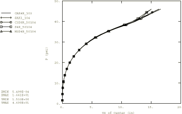

**Figure 1.1.7–8** Pressure versus deflection results for load ramp duration of 0.01 sec, thick disc model with fluid pressure loading, Abaqus/Explicit analysis.

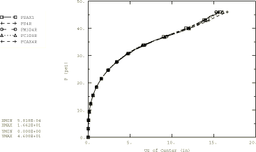

**Figure 1.1.7–9** Pressure versus deflection results for load ramp duration of 0.01 sec, thin disc model with fluid pressure loading, Abaqus/Explicit analysis.

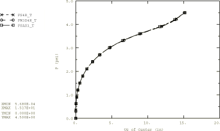

**Figure 1.1.7–10** Pressure versus deflection results for load ramp duration of 0.10 sec, thick disc model with distributed loading, Abaqus/Explicit analysis.

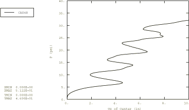

