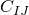
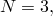
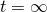
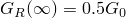
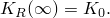

# 1.1.8 Uniaxial stretching of an elastic sheet with a circular hole

**Product: **Abaqus/Standard  

This example considers the uniform large stretching of a thin, initially square sheet containing a centrally located circular hole. Plane stress conditions are assumed, and the results are compared with those provided in Oden (1972) for four different forms of the strain energy function using the experimental results of Treloar (1944). The example demonstrates the use and verifies the results of hyperelastic and viscoelastic materials in plane stress. 

### Problem description

The geometry and the mesh for a quarter-sheet are shown in [Figure 1.1.8--1](ch01s01ach08.md#sxmunistretch-mesh). The undeformed square sheet is 2 mm (0.079 in) thick and is 165 mm (6.5 in) on each side. It has a centrally located internal hole of radius 6.35 mm (0.25 in). The body is modeled with 32 second-order plane stress reduced-integration elements (element type CPS8R). The incompressibility of the material requires the use of the “hybrid” elements for plane strain, axisymmetric, or three-dimensional cases; but in plane stress the thickness change is available as a free variable that can be used to enforce the constraint of constant volume (incompressibility), so this standard displacement formulation element (CPS8R) is appropriate. No mesh convergence studies have been performed, but the good agreement with the results given by Oden (1972) suggests that the model chosen has comparable accuracy with the model used by Oden.

Four different material models are used. The experimental data of Treloar (1944) composed of uniaxial, biaxial, and planar tension data are applied to these models. Two of the four models are forms of the standard polynomial hyperelasticity model in Abaqus. One is the classical Mooney-Rivlin strain energy function: 

The other is due to Biderman: 

In both cases the material is assumed to be incompressible. The constants used by Oden (1972) are = 0.1863 MPa (27.02 psi); = 0.00979 MPa (1.42 psi); and, for the Biderman model, = 0.00186 MPa (0.27 psi), and = 0.0000451 MPa (0.00654 psi), with all other = 0. For the Mooney-Rivlin material  is specified in the hyperelastic material definition (["Hyperelastic behavior of rubberlike materials," Section 22.5.1 of the Abaqus Analysis User's Guide](../usb/usb-link.md#usb-mat-chyperelastic)), and only  and  are given. For the Biderman material  and nine constants must be given. Since the material is incompressible the constants  are set to zero.

The third material model is the Ogden hyperelasticity model in Abaqus:

The Ogden hyperelastic parameters are obtained using test data in the hyperelastic material definition to fit the experimental data of Treloar. Three pairs of parameters  and  are derived for .

The fourth material model is the Marlow hyperelasticity model in Abaqus. In this model the deviatoric part of the response is derived from one set of test data (uniaxial, biaxial, or planar) such that the material's behavior is represented exactly in the deformation mode for which test data are available. Three examples are provided in which the model is based on uniaxial, biaxial, or planar test data, respectively.

In addition, the Biderman model and the Marlow model are used in conjunction with the viscoelastic material model. The shear relaxation is defined by time-dependent moduli expanded in a Prony series with two terms: 

with = 0.25, = 5.0 sec and = 0.25, = 10 sec. The bulk behavior is assumed to remain incompressible. 

### Loading and controls

The sheet is stretched to a width of 1181 mm (46.5 in)—over seven  times its initial width—in the *x*-direction, while the edges parallel to the *x*-axis are restrained from stretching in the *y*-direction. The *y*-direction restraints are imposed directly with a boundary condition. The stretch in the *x*-direction is prescribed by imposing uniform normal displacement on the right-hand edge of the mesh. All the nodes on that edge are constrained to have the same *x*-displacement by using an equation constraint. The displacement of the retained node (node 1601) is then prescribed to stretch the sheet. This technique allows the total stretching force to be obtained directly as the reaction force at this node. The symmetry conditions at  and at  are also imposed with a boundary condition.

An initial increment of 5% of the final displacement is suggested. The size of subsequent increments is chosen by the automatic incrementation scheme.

In the viscoelastic case a second step is added, driven by the quasi-static procedure. The deformation is kept the same, and the stresses relax. The time period is 100 sec, which is much larger than the time constants of the material. As a result, the long-term behavior of the material should be obtained. Setting  in the expression for the time-dependent moduli provides  and  Since the deformation is almost completely constrained during the relaxation step, we expect the stresses to be halved in this process. The maximum difference in the creep strain increment over a time increment is specified using a value of 0.1, which enables automatic incrementation. This value controls the error in the integration of the viscoelastic model by limiting the difference in the strain increments defined by forward Euler and backward Euler integrations. The value of 10% strain error per increment used here is very large and suggests that no attempt is being made to limit this source of error: rather, we are allowing the automatic time incrementation to reach the long-term (steady-state) solution as quickly as possible.

### Results and discussion

The final displaced configuration for the case with the Biderman material model is shown in [Figure 1.1.8--2](ch01s01ach08.md#sxmunistretch-finconfig); and the load responses are shown in [Figure 1.1.8--3](ch01s01ach08.md#sxmunistretch-forcevstrain), where the load is plotted as a function of the overall nominal strain of the sheet in the *x*-direction. The results of the first three hyperelastic models are seen to agree quite closely with Oden's. The results of the Marlow hyperelastic model also agree well with Oden's, although they are not shown in [Figure 1.1.8--3](ch01s01ach08.md#sxmunistretch-forcevstrain). The Mooney-Rivlin strain energy function (with  and  as the only nonzero terms) cannot predict the “locking” of the response at higher strains that is predicted by the Biderman and Ogden strain energy functions. [Figure 1.1.8--4](ch01s01ach08.md#sxmunistretch-loadvtime) shows the load-time response for the case including the viscoelastic relaxation step.

### Input files

#### CPS8R elements:

[elasticsheet_cps8r_biderman.inp](../eif/elasticsheet_cps8r_biderman.inp)

Biderman material model. The Mooney-Rivlin model is obtained by modifying the [*HYPERELASTIC](../key/key-link.md#usb-kws-mhyperelast) option to give  and providing only the first two constants on the data line.

[elasticsheet_cps8r_ogdendata.inp](../eif/elasticsheet_cps8r_ogdendata.inp)

Ogden hyperelasticity formulation with the TEST DATA INPUT option.

[elasticsheet_cps8r_bidervisco.inp](../eif/elasticsheet_cps8r_bidervisco.inp)

Viscoelastic Biderman material model including the relaxation step.

[elasticsheet_bidervisco_stabil.inp](../eif/elasticsheet_bidervisco_stabil.inp)

Viscoelastic Biderman material model including the relaxation step and automatic stabilization.

[elasticsheet_bidervisco_stabil_adap.inp](../eif/elasticsheet_bidervisco_stabil_adap.inp)

Viscoelastic Biderman material model including the relaxation step and adaptive automatic stabilization.

[elasticsheet_postoutput.inp](../eif/elasticsheet_postoutput.inp)

Data used to postprocess the results file from elasticsheet_cps8r_biderman.inp.

[elasticsheet_cps8r_marlowu.inp](../eif/elasticsheet_cps8r_marlowu.inp)

Marlow material model using uniaxial test data.

[elasticsheet_cps8r_marlowb.inp](../eif/elasticsheet_cps8r_marlowb.inp)

Marlow material model using biaxial test data.

[elasticsheet_cps8r_marlowp.inp](../eif/elasticsheet_cps8r_marlowp.inp)

Marlow material model using planar test data.

[elasticsheet_cps8r_marlowuvisco.inp](../eif/elasticsheet_cps8r_marlowuvisco.inp)

Viscoelastic Marlow material model using uniaxial test data and including the relaxation step.

[elasticsheet_cps8r_marlowbvisco.inp](../eif/elasticsheet_cps8r_marlowbvisco.inp)

Viscoelastic Marlow material model using biaxial test data and including the relaxation step.

[elasticsheet_cps8r_marlowpvisco.inp](../eif/elasticsheet_cps8r_marlowpvisco.inp)

Viscoelastic Marlow material model using planar test data and including the relaxation step.

#### CPS4 elements:

[elasticsheet_cps4_biderman.inp](../eif/elasticsheet_cps4_biderman.inp)

Biderman material model. 

[elasticsheet_cps4_ogdendata.inp](../eif/elasticsheet_cps4_ogdendata.inp)

Ogden hyperelasticity formulation with the TEST DATA INPUT option.

[elasticsheet_cps4_bidervisco.inp](../eif/elasticsheet_cps4_bidervisco.inp)

Viscoelastic Biderman material model including the relaxation step.

[elasticsheet_cps4_marlowu.inp](../eif/elasticsheet_cps4_marlowu.inp)

Marlow material model using uniaxial test data.

[elasticsheet_cps4_marlowuvisco.inp](../eif/elasticsheet_cps4_marlowuvisco.inp)

Viscoelastic Marlow material model using uniaxial test data and including the relaxation step.

### References

Oden, J. T., *Finite Elements of Nonlinear Continua,* McGraw-Hill, New York, 1972.

Treloar, L. R. G., “Stress-Strain Data for Vulcanised Rubber Under Various Types of Deformation,” Trans. Faraday Soc., 40, pp. 59–70, 1944.

### Figures

**Figure 1.1.8–1** Rubber sheet and mesh.

**Figure 1.1.8–2** Final displaced configuration, Biderman model.

**Figure 1.1.8–3** Applied force versus overall nominal strain.

**Figure 1.1.8–4** Load versus time, Biderman model, with a relaxation period of 100 secs.

