# 1.1.9 Necking of a round tensile bar

**Products: **Abaqus/Standard  Abaqus/Explicit  

This example illustrates necking and softening of a round tensile bar. This problem has been studied by Needleman (1972), Tvergaard and Needleman (1984), Needleman and Tvergaard (1985), and Aravas (1987). The material is assumed to be a rate-independent metal in which triaxial tension stress can allow voids to nucleate and grow. The example illustrates the use of the porous metal plasticity model with void nucleation. In Abaqus/Explicit a porous failure criteria is used to model failure of the material after a critical void volume fraction is reached.

### Problem description

We consider a long specimen with a circular cross-section. The specimen has an initial length of 2 and a radius of , with 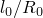 = 4.  is assumed to be equal to 1 unit. Only a quarter of the specimen needs to be analyzed because of the symmetry about the  and 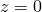 axes. [Figure 1.1.9--1](ch01s01ach09.md#sxmnecking-meshgeom) shows the mesh used in the analysis. Both the geometry and the deformation are assumed to be axisymmetric. Axisymmetric elements are used, and the mesh is refined near the center of the specimen because of the expected softening and intense deformation in that region. An initial geometric imperfection is used to induce necking in the specimen analyzed with Abaqus/Standard. In Abaqus/Explicit the imperfection is not needed because stress wave effects induce necking at the center of the bar.

#### Material

The material properties used in the computation are:

| Young's modulus, E: | 300 |
| --- | --- |
| Poisson's ratio, : | 0.3 |
| Porous material parameters: |  = 1.5,  = 1.0, and  = 2.25 |
| Initial relative density: | 1.0 ( = 0.0) |
| Void nucleation parameters: |  = 0.3,  = 0.1, and 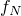 = 0.04 |
| Porous failure criteria: |  = 0.6, 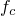 = 0.59 (for Abaqus/Explicit only) |

The work hardening behavior (yield stress, , versus equivalent plastic strain, ) given for the metal plasticity is of the form 

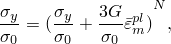

where  = 1 is the initial yield stress, *N* = 0.1 is the hardening parameter, and *G* is the elastic shear modulus. Necking is expected to start when the yield stress approaches the work hardening rate, which occurs at a strain of about 10 to 12%. Hence, the work hardening behavior is described more accurately for 0.08  0.3 than for the rest of the curve.

The parameters , , and  were introduced by Tvergaard (1981) to make the predictions of the Gurson model agree with numerical studies of an elastic-plastic medium containing a periodic array of voids. The parameter values used in this analysis are those chosen by Tvergaard.

The void nucleation parameters used in the material description are the same as those given by Tvergaard and Needleman (1984) and Needleman and Tvergaard (1985). These parameters describe the normal distribution of the nucleation strain (see ["Porous metal plasticity," Section 23.2.9 of the Abaqus Analysis User's Guide](../usb/usb-link.md#usb-mat-cpormetalplas)). The area under the normal distribution curve represents the total volume fraction of the nucleated voids and is approximately equal to . With the normal distribution, the amount of voids nucleated between 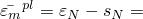 0.2 and  0.4 is about 68% of .

#### Boundary conditions and loading

The kinematic boundary conditions are symmetry about 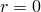 (all nodes along  have 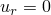 prescribed) and symmetry about  (all nodes along  have  prescribed). All the nodes on the top of the specimen along  4.0, in the node set `TOPSIDE`, are pulled in the *z*-direction while being held fixed in the *r*-direction. In the Abaqus/Explicit analysis the nodes in node set `TOPSIDE` are pulled with a prescribed velocity that increases linearly from 0 to 30 at 0.025 s and then decreases linearly from 30 to 0 at 0.05 s; in the Abaqus/Standard analysis the displacement is applied directly to obtain the deformations desired in the two analysis steps described below.

In the Abaqus/Standard analysis the accuracy of the implicit integration of the void nucleation and growth equation is controlled by prescribing a maximum allowable time increment in the automatic time incrementation scheme.

### Results and discussion

The example problem focuses on the neck development, which is a precursor to failure in the form of “cup-cone fracture.” The formation of the neck results in a triaxial state of stress at the center of the specimen, which accelerates the growth of the nucleated voids. A detailed analysis of the cup-cone fracture can be found in Tvergaard and Needleman (1984), which predicts that void nucleation is followed by the formation of a planar crack at the center of the neck as a result of the coalescence of voids. The planar crack propagates along a zig-zag path closer to the traction-free surface, eventually leading to the formation of the well-known cup-cone fracture.

#### Abaqus/Standard results

The calculations in the first step are terminated at an overall nominal strain 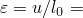 19%, thereby making it possible to compare the results with those of Aravas (1987). In the second step the calculations are carried on further to an overall nominal strain of 19.75%.

The results of the analysis are illustrated in [Figure 1.1.9--2](ch01s01ach09.md#necking-stress-v-strain) to [Figure 1.1.9--6](ch01s01ach09.md#sxmnecking-press-19-75). [Figure 1.1.9--2](ch01s01ach09.md#necking-stress-v-strain) shows the computed force as a function of the overall nominal strain. The maximum load is reached at an overall nominal strain of about 10.2%. The nominal stress–nominal strain curve, as well as the contour plots of void volume fraction ([Figure 1.1.9--3](ch01s01ach09.md#sxmnecking-voidvol-19)) and hydrostatic pressure ([Figure 1.1.9--4](ch01s01ach09.md#sxmnecking-press-19)) at an overall nominal strain of 19%, match well with the results obtained by Aravas (1987).

[Figure 1.1.9--5](ch01s01ach09.md#sxmnecking-voidvol-19-75) and [Figure 1.1.9--6](ch01s01ach09.md#sxmnecking-press-19-75) show the contour plots of void volume fraction and hydrostatic pressure at an overall nominal strain of 19.75%; a comparison with [Figure 1.1.9--3](ch01s01ach09.md#sxmnecking-voidvol-19) and [Figure 1.1.9--4](ch01s01ach09.md#sxmnecking-press-19) reveals a significant growth of voids and a corresponding decrease of the hydrostatic tension in the neck region, indicative of the material softening that has taken place.

#### Abaqus/Explicit results

The results of the analysis are illustrated in [Figure 1.1.9--2](ch01s01ach09.md#necking-stress-v-strain) and [Figure 1.1.9--7](ch01s01ach09.md#exxneck-voidvolume) through [Figure 1.1.9--10](ch01s01ach09.md#exxneck-hydropress-t2). [Figure 1.1.9--2](ch01s01ach09.md#necking-stress-v-strain) shows the computed nominal stress as a function of the nominal strain. The maximum load is reached at a nominal strain of about 9%, after which the specimen softens due to coalescence of voids and eventually fractures across the neck region. Due to the relatively high speed of the loading in the Abaqus/Explicit analysis, the void growth and coalescence and the failure propagation are coupled with dynamic effects. These dynamic effects are the source of the small differences observed in the results obtained with Abaqus/Explicit and Abaqus/Standard. [Figure 1.1.9--7](ch01s01ach09.md#exxneck-voidvolume) and [Figure 1.1.9--8](ch01s01ach09.md#exxneck-hydropress-t1) show total void volume fraction and pressure stress contours at  22.88% (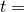 0.0317 s). [Figure 1.1.9--9](ch01s01ach09.md#exxneck-brokenbar) shows the broken tensile specimen (at  0.05 s), where only the elements whose void volume fraction is still below the ultimate failure ratio are shown. The deformed mesh is shown next to the initial mesh. [Figure 1.1.9--10](ch01s01ach09.md#exxneck-hydropress-t2) shows contours of pressure in the broken bar. As was mentioned earlier, the tensile bar typically fails in a “cup-cone fracture”; because a symmetric solution was assumed in this model, a proper cup-cone fracture cannot develop in this case.

### Input files

##### **Abaqus/Standard input files**

[neckingtensilebar_cax4r.inp](../eif/neckingtensilebar_cax4r.inp)

CAX4R elements.

[neckingtensilebar_cax6.inp](../eif/neckingtensilebar_cax6.inp)

CAX6 elements.

[neckingtensilebar_cax6m.inp](../eif/neckingtensilebar_cax6m.inp)

CAX6M elements.

[neckingtensilebar_cax8r.inp](../eif/neckingtensilebar_cax8r.inp)

CAX8R elements.

##### **Abaqus/Explicit input files**

[neck.inp](../eif/neck.inp)

Abaqus/Explicit analysis.

[neck_ale.inp](../eif/neck_ale.inp)

Model using the [*ADAPTIVE MESH](../key/key-link.md#usb-kws-hadaptivemesh) option.

[neck_ef1.inp](../eif/neck_ef1.inp)

External file referenced in the adaptive mesh input file.

[neck_ef2.inp](../eif/neck_ef2.inp)

External file referenced in the adaptive mesh input file.

### References

Aravas,  N., “On the Numerical Integration of a Class of Pressure-Dependent Plasticity Models,” International Journal for Numerical Methods in Engineering, vol. 24, pp. 1395–1416, 1987.

Needleman,  A., “A Numerical Study of Necking in Circular Cylindrical Bars,” Journal of the Mechanics and Physics of Solids, vol. 20, pp. 111–127, 1972.

Needleman,  A., and V. Tvergaard, “Material Strain-Rate Sensitivity in the Round Tensile Bar,” Brown University Report, Division of Engineering, 1985.

Tvergaard,  V., “Influence of Voids on Shear Band Instabilities under Plane Strain Conditions,” International Journal of Fracture, vol. 17, pp. 389–406, 1981.

Tvergaard,  V., and A. Needleman, “Analysis of the Cup-Cone Fracture in a Round Tensile Bar,” Acta Metallurgica, vol. 32, pp. 157–169, 1984.

### Figures

**Figure 1.1.9–1** Geometry and mesh for the round tensile bar.

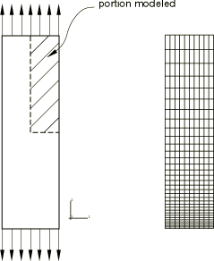

**Figure 1.1.9–2** Overall nominal stress, 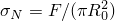, vs. overall nominal strain, 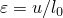.

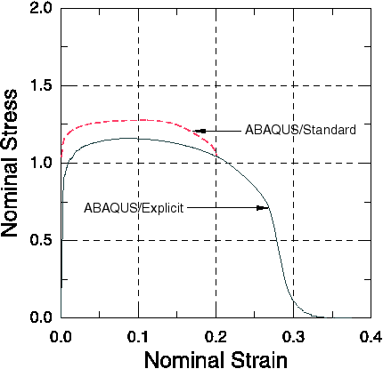

**Figure 1.1.9–3** Void volume fraction at 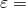 19% (Abaqus/Standard).

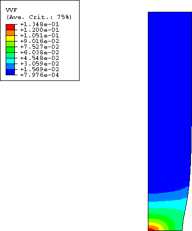

**Figure 1.1.9–4** Hydrostatic pressure at  19% (Abaqus/Standard).

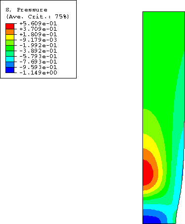

**Figure 1.1.9–5** Void volume fraction at  19.75% (Abaqus/Standard).

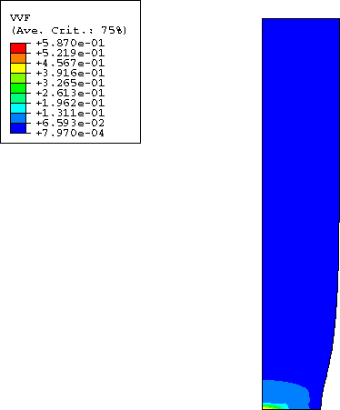

**Figure 1.1.9–6** Hydrostatic pressure at  19.75% (Abaqus/Standard).

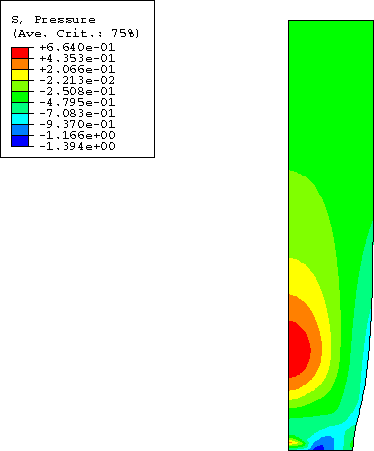

**Figure 1.1.9–7** Total void volume fraction at  22.88% (Abaqus/Explicit).

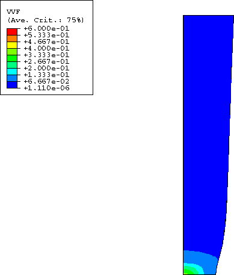

**Figure 1.1.9–8** Hydrostatic pressure at  22.88% (Abaqus/Explicit).

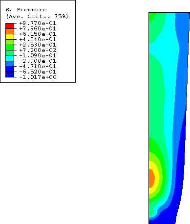

**Figure 1.1.9–9** Final broken bar and its initial configuration (Abaqus/Explicit).

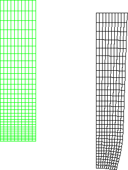

**Figure 1.1.9–10** Hydrostatic pressure in the broken bar (Abaqus/Explicit).

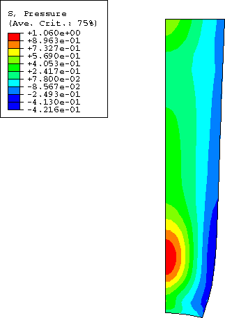

