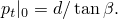
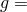
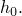
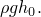

# 1.1.10 Concrete slump test

**Products: **Abaqus/Standard  Abaqus/Explicit  

This example illustrates the use of the extended Drucker-Prager plasticity model in Abaqus for a problem involving finite deformation. Abaqus provides three different yield criteria of the Drucker-Prager class. In all three the yield function is dependent on both the confining pressure and the deviatoric stress in the material. The simplest is a straight line in the meridional (*p*–*q*) plane. The other yield criteria are a hyperbolic surface and a general exponential surface in the meridional plane. ["Extended Drucker-Prager models," Section 23.3.1 of the Abaqus Analysis User's Guide](../usb/usb-link.md#usb-mat-cdruckerprager), describes these yield criteria in detail.

In this example the effects of different material parameters for the linear Drucker-Prager model are examined by simulating a concrete slump test. The other two Drucker-Prager yield criteria are verified by using parameters that reduce them to equivalent linear forms.

The slump test is a standardized procedure performed on fresh, wet concrete to determine its consistency and ability to flow. The test consists of filling a conical mold with concrete to a specified height. The mold is then removed, and the concrete is allowed to deform under its own weight. The reduction in height of the concrete cone, referred to as the “slump,” is an indication of the consistency and strength of the concrete. This example is a simulation of such a test. A finite element analysis of this problem has been published by Famiglietti and Prevost (1994).

### Problem description

No specific system of units is used in this example for the dimensions, the material parameters, or the loads. The units are assumed to be consistent. A standard, conical mold is used when performing a slump test on concrete. The cone is 0.3 units high. The radius at the base of the cone is 0.1, and the radius at the top is 0.05. An axisymmetric model is used to analyze the response of the concrete. The mesh used in the example is shown in [Figure 1.1.10--1](ch01s01ach10.md#sxmconcslump-mesh). First-order CAX4 elements are used for the Abaqus/Standard models, and first-order CAX4R elements are used for the Abaqus/Explicit models. We also include a three-dimensional model in Abaqus/Standard using two cylindrical elements spanning a 180 segment. No mesh convergence studies have been performed.

### Material parameters

The material properties reported by Famiglietti and Prevost are used in this example.

A Young's modulus of 2.25 and a Poisson's ratio of 0.125 define the elastic response of the concrete. A density of  0.1 is used.

It is assumed that the inelastic behavior is governed by the cohesion or shear strength and by the friction angle of the material. A cohesion of  0.0011547 is used, and the responses at four different friction angles ( 0, 5, 20, and 35) are compared. Perfect plasticity is assumed. Since these parameters are provided for a Mohr-Coulomb plasticity model, they must be converted to linear Drucker-Prager parameters. ["Extended Drucker-Prager models," Section 23.3.1 of the Abaqus Analysis User's Guide](../usb/usb-link.md#usb-mat-cdruckerprager), describes a method for converting Mohr-Coulomb parameters to equivalent linear Drucker-Prager parameters. Plane strain deformation and an associated plastic flow rule, where the dilation angle  is equal to the material friction angle , are assumed for the purpose of this conversion. The corresponding linear Drucker-Prager parameters,  and *d*, are given in [Table 1.1.10--1](ch01s01ach10.md#table-concslump-dpmatparams). The values are obtained using the expressions given in the [Abaqus Analysis User's Guide](../usb/usb-link.md#usb).

Reducing the hyperbolic yield function into a linear form requires that  Reducing the exponent yield function into a linear form requires that  1.0 and that  ()1. The material parameters for the exponential and hyperbolic yield criteria that create equivalent linear models are given in [Table 1.1.10--1](ch01s01ach10.md#table-concslump-dpmatparams). Neither the hyperbolic nor the exponential yield criteria can be reduced to a linear model where  0 (Mises yield surface).

The hyperbolic and exponential yield criteria both use a hyperbolic flow potential in the meridional stress plane. This flow potential, which is continuous and smooth, ensures that the flow direction is well-defined. The function asymptotically approaches the straight-line Drucker-Prager flow potential at high confining pressure stress but intersects the hydrostatic pressure axis at an angle of 90. This function is, therefore, preferred as a flow potential for the Drucker-Prager model over the straight-line potential, which has a vertex on the hydrostatic pressure axis.

To match the hyperbolic flow potential as closely as possible to the straight-line Drucker-Prager flow potential, the parameter  must be set to a small value. The default value for the exponent model,  0.1, is assumed in this example. This value ensures that the results obtained with this model will not deviate substantially from an equivalent straight-line flow potential, except for a small region in the meridional plane around the triaxial extension point. The size of this region diminishes as  decreases. This parameter rarely needs to be modified for problems where a linear flow potential is desired for modeling the inelastic deformation. Reducing  to a smaller value may cause convergence problems.

The inelastic material properties are specified using the extended Drucker-Prager plasticity model with hardening.

### Loading

The loading is a gravity load,  0.666, applied to the entire model. In Abaqus/Standard the load is increased linearly from zero at the beginning of the step to its maximum value at the end of the step.  In Abaqus/Explicit the load is ramped up using a smooth step amplitude definition. This amplitude definition provides a smooth loading rate, which is desirable in quasi-static or steady-state simulations.

The base of the concrete cone is held fixed in the vertical (2) direction but is free to move in the radial (1) direction. Thus, friction between the concrete and the support is not considered in this example.

This step accounts for finite strains and large displacements.

### Solution controls in Abaqus/Standard

The models with the hyperbolic and exponential yield criteria use the default values for solution controls. However, for the linear Drucker-Prager model field equation tolerances are used to override the automatic calculation of the average forces to decrease the computational time required for the analysis. The convergence criteria is set to 1%, and the average force is set to 5.0  105. The convergence check for the maximum allowable correction in displacement during an increment is also disabled. In addition, the time incrementation parameters are set automatically for this model to avoid premature cutbacks of the automatic time incrementation scheme. This is done because the linear flow potential used with this model creates a discontinuity in the solution when a material point reaches the vertex of the yield surface on the hydrostatic pressure axis. The error introduced in the solution by these relaxed tolerances is not large but results in a substantial reduction in computational time.

The maximum time increment is limited in the models such that no more than 2.0% of the total load is applied in any given increment. This is done so that the point of initial yield and the shape of the inelastic response are captured accurately during the analyses (see [Figure 1.1.10--4](ch01s01ach10.md#sxmconcslump-trajects) and [Figure 1.1.10--5](ch01s01ach10.md#sxmconcslump-vyieldfrac)).

The unsymmetric solver is activated for the exponential and hyperbolic yield models. This is needed because the hyperbolic flow potential used with the linear yield criteria causes nonassociated inelastic flow that results in an unsymmetric system of equations.

### Results and discussion

[Figure 1.1.10--2](ch01s01ach10.md#sxmconcslump-contours) shows the deformed shape and contours of the plastic strain in the vertical direction, PE22, for the linear Drucker-Prager model with  0. [Figure 1.1.10--3](ch01s01ach10.md#sxmconcslump-contours-30) shows a similar plot for the linear Drucker-Prager model with  30.16. The difference in the inelastic response seen in these figures can be attributed to two effects. First, the self-weight of the structure causes hydrostatic pressure stresses throughout most of the specimen, except for a thin layer at the outside surface of the cone where there are hydrostatic tensile stresses. The equivalent Mises stress, *q*, at which inelastic deformation occurs (the elastic extent) increases with increasing friction angle and pressure stress. This mechanism is illustrated in [Figure 1.1.10--4](ch01s01ach10.md#sxmconcslump-trajects) for the two limit cases ( 0 and  43.32) considered in this example. The figure shows the stress history in the meridional stress plane (equivalent pressure stress versus equivalent shear stress) for a material point located in the center of the cone near the base. Second, associated flow is assumed, so shearing is accompanied by dilation. Because of the confined nature of the geometry, an increase in volume strain is accompanied by an increase in pressure stress, further adding to the strength of the material. The second mechanism can easily be verified by performing nondilatant,  0, tests that will show larger slumps.

The response at different friction angles is also illustrated in [Figure 1.1.10--5](ch01s01ach10.md#sxmconcslump-vyieldfrac). The dimensionless slump parameter is the displacement of the center of the top surface of the concrete divided by the initial height,  The yield fraction is the ratio of the Drucker-Prager cohesion parameter, *d*, to the portion of applied load,  Typical dimensionless slumps for actual concrete, as reported by Christensen (1991), can range from 0.2 to 0.8. [Figure 1.1.10--6](ch01s01ach10.md#sxmconcslump-compare) compares the results of slump tests on two different concrete mixtures, normal and light, to computational results obtained with friction angles of 0 and 30.16. The experimental data are generally within the range bounded by these two computational models.

The results obtained with the linear versions of the exponent and hyperbolic yield criteria are identical to those obtained with the linear Drucker-Prager criterion. In Abaqus/Standard the analyses with the exponential and hyperbolic criteria generally require fewer iterations to achieve a converged solution compared to analyses with the linear criterion. This is attributed to the smooth, continuous hyperbolic flow potential used with the exponential and hyperbolic yield criteria.

The results discussed in the previous paragraphs correspond to the Abaqus/Standard analyses using CAX4 elements. The solutions obtained with the Abaqus/Explicit simulations using CAX4R elements are in close agreement. Similarly, the three-dimensional solution obtained with cylindrical elements also agrees closely with the corresponding axisymmetric solution. The results of these simulations are not reported here.

### Input files

##### **Abaqus/Standard input files**

[concreteslump_castiron.inp](../eif/concreteslump_castiron.inp)

Cast iron plasticity model.

The differences in the following data files are only in the Drucker-Prager parameters:

[concreteslump_beta30.inp](../eif/concreteslump_beta30.inp)

Linear Drucker-Prager model with  30.16.

[concreteslump_beta0.inp](../eif/concreteslump_beta0.inp)

Model with  0. Note that Mises plasticity, rather than Drucker-Prager plasticity, is used.

[concreteslump_beta8.inp](../eif/concreteslump_beta8.inp)

Exponential Drucker-Prager model with  8.574.

[concreteslump_beta43.inp](../eif/concreteslump_beta43.inp)

Hyperbolic Drucker-Prager model with  43.32.

[concreteslump_3dcyl.inp](../eif/concreteslump_3dcyl.inp)

Cylindrical element model with  0.

The differences in the following data files are only in the Mohr-Coulomb parameters:

[concreteslump_phi0.inp](../eif/concreteslump_phi0.inp)

Mohr-Coulomb model with  0.

[concreteslump_phi5.inp](../eif/concreteslump_phi5.inp)

Mohr-Coulomb model with  5.

[concreteslump_phi20.inp](../eif/concreteslump_phi20.inp)

Mohr-Coulomb model with  20.

[concreteslump_phi35.inp](../eif/concreteslump_phi35.inp)

Mohr-Coulomb model with  35.

##### **Abaqus/Explicit input files**

[concreteslump_castiron_xpl.inp](../eif/concreteslump_castiron_xpl.inp)

Cast iron plasticity model.

The differences in the following data files are only in the Drucker-Prager parameters:

[concreteslump_beta30_xpl.inp](../eif/concreteslump_beta30_xpl.inp)

Linear Drucker-Prager model with  30.16.

[concreteslump_beta0_xpl.inp](../eif/concreteslump_beta0_xpl.inp)

Model with  0. Note that Mises plasticity, rather than Drucker-Prager plasticity, is used.

[concreteslump_beta8_xpl.inp](../eif/concreteslump_beta8_xpl.inp)

Exponential Drucker-Prager model with  8.574.

[concreteslump_beta43_xpl.inp](../eif/concreteslump_beta43_xpl.inp)

Hyperbolic Drucker-Prager model with  43.32.

The differences in the following data files are only in the Mohr-Coulomb parameters:

[concreteslump_phi0_xpl.inp](../eif/concreteslump_phi0_xpl.inp)

Mohr-Coulomb model with  0.

[concreteslump_phi5_xpl.inp](../eif/concreteslump_phi5_xpl.inp)

Mohr-Coulomb model with  5.

[concreteslump_phi20_xpl.inp](../eif/concreteslump_phi20_xpl.inp)

Mohr-Coulomb model with  20.

[concreteslump_phi35_xpl.inp](../eif/concreteslump_phi35_xpl.inp)

Mohr-Coulomb model with  35.

### References

Christensen,  G., *Modeling the Flow of Fresh Concrete: The Slump Test, *Ph.D. dissertation, Princeton University, 1991.

Famiglietti,  C. M., and J. H. Prevost, “Solution of the Slump Test Using a Finite Deformation Elasto-Plastic Drucker-Prager Model,” International Journal for Numerical Methods in Engineering, vol. 37, pp. 3869–3903, 1994.

### Table

**Table 1.1.10–1** Drucker-Prager material parameters. For all models it is assumed that .
| Mohr-Coulomb | Linear | Exponential | Hyperbolic |
| --- | --- | --- | --- |
| *c* |  |  | *d* | *a* | *b* |  |
| 1.1547 103 | 0 | 0.000 | 2.00 103 | N/A | N/A | N/A |
| 1.1547 103 | 5 | 8.574 | 1.989 103 | 6.632 | 1.0 | 1.319 102 |
| 1.1547 103 | 20 | 30.164 | 1.844 103 | 1.721 | 1.0 | 3.173 103 |
| 1.1547 103 | 35 | 43.322 | 1.555 103 | 1.060 | 1.0 | 1.649 103 |

### Figures

**Figure 1.1.10–1** Undeformed mesh (CAX4 elements).

**Figure 1.1.10–2** Contours of PE22 for model with  0.

**Figure 1.1.10–3** Contours of PE22 for model with  30.16.

**Figure 1.1.10–4** Material point trajectory in meridional stress plane for  0 and  43.32.

**Figure 1.1.10–5** Dimensionless slump vs. yield fraction.

**Figure 1.1.10–6** Comparison of experimental slump test results (from Christensen) with computational results.

