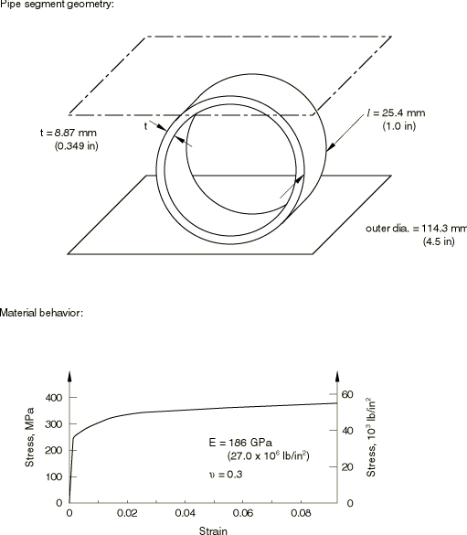
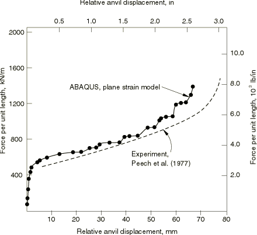
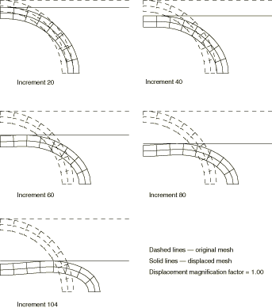
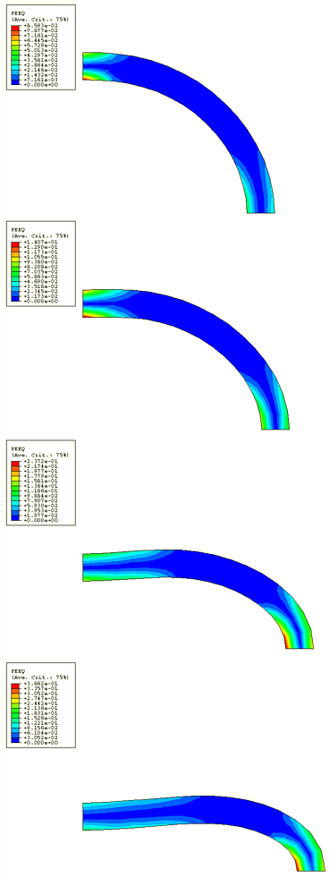

# 1.1.12 Crushing of a pipe

**Product: **Abaqus/Standard  

Extreme accident analysis of piping systems sometimes requires knowledge of the behavior of a pipe section as it is crushed. The simplest such investigation is discussed in this example: the crushing of a long, straight pipe between two flat, frictionless anvils. The objectives are to establish the load-deflection response of the pipe and to describe the overall deformation of the section, since this may greatly affect fluid flow through the pipe. The example also provides a simple demonstration of the capabilities of Abaqus for modeling contact problems between deformable bodies and rigid, impenetrable surfaces.

### Problem description

The dimensions of the pipe section segment and its material properties are shown in [Figure 1.1.12--1](ch01s01ach12.md#sxmpipecrush-geommat). By symmetry only one quadrant of the pipe section needs to be modeled. A uniform mesh of fully integrated 8-node, plane strain, “hybrid” elements is used, with two elements through the thickness and eight around the pipe quadrant. No mesh convergence studies have been performed, but the reasonable agreement with experimental results suggests that the mesh is adequate to predict the overall response with usable accuracy.

The contact between the pipe and a flat, rigid anvil is modeled with a contact pair. The outside surface of the pipe is specified using a surface definition. The rigid anvil is modeled as an analytical rigid surface using a surface definition and a rigid body constraint. The mechanical interaction between the contact surfaces is assumed to be frictionless. The pipe is crushed by pushing down on the rigid anvil using a boundary condition to prescribe a downward vertical displacement.

In addition to the plane strain models, a continuum shell element model is provided for illustrative purposes. This model uses a uniform mesh of SC8R elements, with four elements stacked through the thickness and sixteen elements around the pipe quadrant. The anvil is modeled using continuum shell elements and then converted to a rigid body. No mesh convergence studies have been performed, since the results provide reasonable agreement with the experimental results. This model is more costly than the plane strain model since it uses more degrees of freedom.

### Results and discussion

[Figure 1.1.12--2](ch01s01ach12.md#sxmpipecrush-response) shows the load versus relative anvil displacement, compared to the experimental measurements of Peech et al. (1977). The “staircase” pattern of the predicted response is caused by the discrete contact that occurs in the model because contact is detected only at the nodes of the contact slave surface. A finer mesh would provide a smoother response. The plane strain model predicts the experimental results with reasonably good accuracy up to a relative displacement of about 50.8 mm (2.0 in). Beyond this point the plane strain assumption no longer characterizes the overall physical behavior, and the model predicts a stiffer response than the “ring crush” experiments of Peech et al. (1977). Another analysis of the same problem (Taylor, 1981) shows the same discrepancy, which might, therefore, be attributable to incorrect assumptions about the material behavior.

Deformed configuration plots and contours of equivalent total plastic strain are shown in [Figure 1.1.12--3](ch01s01ach12.md#sxmpipecrush-progdeform) and [Figure 1.1.12--4](ch01s01ach12.md#sxmpipecrush-contours). Large plastic strains develop near the symmetry planes where the tube is being crushed and extended severely. The “figure eight” shape is correctly predicted: the constriction of the pipe section associated with this geometry will certainly restrict flow.

The results for the continuum shell model are similar to the plane strain model and, hence, show reasonable agreement with the experimental results.

### Input files

[pipecrushing_cpe8h.inp](../eif/pipecrushing_cpe8h.inp)

Plane strain modeling of the ring crush experiment using CPE8H elements.

[pipecrushing_cpe6h.inp](../eif/pipecrushing_cpe6h.inp)

CPE6H elements.

[pipecrushing_cpe4i.inp](../eif/pipecrushing_cpe4i.inp)

CPE4I elements.

[pipecrushing_sc8r.inp](../eif/pipecrushing_sc8r.inp)

SC8R elements.

### References

Peech, J. M., R. E. Roener, S. D. Porofin, G. H. East, and N. A. Goldstein, “Local Crush Rigidity of Pipes and Elbows,” Proc. 4th SMIRT Conf. paper F-3/8, North Holland, 1977.

Taylor, L. M., “A Finite Element Analysis for Large Deformation Metal Forming Problems Involving Contact and Friction,” Ph.D. Thesis, U. Texas at Austin, December 1981.

### Figures

**Figure 1.1.12–1** Pipe crush example.

**Figure 1.1.12–2** Force-displacement response for pipe crush case.

**Figure 1.1.12–3** Progressive deformation of the pipe.

**Figure 1.1.12–4** Equivalent plastic strain contours in the pipe.

