# 1.1.13 Radial stretching of a cylinder

**Product: **Abaqus/Standard  

This problem verifies and illustrates the use of axisymmetric and cylindrical elements under uniform radial displacement in Abaqus. The analytical solution for stress components in cylindrical coordinates is used to verify the Abaqus quasi-static solution.

### Problem description

The physical problem consists of a hollow cylinder with the inner edge constrained in the radial direction. The base of the cylinder is constrained in the axial direction. A uniform radial displacement is specified along the outer edge of the cylinder. [Figure 1.1.13--1](ch01s01ach13.md#bmk_anl_radial_stretch_fig1_prob)  and [Figure 1.1.13--2](ch01s01ach13.md#bmk_anl_radial_stretch_fig2_prob) show the model geometry used in this analysis. In consistent units the inner and outer radii of the cylinder are 4.0 and 6.0, respectively, with a cylinder height of 2.0. A linear elastic, isotropic material with a Young's modulus of 2  1011, a Poisson's ratio of 0.3, and a density of 1000 is specified. A 20  20 mesh is used to model the axisymmetric domain with CAX4R, CAX4, and CAX8 elements. The complete three-dimensional domain is modeled with CCL12 and CCL24 cylindrical elements. Mesh convergence studies have not been performed.

### Results and discussion

The derived analytical solution for this problem is

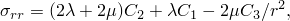

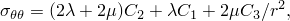

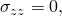

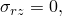

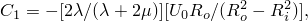

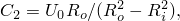

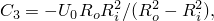

where  and  are the Lam parameters;  and  are the outer and inner radii, respectively; and  is the applied uniform displacement of 0.2 units.

[Figure 1.1.13--3](ch01s01ach13.md#bmk_anl_rad_stretch_radialstress) and [Figure 1.1.13--4](ch01s01ach13.md#bmk_anl_rad_stretch_hoopstress) show the variation of the radial stress, 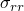, and hoop stress, , with respect to the radius of the hollow cylinder for the various elements. These stresses are compared to the analytical solution. The results for all elements agree well with the analytical solution. 

### Input files

[radstr_holcyl_cax4r.inp](../eif/radstr_holcyl_cax4r.inp)

CAX4R axisymmetric model.

[radstr_holcyl_cax4.inp](../eif/radstr_holcyl_cax4.inp)

CAX4 axisymmetric model.

[radstr_holcyl_cax8.inp](../eif/radstr_holcyl_cax8.inp)

CAX8 axisymmetric model.

[radstr_holcyl_ccl12.inp](../eif/radstr_holcyl_ccl12.inp)

CCL12 three-dimensional model.

[radstr_holcyl_ccl24.inp](../eif/radstr_holcyl_ccl24.inp)

CCL24 three-dimensional model.

### Figures

**Figure 1.1.13–1** Three-dimensional representation of the problem.

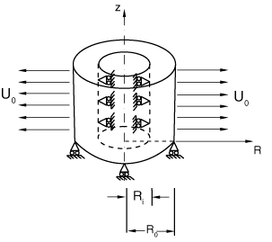

**Figure 1.1.13–2** Equivalent axisymmetric model.

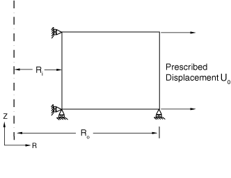

**Figure 1.1.13–3** Variation of radial stress with radius.

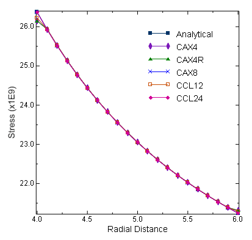

**Figure 1.1.13–4** Variation of hoop stress with radius.

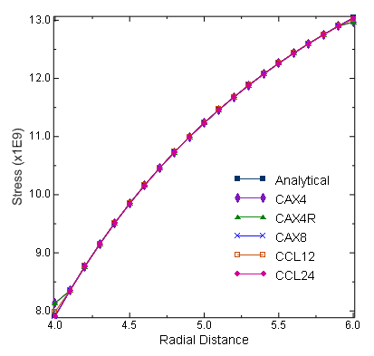

