# 1.2.2 Buckling of a ring in a plane under external pressure

**Product: **Abaqus/Standard  

A particularly simple and interesting example of the asymmetric buckling of an axisymmetric structure under axisymmetric loading is the buckling of a thin, elastic ring under external pressure. The problem is interesting because the buckling load is strongly influenced by the follower force nature of the pressure: if this effect is neglected (the “radial loading” case), the prediction of the critical buckling load will be too high—Boresi (1955) shows that the error can be as much as 50% for very thin rings.

In problems of this geometric type the prebuckled deformation is axisymmetric (assuming no imperfections), while the buckling occurs as deformation in a periodic mode with respect to angular position: 

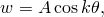

where *w* is the radial displacement of a point at angular position , *A* is some arbitrary magnitude, and *k* is the mode number, 2,3,4.... Eigenvalue buckling load estimates are useful in design in such a case, because they are quite accurate if the structure is not very sensitive to imperfections. The buckling deformation can be arbitrarily chosen to be symmetric about 0 and will then be antisymmetric about 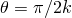.

For this case we know the lowest buckling mode (2) has the smallest critical load, so a mesh of 45 extent should suffice for eigenvalue buckling estimation. This requires symmetric boundary conditions at  45 during loading, but antisymmetry at  45 during eigenvalue solution. This is easily accomplished with Abaqus, as shown below.

Following the eigenvalue buckling estimation, imperfection sensitivity is studied by introducing an imperfection into the radius in the form of the lowest buckling mode:

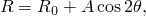

where  is the radius of the perfect ring. The magnitude of the imperfection is usually chosen in the range of 1% to 10% of the thickness of the ring and the load-displacement response obtained. These results then show the sensitivity of the response to such an imperfection. For load-displacement analysis the antisymmetry condition no longer applies, since the response is no longer a pure bifurcation. As a result of this, a 90 model with symmetry conditions at both ends must be used.

### Problem description

The problem is shown in [Figure 1.2.2--1](ch01s02ach15.md#sxmringbuckling-geom). The ring has a mean radius of 2.54 m (100 in), with a square cross-section of 25.4  25.4 mm (1  1 in). The material is assumed to be linear elastic, with Young's modulus of 206.8 GPa (30  106 lb/in2) and Poisson's ratio 0.0. The ring is loaded by uniform external pressure.

### Element choice

The obvious element choice for this case is a beam in a plane. Element types B21 and B22 are, therefore, used. For purposes of verification, the analyses are also done with shell elements S8R, S8R5, S9R5, STRI65 and STRI3. The axisymmetric elements with nonaxisymmetric deformation are ideally suited for this problem. Results are reported for shell elements SAXA1*n* and SAXA2*n* and continuum elements CAXA8*n* and CAXA8H*n* (*n* = 2, 3 or 4), where *n* is the number of Fourier modes used in the element. The lowest-order Fourier mode possible for this problem is *n* = 2, since the buckling shape has a  circumferential displacement. Higher-order modes can be used, but they do not alter the solution.

### Eigenvalue buckling load estimates

Several meshes are used for the eigenvalue buckling load estimates: three or five elements of type B21 in 45; three B22 elements; one or two shell elements of type S8R, S8R5, S9R5; five or ten elements of type STRI3; three or six elements of STRI65; one element of type SAXA12 or SAXA22; and one element of type CAXA82 or CAXA8H2.

In all models symmetry boundary conditions are used at  0. Except for the SAXA and CAXA models, at  45 a local coordinate system definition is used to obtain a local system with local 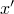 radial to the ring and local 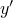 tangential to the ring. In that local system the boundary conditions are symmetric (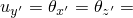0) during load application and antisymmetric (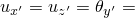 0) during eigenvalue extraction.

In the SAXA and CAXA model the rigid body mode in the global *x*-direction is eliminated by forcing the radial displacements at a node in the  0 plane and at the corresponding node in the  180 plane to be identical with an equation constraint.

Eigenvalue buckling estimates are obtained by using the eigenvalue buckling procedure (["Eigenvalue buckling prediction," Section 6.2.3 of the Abaqus Analysis User's Guide](../usb/usb-link.md#usb-anl-aeigenbuckling)). This is a linear perturbation procedure in which the current stiffness is calculated using the rules for linear perturbation analysis. The stiffness matrix associated with the external pressure load is calculated. For a linear perturbation analysis, the magnitude of the pressure is immaterial, since the stiffness is proportional to the pressure. (A magnitude of 6895 Pa, 1 lb/in2 is used.) Since deformation due to the pressure load is a uniform compression, except for the SAXA and CAXA models, symmetric boundary conditions are applied. For the eigenvalue buckling analysis we need to specify symmetric boundary conditions at  0 but antisymmetric at  45. This is done by a complete specification of the buckling mode boundary conditions. If a second set of boundary conditions is specified this way, it is used during the buckling analysis. These boundary condition changes are not needed for the CAXA and SAXA elements. Only one eigenmode is requested, since the 45 sector has been chosen based on it being able to represent the lowest mode. Higher modes would require a different sector.

The exact solution to this problem is a critical pressure of 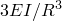, where *E* is Young's modulus, *I* is the moment of inertia of the ring, and *R* is the mean radius, so that with the data chosen here the critical pressure is 0.05171 MPa (7.5 lb/in2). The solutions obtained with the various Abaqus models are shown in [Table 1.2.2--1](ch01s02ach15.md#table-ringbuckling-eigests). Except for the coarsest models, all of the models give the critical pressure quite accurately.

### Results and discussion

The load-displacement response prediction requires 90 models, since the pure symmetry or antisymmetry condition at 45 is no longer valid. Meshes of five B21 beams and of two and three shell elements in a 90 arc are, therefore, used. A model of perfectly circular geometry is not useful, since it has no basis to switch into the postbifurcation mode. Various methods are commonly adopted to overcome this problem. Most typically some slight imperfection is introduced into the geometry. This imperfection may be random or may be chosen in the shape of the most critical buckling mode predicted by the eigenvalue analysis. The latter method is used here: presumably an imperfection in the shape of the lowest mode would be the most critical, so this seems to be a rational basis for investigating the sensitivity of the structure to imperfections. Thus, we generate the model with a radius

where  is the nominal radius (2.54 m, 100 in) and *A* is the imperfection magnitude. This magnitude is chosen as 10%, 1%, and as 0.1% of the thickness. These values are all very small compared to the radius of the ring.

First, we compare the different models. [Figure 1.2.2--2](ch01s02ach15.md#sxmringbuckling-pressvdisp) shows the response of the three different meshes for the 10% initial imperfection case. The two shell models are consistent, while the five-element beam model gives a stiffer response as it buckles. This is to be expected, since the beam element chosen uses linear interpolation. A finer mesh, or use of higher-order beam elements (B22 or B23), would probably improve the results.

The different imperfection magnitudes are compared in [Figure 1.2.2--3](ch01s02ach15.md#sxmringbuckling-pressvdisp2), based on the two-shell-element model (since that model seems adequate from the above comparison). The figure shows the expected behavior: as the imperfection magnitude is reduced, the response becomes less smooth, with a sudden, sharp transition especially evident in the smallest imperfection modeled occurring at the load value predicted by the eigenvalue approach.

For the CAXA and SAXA elements an initial geometric imperfection is not possible, and results for these elements are not reported. Load-displacement results could be obtained, however, by introducing an initial imperfection in the loading.

### Input files

[ringbuckling_b21_buckle.inp](../eif/ringbuckling_b21_buckle.inp)

Eigenvalue buckling input data for B21.

[ringbuckling_b21_static.inp](../eif/ringbuckling_b21_static.inp)

Static collapse input data for B21, where the imperfect mesh is generated by the ringbuckling_b21_meshgen.f FORTRAN program.

[ringbuckling_b21_meshgen.f](../eif/ringbuckling_b21_meshgen.f)

FORTRAN program used to generate the mesh for ringbuckling_b21_static.inp.

[ringbuckling_b21_5el.inp](../eif/ringbuckling_b21_5el.inp)

Eigenvalue buckling input data for the five-element B21 model.

[ringbuckling_b22_3el.inp](../eif/ringbuckling_b22_3el.inp)

Eigenvalue buckling input data for the three-element B21 model.

[ringbuckling_s8r_1el.inp](../eif/ringbuckling_s8r_1el.inp)

Eigenvalue buckling data for S8R, 1-element model.

[ringbuckling_s8r_2el.inp](../eif/ringbuckling_s8r_2el.inp)

Eigenvalue buckling data for S8R, 2-element model.

[ringbuckling_s8r_static.inp](../eif/ringbuckling_s8r_static.inp)

Static collapse input data for S8R, where the imperfect mesh is generated by the ringbuckling_s8r_meshgen.f FORTRAN program.

[ringbuckling_s8r_meshgen.f](../eif/ringbuckling_s8r_meshgen.f)

FORTRAN program used to generate the mesh for ringbuckling_s8r_static.inp.

[ringbuckling_s8r5_1el.inp](../eif/ringbuckling_s8r5_1el.inp)

Eigenvalue buckling data for S8R5, 1-element model.

[ringbuckling_s8r5_2el.inp](../eif/ringbuckling_s8r5_2el.inp)

Eigenvalue buckling data for S8R5, 2-element model.

[ringbuckling_s9r5_1el.inp](../eif/ringbuckling_s9r5_1el.inp)

Eigenvalue buckling data for S9R5, 1-element model.

[ringbuckling_s9r5_2el.inp](../eif/ringbuckling_s9r5_2el.inp)

Eigenvalue buckling data for S9R5, 2-element model.

[ringbuckling_stri3_5by2.inp](../eif/ringbuckling_stri3_5by2.inp)

Eigenvalue buckling input data for STRI3, 5  2 mesh.

[ringbuckling_stri3_10by2.inp](../eif/ringbuckling_stri3_10by2.inp)

Eigenvalue buckling input data for STRI3, 10  2 mesh.

[ringbuckling_stri65_2el.inp](../eif/ringbuckling_stri65_2el.inp)

Eigenvalue buckling input data for STRI65, 2-element model.

[ringbuckling_stri65_6el.inp](../eif/ringbuckling_stri65_6el.inp)

Eigenvalue buckling input data for STRI65, 6-element model.

[ringbuckling_caxa82.inp](../eif/ringbuckling_caxa82.inp)

Eigenvalue buckling input data for CAXA82.

[ringbuckling_caxa8h2.inp](../eif/ringbuckling_caxa8h2.inp)

Eigenvalue buckling input data for CAXA8H2.

[ringbuckling_saxa12.inp](../eif/ringbuckling_saxa12.inp)

Eigenvalue buckling input data for SAXA12.

[ringbuckling_saxa22.inp](../eif/ringbuckling_saxa22.inp)

Eigenvalue buckling input data for SAXA22.

### Reference

Boresi, A. P., “A Refinement of the Theory of Buckling of Rings Under Uniform Pressure,” Journal of Applied Mechanics, vol. 77, pp. 99–102, 1955.

### Table

**Table 1.2.2–1** Eigenvalue buckling estimates.
| Element type | Number of | Critical pressure | Error |
| --- | --- | --- | --- |
| elements | estimate |
| in 45 | (MPa) | (lb/in2) |
| B21 | 3 | 0.0538 | 7.796 | 4.0% |
|  | 5 | 0.0524 | 7.605 | 1.4% |
| B22 | 3 | 0.0517 | 7.501 | 0.1% |
| S8R | 1 | 0.0523 | 7.587 | 1.2% |
|  | 2 | 0.0517 | 7.505 | 0.1% |
| STRI3 | 5 | 0.0524 | 7.606 | 1.4% |
|  | 10 | 0.0519 | 7.526 | 0.3% |
| STRI65 | 3 | 0.0530 | 7.693 | 3.8% |
|  | 6 | 0.0517 | 7.505 | 0.1% |
| S8R5 | 1 | 0.0537 | 7.786 | 3.8% |
|  | 2 | 0.0519 | 7.523 | 0.3% |
| S9R5 | 1 | 0.0537 | 7.786 | 3.8% |
|  | 2 | 0.0519 | 7.523 | 0.3% |
| SAXA12 | 1 in 180 | 0.0517 | 7.499 | 0.01% |
| SAXA22 | 1 in 180 | 0.0517 | 7.499 | 0.01% |
| CAXA82 | 1 in 180 | 0.0517 | 7.499 | 0.01% |
| CAXA8H2 | 1 in 180 | 0.0517 | 7.499 | 0.01% |

### Figures

**Figure 1.2.2–1** Ring buckling problem.

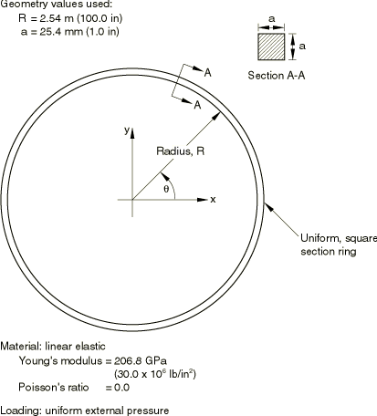

**Figure 1.2.2–2** Pressure-displacement response for ring.

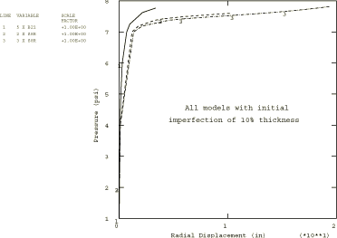

**Figure 1.2.2–3** Pressure-displacement response with various initial imperfections.

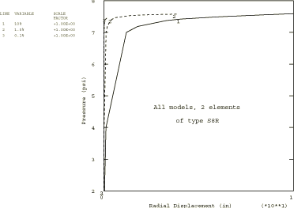

