# 1.2.3 Buckling of a cylindrical shell under uniform axial pressure

**Product: **Abaqus/Standard  

This example illustrates the use of Abaqus to predict the elastic buckling instability of a “stiff” structure (a structure that exhibits only small, elastic deformations prior to buckling). The example is a classic case of this type of problem; a detailed analytical discussion of the problem is available in Timoshenko and Gere (1961). This analytical solution allows the example to be used for verification of the numerical results.

The structural analyst often encounters problems involving stability assessment, especially in the design of efficient shell structures. Since the shell is usually designed to carry the loading primarily as a membrane, its initial response is stiff; that is, it undergoes very little deformation. If the membrane state created by the external loading is compressive, there is a possibility that the membrane equilibrium state will become unstable and the structure will buckle. Since the shell is thin, its bending response is much less stiff than its membrane response. Such buckling will result in very large deflections of the shell (even though the postbuckling response may be mathematically stable in the sense that the structure's stiffness remains positive). In many cases the postbuckled stiffness is not positive; in such cases the collapse load generally will depend strongly on imperfections in the original geometry; that is, the structure is “imperfection sensitive.” In some cases the buckling may be only a local effect in the overall response: the shell may subsequently become stiffer again and reach higher load levels usefully with respect to its design objective. Sometimes there are many collapse modes into which the shell may buckle. For all of these reasons shell collapse analysis is challenging. This example illustrates the standard numerical approach to such problems: eigenvalue estimation of bifurcation loads and modes, followed by load-deflection analysis of a model that includes imperfections.

### Problem description

The problem consists of a long, thin, metal cylinder that is simply supported in its cross-section and loaded by a uniformly distributed compressive axial stress at its ends ([Figure 1.2.3--1](ch01s02ach16.md#sxmbuckshell-geom)). The cylinder is sufficiently thin so that buckling occurs well below yield. (When buckling occurs in the plastic range, the problem can generally be studied numerically only by load-deflection analysis of models that include initial imperfections. The sudden change of deformation mode at collapse causes the elastic-plastic response to switch from elastic to yielding in some parts of the model and from yielding to elastic unloading at other points. Eigenvalue bifurcation predictions are then useful only as guidance for mesh design.)

In the particular case studied, the cylinder length is 20.32 m (800 in), the radius is 2.54 m (100 in), and the shell thickness is 6.35 mm (0.25 in). Thus, the radius to thickness ratio for the shell is 400:1.

The shell is made of an isotropic material with Young's modulus of 207 GPa (30  106 lb/in2) and Poisson's ratio of 0.3.

### Analysis procedure

In general, shell buckling stability studies require two types of analysis. First, eigenvalue analysis is used to obtain estimates of the buckling loads and modes. Such studies also provide guidance in mesh design because mesh convergence studies are required to ensure that the eigenvalue estimates of the buckling load have converged: this requires that the mesh be adequate to model the buckling modes, which are usually more complex than the prebuckling deformation mode. Using a mesh and imperfections suggested by the eigenvalue analysis, the second phase of the study is the performance of load-displacement analyses, usually using the Riks method to handle possible instabilities. These analyses would typically study imperfection sensitivity by perturbing the perfect geometry with different magnitudes of imperfection in the most important buckling modes and investigating the effect on the response.

### Eigenvalue buckling prediction

The key aspect of the eigenvalue analysis is the mesh design. For the particular problem under study we know that the critical buckling mode will be a displacement pattern with *n* circumferential waves ([Figure 1.2.3--2](ch01s02ach16.md#sxmbuckshell-xsection) shows a cross-section with 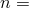 2 and  3) and *m* longitudinal half-waves, and we need to determine the values of *n* and *m* that represent the lowest critical stress. One approach would be to model the whole cylinder with a very fine mesh and to assume that we can then pick up the most critical mode. This approach would be computationally expensive and is not needed in this case because of the symmetry of the initial geometry. We need to model only one-quarter of a circumferential wave: the combination of symmetry boundary conditions at one longitudinal edge of this circumferential slice and antisymmetry boundary conditions at the other longitudinal edge during the eigenvalue extraction allows this quarter-wave model to represent the entire cylinder in the circumferential direction. A quarter-wave circumferentially subtends an angle of 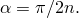 Likewise, we need only model one-half of the axial length, using either symmetry or antisymmetry at the midplane, depending on whether we are looking for even or odd modes 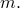

With this approach it is necessary to perform several analyses using different values of  and symmetry or antisymmetry at the midplane, instead of a single analysis with a very large model. Several small analyses are generally less expensive than one large analysis, since the computational costs rise rapidly with model size. In this particular example we consider the variation of  in the range of 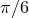 to 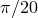, corresponding to the range  3 to  10. We do not consider the cases of  1 and  2 because we know that these will not give lower critical loads.

The mesh chosen for the analysis of such a segment of the cylinder, using element type S4R5, is shown in [Figure 1.2.3--3](ch01s02ach16.md#sxmbuckshell-mesh). Similar meshes with element types S4R, STRI3, STRI65, and S9R5 are also used. For the triangular elements each quadrilateral shown in [Figure 1.2.3--3](ch01s02ach16.md#sxmbuckshell-mesh) is divided into two triangles. The meshes using element types S9R5 and STRI65 have half the number of elements in the circumferential and axial directions as the meshes using the lower-order elements. No mesh convergence studies have been done, but all the meshes and elements used give reasonably accurate predictions of the critical load.

Eigenvalue buckling analysis is performed with Abaqus by first storing the stiffness matrix at the state corresponding to the “base state” loading on the structure, then applying a small perturbation of “live” load. The initial stress matrix resulting from the live load is calculated, and then an eigenvalue calculation is performed to determine a multiplier to the “live” load at which the structure reaches instability. In this example there is no load prior to the “live” load; therefore, the eigenvalue buckling (["Eigenvalue buckling prediction," Section 6.2.3 of the Abaqus Analysis User's Guide](../usb/usb-link.md#usb-anl-aeigenbuckling)) is the only step. During the buckling procedure one longitudinal edge has symmetry boundary conditions, and the other has antisymmetry boundary conditions, as shown in [Figure 1.2.3--3](ch01s02ach16.md#sxmbuckshell-mesh). With these constraints a mesh subtending an angle of  can model modes with 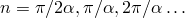 waves around the circumference of the cylinder. However, during the calculation of the initial stress matrix, both longitudinal edges must have symmetric boundary conditions (because the prebuckling response that creates this stress stiffness is symmetric). Thus, the boundary conditions associated with the “live” loading are specified under one boundary condition, and the boundary conditions associated with the buckling deformation are defined under a second boundary condition. If the second definition is not given, the boundary conditions are the same for the loading and for the buckling mode calculation. The loaded edge is simply supported. Since the number of longitudinal half-waves *m* can have odd or even values, the midlength edge is alternately modeled with symmetry and antisymmetry boundary conditions. 

### Load-displacement analysis on imperfect geometries

The example is continued by performing an incremental load-deflection analysis using the modified Riks method. For some problems linear eigenvalue analysis is sufficient for design evaluation, but if there is concern about material nonlinearity, geometric nonlinearity prior to buckling, or unstable postbuckling response (with associated imperfection sensitivity), the analyst generally must perform a load-deflection analysis to investigate the problem further.

The mesh used for this phase of the analysis consists of eight rows of elements of type S4R5 in the circumferential direction between symmetry lines. (In the eigenvalue analysis antisymmetry boundary conditions are used, since the analysis is a linear perturbation method. But this load-deflection study allows fully nonlinear response, so the antisymmetry assumption is no longer correct.) Twenty elements are used along the length of the cylinder.

An imperfection in the form of the critical buckling mode (obtained in the previous analyses of the example) is assumed to be the most critical. The mesh is, therefore, perturbed in the radial direction by that eigenmode, scaled so that the largest perturbation is a fraction of the shell thickness. The studies reported here use perturbations of 1%, 10%, and 100% of the thickness. The following examples demonstrate two methods of introducing the imperfection.

The first method makes use of the model antisymmetry and defines the imperfection by means of a FORTRAN routine that is used to generate the perturbed mesh, using the data stored on the results file written during the eigenvalue buckling analysis. [bucklecylshell_stri3_n4.inp](../eif/bucklecylshell_stri3_n4.inp) shows the input data for the buckling prediction, [bucklecylshell_progpert.f](../eif/bucklecylshell_progpert.f) shows the FORTRAN routine used to generate the nodal coordinates of the perturbed mesh, and [bucklecylshell_postbucklpert.inp](../eif/bucklecylshell_postbucklpert.inp) shows the input data for the postbuckling analysis. The meshes for the buckling prediction analysis and the postbuckling analysis are different and are described in the “Input Files” section. The postbuckling analysis is performed using the static RIKS procedure (["Unstable collapse and postbuckling analysis," Section 6.2.4 of the Abaqus Analysis User's Guide](../usb/usb-link.md#usb-anl-apostbuckling)).

The second method uses a geometric imperfection to define the imperfection, which requires that the model definitions for the buckling prediction analysis and the postbuckling analysis be identical. [bucklecylshell_s4r5_n1.inp](../eif/bucklecylshell_s4r5_n1.inp) shows the input data for the buckling prediction, and [bucklecylshell_postbucklimperf.inp](../eif/bucklecylshell_postbucklimperf.inp) shows the input data for the postbuckling analysis.

### Results and discussion

The results for both analyses are discussed below.

#### Eigenvalue buckling prediction

The analytical solution given by Timoshenko and Gere assumes that the buckling eigenmode has *n* lobes or waves circumferentially and *m* half-waves longitudinally and provides a critical stress value for each combination of *m* and *n*. The mode that gives the minimum critical stress value will be the primary buckling mode of the shell: which mode is critical depends on the thickness, radius, and length of the cylinder. For the particular case studied here, the dependency of the critical stress values on *m* and *n* is illustrated in [Figure 1.2.3--4](ch01s02ach16.md#sxmbuckshell-critstress): each node on the surface represents a possible buckling mode. [Table 1.2.3--1](ch01s02ach16.md#table-buckshell-strss-v-mode) shows the numerical values of these critical stresses for a number of mode shapes. For this geometry the minimum critical stress corresponds to a mode shape defined by 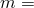 1 and  4; that is, one half-wave along the cylinder and four full waves around the circumference. [Figure 1.2.3--5](ch01s02ach16.md#sxmbuckshell-modeshape) shows the (1, 4) buckling mode shape predicted with the mesh of S4R5 elements.

The  1,  0 mode corresponds to buckling of the cylindrical shell as an Euler column: for this mode the critical stress is more than 250 times the critical stress for  1,  4. For small numbers of axial half-waves (*m*) the critical stress changes rapidly with respect to the number of circumferential lobes (*n*). However, for higher values of *m* and *n* the critical stresses are not very much higher than the critical stress for  1,  4 and do not vary much from mode to mode, as can be observed in [Figure 1.2.3--4](ch01s02ach16.md#sxmbuckshell-critstress) and [Table 1.2.3--1](ch01s02ach16.md#table-buckshell-strss-v-mode). This behavior exhibits itself in the finite element solutions, as shown—for example—in [Table 1.2.3--2](ch01s02ach16.md#table-buckshell-strss-s9r5), where the results for element type S9R5 are given and compared to the analytical results of Timoshenko and Gere. The mode numbers (values of *n* and *m*) given in that table are estimated visually from inspection of deformed configuration plots of the eigenmodes. In several cases no identification is given (the mode number is listed as ``*''), because the mesh is too coarse to define any mode. As an example, consider the mesh for 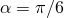, which allows for an odd number of half-waves in the longitudinal direction. This mesh can yield eigenvectors that correspond to the 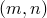 mode shapes (3,1), (3,3), (3,5),  or (6,1), (6,3), (6,5),  However, as described earlier, the eigenvalues do not show an ascending pattern with the number of lobes either in the circumferential or longitudinal direction because of the geometry of this problem. Abaqus will estimate the eigenvalues in ascending order, from the closest eigenvalue to zero, unless a shift point is defined. For this case the analytical solution shows that the lower-order modes (among those that can be represented by the mesh) have very large eigenvalues: the eigenvalues reduce steadily as the number of longitudinal half-waves increases (see the analytical solution given in [Figure 1.2.3--4](ch01s02ach16.md#sxmbuckshell-critstress) and [Table 1.2.3--1](ch01s02ach16.md#table-buckshell-strss-v-mode)), approaching a slightly higher value than the critical stress for  1,  4. Thus, for , the number of longitudinal half-waves in the eigenmodes corresponding to the lowest critical stress is very large; and, since the critical stresses for all of these high-order longitudinal eigenmodes are so similar, the eigenmode is rather indeterminate. The finite element mesh, however, has a fixed number of nodes longitudinally and cannot represent these very high numbers of half-waves with any amount of clarity. Thus, the eigenvector plots show many longitudinal modes—obviously too many for the mesh to represent accurately.

It should be emphasized that these remarks apply in the context of this case only. Nevertheless, the discussion offers some useful insight into more general problems of this class and illustrates some of the difficulties that can be encountered in buckling analysis.

The critical stress values in [Table 1.2.3--2](ch01s02ach16.md#table-buckshell-strss-s9r5) to [Table 1.2.3--4](ch01s02ach16.md#table-buckshell-strss-stri35) for the various mode shapes correlate well with the analytical solution. [Figure 1.2.3--6](ch01s02ach16.md#sxmbuckshell-strvangle) compares the eigenvalues obtained with different shell elements with the analytical solutions. Element type S9R5 provides the most accurate results among the shell elements studied. The accuracy of this element is particularly evident in the critical stresses corresponding to the higher-order modes. S4R5 and S4R elements predict somewhat higher critical loads than S9R5. STRI3 provides stiffer solutions compared to the quadrilateral elements due to the constant membrane strain representation.

The element STRI65 results correspond very closely with the analytical solutions. This element can represent linear stress variation (both in membrane and bending modes) and does not have any hourglass modes. Therefore, STRI65 is a robust and efficient element. In general, STRI65 is a good choice, particularly in problems that need very accurate modeling.

A close examination of the analytical solution reveals that there are several hundred modes for which the critical stress is within 15% of the ( 1,  4) critical stress. Therefore, this example provides a severe test of the ability of the eigenvalue algorithm to predict nearly equal eigenvalues with distinctly different eigenvectors.

#### Load-displacement analysis on imperfect geometries

[Figure 1.2.3--7](ch01s02ach16.md#sxmbuckshell-loadvdisp) shows the applied load against the axial displacement of the node at a corner of the mesh plotted for the different initial imperfection values. The figure shows that the peak load is essentially the same as that predicted by eigenvalue analysis for the smaller initial imperfections (1% and 10% of the thickness). The larger imperfection (100% of thickness) reduces the peak load by about 12%. The analysis is completed with relative ease for an extensive portion of the postbuckling response.

[Figure 1.2.3--8](ch01s02ach16.md#sxmbuckshell-postbuckle) shows the deformed shape of the cylinder well into the postbuckling response. The particular case shown has an initial imperfection of 1% of the thickness. The development of the postbuckling  4,  1 mode is very apparent. Higher axial modes are also evident: these may be mesh dependent but are not investigated further here.

### Input files

[bucklecylshell_stri3_n4_40.inp](../eif/bucklecylshell_stri3_n4_40.inp)

Eigenvalue buckling prediction. The mesh uses STRI3 elements, with eight rows of elements in the circumferential direction describing an arc of 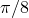 radians and 40 elements along the cylinder length.

[bucklecylshell_progpert.f](../eif/bucklecylshell_progpert.f)

FORTRAN routine to access the results file and generate the nodal coordinates of a mesh, including a specified degree of geometric imperfection.

[bucklecylshell_postbucklpert.inp](../eif/bucklecylshell_postbucklpert.inp)

Postbuckling load-displacement analysis, with the nodal geometry defined by the FORTRAN routine of bucklecylshell_progpert.f.

[bucklecylshell_s4r5_n1.inp](../eif/bucklecylshell_s4r5_n1.inp)

Eigenvalue buckling prediction. The mesh uses S4R5 elements, with eight rows of elements in the circumferential direction describing an arc of 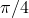 radians and 20 elements along the cylinder length.

[bucklecylshell_postbucklimperf.inp](../eif/bucklecylshell_postbucklimperf.inp)

Postbuckling analysis, with the imperfection defined by the [*IMPERFECTION](../key/key-link.md#usb-kws-mimperfection) option. The mesh is identical to the mesh described in bucklecylshell_s4r5_n1.inp.

#### S4 elements, symmetry boundary conditions:

[bucklecylshell_s4_n3.inp](../eif/bucklecylshell_s4_n3.inp)

*n* = 3.

[bucklecylshell_s4_n4.inp](../eif/bucklecylshell_s4_n4.inp)

*n* = 4.

[bucklecylshell_s4_n5.inp](../eif/bucklecylshell_s4_n5.inp)

*n* = 5.

[bucklecylshell_s4_n6.inp](../eif/bucklecylshell_s4_n6.inp)

*n* = 6.

[bucklecylshell_s4_n7.inp](../eif/bucklecylshell_s4_n7.inp)

*n* = 7.

[bucklecylshell_s4_n8.inp](../eif/bucklecylshell_s4_n8.inp)

*n* = 8.

[bucklecylshell_s4_n9.inp](../eif/bucklecylshell_s4_n9.inp)

*n* = 9.

[bucklecylshell_s4_n10.inp](../eif/bucklecylshell_s4_n10.inp)

*n* = 10.

#### S4 elements, antisymmetry boundary conditions:

[bucklecylshell_s4_n3anti.inp](../eif/bucklecylshell_s4_n3anti.inp)

*n* = 3.

[bucklecylshell_s4_n4anti.inp](../eif/bucklecylshell_s4_n4anti.inp)

*n* = 4.

[bucklecylshell_s4_n5anti.inp](../eif/bucklecylshell_s4_n5anti.inp)

*n* = 5.

[bucklecylshell_s4_n6anti.inp](../eif/bucklecylshell_s4_n6anti.inp)

*n* = 6.

[bucklecylshell_s4_n7anti.inp](../eif/bucklecylshell_s4_n7anti.inp)

*n* = 7.

[bucklecylshell_s4_n8anti.inp](../eif/bucklecylshell_s4_n8anti.inp)

*n* = 8.

[bucklecylshell_s4_n9anti.inp](../eif/bucklecylshell_s4_n9anti.inp)

*n* = 9.

[bucklecylshell_s4_n10anti.inp](../eif/bucklecylshell_s4_n10anti.inp)

*n* = 10.

#### S4R elements, symmetry boundary conditions:

[bucklecylshell_s4r_n3.inp](../eif/bucklecylshell_s4r_n3.inp)

*n* = 3.

[bucklecylshell_s4r_n4.inp](../eif/bucklecylshell_s4r_n4.inp)

*n* = 4.

[bucklecylshell_s4r_n5.inp](../eif/bucklecylshell_s4r_n5.inp)

*n* = 5.

[bucklecylshell_s4r_n6.inp](../eif/bucklecylshell_s4r_n6.inp)

*n* = 6.

[bucklecylshell_s4r_n7.inp](../eif/bucklecylshell_s4r_n7.inp)

*n* = 7.

[bucklecylshell_s4r_n8.inp](../eif/bucklecylshell_s4r_n8.inp)

*n* = 8.

[bucklecylshell_s4r_n9.inp](../eif/bucklecylshell_s4r_n9.inp)

*n* = 9.

[bucklecylshell_s4r_n10.inp](../eif/bucklecylshell_s4r_n10.inp)

*n* = 10.

#### S4R elements, antisymmetry boundary conditions:

[bucklecylshell_s4r_n3anti.inp](../eif/bucklecylshell_s4r_n3anti.inp)

*n* = 3.

[bucklecylshell_s4r_n4anti.inp](../eif/bucklecylshell_s4r_n4anti.inp)

*n* = 4.

[bucklecylshell_s4r_n5anti.inp](../eif/bucklecylshell_s4r_n5anti.inp)

*n* = 5.

[bucklecylshell_s4r_n6anti.inp](../eif/bucklecylshell_s4r_n6anti.inp)

*n* = 6.

[bucklecylshell_s4r_n7anti.inp](../eif/bucklecylshell_s4r_n7anti.inp)

*n* = 7.

[bucklecylshell_s4r_n8anti.inp](../eif/bucklecylshell_s4r_n8anti.inp)

*n* = 8.

[bucklecylshell_s4r_n9anti.inp](../eif/bucklecylshell_s4r_n9anti.inp)

*n* = 9.

[bucklecylshell_s4r_n10anti.inp](../eif/bucklecylshell_s4r_n10anti.inp)

*n* = 10.

#### S4R5 elements, symmetry boundary conditions:

[bucklecylshell_s4r5_n3.inp](../eif/bucklecylshell_s4r5_n3.inp)

*n* = 3.

[bucklecylshell_s4r5_n4.inp](../eif/bucklecylshell_s4r5_n4.inp)

*n* = 4.

[bucklecylshell_s4r5_n5.inp](../eif/bucklecylshell_s4r5_n5.inp)

*n* = 5.

[bucklecylshell_s4r5_n6.inp](../eif/bucklecylshell_s4r5_n6.inp)

*n* = 6.

[bucklecylshell_s4r5_n7.inp](../eif/bucklecylshell_s4r5_n7.inp)

*n* = 7.

[bucklecylshell_s4r5_n8.inp](../eif/bucklecylshell_s4r5_n8.inp)

*n* = 8.

[bucklecylshell_s4r5_n9.inp](../eif/bucklecylshell_s4r5_n9.inp)

*n* = 9.

[bucklecylshell_s4r5_n10.inp](../eif/bucklecylshell_s4r5_n10.inp)

*n* = 10.

#### S4R5 elements, antisymmetry boundary conditions:

[bucklecylshell_s4r5_n3anti.inp](../eif/bucklecylshell_s4r5_n3anti.inp)

*n* = 3.

[bucklecylshell_s4r5_n4anti.inp](../eif/bucklecylshell_s4r5_n4anti.inp)

*n* = 4.

[bucklecylshell_s4r5_n5anti.inp](../eif/bucklecylshell_s4r5_n5anti.inp)

*n* = 5.

[bucklecylshell_s4r5_n6anti.inp](../eif/bucklecylshell_s4r5_n6anti.inp)

*n* = 6.

[bucklecylshell_s4r5_n7anti.inp](../eif/bucklecylshell_s4r5_n7anti.inp)

*n* = 7.

[bucklecylshell_s4r5_n8anti.inp](../eif/bucklecylshell_s4r5_n8anti.inp)

*n* = 8.

[bucklecylshell_s4r5_n9anti.inp](../eif/bucklecylshell_s4r5_n9anti.inp)

*n* = 9.

[bucklecylshell_s4r5n10anti.inp](../eif/bucklecylshell_s4r5n10anti.inp)

*n* = 10.

#### S9R5 elements, symmetry boundary conditions:

[bucklecylshell_s9r5_n3.inp](../eif/bucklecylshell_s9r5_n3.inp)

*n* = 3.

[bucklecylshell_s9r5_n4.inp](../eif/bucklecylshell_s9r5_n4.inp)

*n* = 4.

[bucklecylshell_s9r5_n5.inp](../eif/bucklecylshell_s9r5_n5.inp)

*n* = 5.

[bucklecylshell_s9r5_n6.inp](../eif/bucklecylshell_s9r5_n6.inp)

*n* = 6.

[bucklecylshell_s9r5_n7.inp](../eif/bucklecylshell_s9r5_n7.inp)

*n* = 7.

[bucklecylshell_s9r5_n8.inp](../eif/bucklecylshell_s9r5_n8.inp)

*n* = 8.

[bucklecylshell_s9r5_n9.inp](../eif/bucklecylshell_s9r5_n9.inp)

*n* = 9.

[bucklecylshell_s9r5_n10.inp](../eif/bucklecylshell_s9r5_n10.inp)

*n* = 10.

#### S9R5 elements, antisymmetry boundary conditions:

[bucklecylshell_s9r5_n3anti.inp](../eif/bucklecylshell_s9r5_n3anti.inp)

*n* = 3.

[bucklecylshell_s9r5_n4anti.inp](../eif/bucklecylshell_s9r5_n4anti.inp)

*n* = 4.

[bucklecylshell_s9r5_n5anti.inp](../eif/bucklecylshell_s9r5_n5anti.inp)

*n* = 5.

[bucklecylshell_s9r5_n6anti.inp](../eif/bucklecylshell_s9r5_n6anti.inp)

*n* = 6.

[bucklecylshell_s9r5_n7anti.inp](../eif/bucklecylshell_s9r5_n7anti.inp)

*n* = 7.

[bucklecylshell_s9r5_n8anti.inp](../eif/bucklecylshell_s9r5_n8anti.inp)

*n* = 8.

[bucklecylshell_s9r5_n9anti.inp](../eif/bucklecylshell_s9r5_n9anti.inp)

*n* = 9.

[bucklecylshell_s9r5_n10anti.inp](../eif/bucklecylshell_s9r5_n10anti.inp)

*n* = 10.

#### STRI3 elements, symmetry boundary conditions:

[bucklecylshell_stri3_n3.inp](../eif/bucklecylshell_stri3_n3.inp)

*n* = 3.

[bucklecylshell_stri3_n4.inp](../eif/bucklecylshell_stri3_n4.inp)

*n* = 4.

[bucklecylshell_stri3_n5.inp](../eif/bucklecylshell_stri3_n5.inp)

*n* = 5.

[bucklecylshell_stri3_n6.inp](../eif/bucklecylshell_stri3_n6.inp)

*n* = 6.

[bucklecylshell_stri3_n7.inp](../eif/bucklecylshell_stri3_n7.inp)

*n* = 7.

[bucklecylshell_stri3_n8.inp](../eif/bucklecylshell_stri3_n8.inp)

*n* = 8.

[bucklecylshell_stri3_n9.inp](../eif/bucklecylshell_stri3_n9.inp)

*n* = 9.

[bucklecylshell_stri3_n10.inp](../eif/bucklecylshell_stri3_n10.inp)

*n* = 10.

#### STRI3 elements, antisymmetry boundary conditions:

[bucklecylshell_stri3_n3anti.inp](../eif/bucklecylshell_stri3_n3anti.inp)

*n* = 3.

[bucklecylshell_stri3_n4anti.inp](../eif/bucklecylshell_stri3_n4anti.inp)

*n* = 4.

[bucklecylshell_stri3_n5anti.inp](../eif/bucklecylshell_stri3_n5anti.inp)

*n* = 5.

[bucklecylshell_stri3_n6anti.inp](../eif/bucklecylshell_stri3_n6anti.inp)

*n* = 6.

[bucklecylshell_stri3_n7anti.inp](../eif/bucklecylshell_stri3_n7anti.inp)

*n* = 7.

[bucklecylshell_stri3_n8anti.inp](../eif/bucklecylshell_stri3_n8anti.inp)

*n* = 8.

[bucklecylshell_stri3_n9anti.inp](../eif/bucklecylshell_stri3_n9anti.inp)

*n* = 9.

[bucklecylshell_stri3_n10anti.inp](../eif/bucklecylshell_stri3_n10anti.inp)

*n* = 10.

#### STRI65 elements, symmetry boundary conditions:

[bucklecylshell_stri65_n3.inp](../eif/bucklecylshell_stri65_n3.inp)

*n* = 3.

[bucklecylshell_stri65_n4.inp](../eif/bucklecylshell_stri65_n4.inp)

*n* = 4.

[bucklecylshell_stri65_n5.inp](../eif/bucklecylshell_stri65_n5.inp)

*n* = 5.

[bucklecylshell_stri65_n6.inp](../eif/bucklecylshell_stri65_n6.inp)

*n* = 6.

[bucklecylshell_stri65_n7.inp](../eif/bucklecylshell_stri65_n7.inp)

*n* = 7.

[bucklecylshell_stri65_n8.inp](../eif/bucklecylshell_stri65_n8.inp)

*n* = 8.

[bucklecylshell_stri65_n9.inp](../eif/bucklecylshell_stri65_n9.inp)

*n* = 9.

[bucklecylshell_stri65_n10.inp](../eif/bucklecylshell_stri65_n10.inp)

*n* = 10.

#### STRI65 elements, antisymmetry boundary conditions:

[bucklecylshell_stri65_n3anti.inp](../eif/bucklecylshell_stri65_n3anti.inp)

*n* = 3.

[bucklecylshell_stri65_n4anti.inp](../eif/bucklecylshell_stri65_n4anti.inp)

*n* = 4.

[bucklecylshell_stri65_n5anti.inp](../eif/bucklecylshell_stri65_n5anti.inp)

*n* = 5.

[bucklecylshell_stri65_n6anti.inp](../eif/bucklecylshell_stri65_n6anti.inp)

*n* = 6.

[bucklecylshell_stri65_n7anti.inp](../eif/bucklecylshell_stri65_n7anti.inp)

*n* = 7.

[bucklecylshell_stri65_n8anti.inp](../eif/bucklecylshell_stri65_n8anti.inp)

*n* = 8.

[bucklecylshell_stri65_n9anti.inp](../eif/bucklecylshell_stri65_n9anti.inp)

*n* = 9.

[bucklecylshell_stri65_n10anti.inp](../eif/bucklecylshell_stri65_n10anti.inp)

*n* = 10.

### Reference

Timoshenko,  S. P., and J. M. Gere, *Theory of Elastic Stability, *2nd Edition, McGraw-Hill, New York, 1961.

### Tables

**Table 1.2.3–1** Critical stresses versus mode shape, stresses given in GPa (from Timoshenko and Gere, 1961).
| 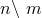 | 1 | 2 | 3 | 4 | 5 |
| --- | --- | --- | --- | --- | --- |
| 0 | 75.08 | 64.29 | 51.86 | 40.81 | 32.04 |
| 1 | 116.7 | 24.45 | 27.84 | 26.25 | 23.05 |
| 2 | 1.478 | 4.741 | 7.832 | 9.769 | 10.53 |
| 3 | 0.388 | 1.251 | 2.389 | 3.478 | 4.331 |
| 4 | 0.281 | 0.478 | 0.913 | 1.417 | 1.908 |
| 5 | 0.479 | 0.298 | 0.449 | 0.681 | 0.942 |
| 6 | 94.65 | 0.329 | 0.309 | 0.401 | 0.533 |
| 7 | 1.757 | 0.495 | 0.314 | 0.308 | 0.360 |
| 8 | 3.022 | 0.794 | 0.414 | 0.316 | 0.305 |
| 9 | 4.875 | 1.251 | 0.510 | 0.394 | 0.322 |
| 10 | 7.473 | 1.898 | 0.878 | 0.537 | 0.395 |
|  |
|  | 6 | 7 | 8 | 9 | 10 |
| 0 | 25.37 | 20.36 | 16.59 | 13.71 | 11.48 |
| 1 | 19.68 | 16.65 | 14.10 | 11.99 | 10.27 |
| 2 | 10.47 | 9.941 | 9.190 | 8.376 | 7.577 |
| 3 | 4.886 | 5.165 | 5.228 | 5.136 | 4.945 |
| 4 | 2.328 | 2.654 | 2.878 | 3.010 | 3.064 |
| 5 | 1.197 | 1.430 | 1.625 | 1.778 | 1.888 |
| 6 | 0.680 | 0.827 | 0.966 | 1.089 | 1.191 |
| 7 | 0.437 | 0.525 | 0.616 | 0.702 | 0.782 |
| 8 | 0.332 | 0.377 | 0.431 | 0.487 | 0.544 |
| 9 | 0.305 | 0.315 | 0.339 | 0.372 | 0.407 |
| 10 | 0.333 | 0.310 | 0.305 | 0.318 | 0.336 |

**Table 1.2.3–2** Critical stresses – S9R5 element, stresses given in GPa.
|  | Boundary condition at midlength of cylinder |
| --- | --- |
| SYMM | ASYMM |
|  | 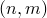 |  |  |
|  | 0.316 | (*, *) | 0.318 | (*, *) |
|  | 0.281 | (4, 1) | 0.317 | (4, *) |
| 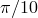 | 0.316 | (*, *) | 0.299 | (*, 2) |
| 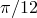 | 0.310 | (6, 3) | 0.316 | (6, *) |
| 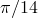 | 0.315 | (7, 3) | 0.309 | (7, 4) |
| 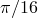 | 0.306 | (8, 5) | 0.316 | (8, 4) |
| 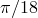 | 0.316 | (9, 7) | 0.306 | (9, 6) |
|  | 0.310 | (10, 7) | 0.309 | (10, 8) |

**Table 1.2.3–3** Critical stresses – S4R5, S4R elements, stresses given in GPa.
|  | Boundary condition at midlength of cylinder |
| --- | --- |
| SYMM | ASYMM |
|  |  |  |  |
|  | 0.327 | (*, *) | 0.327 | (*, *) |
|  | 0.290 | (4, 1) | 0.326 | (4, *) |
|  | 0.326 | (*, *) | 0.308 | (*, 2) |
|  | 0.320 | (6, 3) | 0.326 | (6, *) |
|  | 0.327 | (7, 3) | 0.319 | (7, 4) |
|  | 0.317 | (8, 5) | 0.326 | (8, 4) |
|  | 0.326 | (9, 7) | 0.317 | (9, 6) |
|  | 0.322 | (10, 7) | 0.320 | (10, 8) |

**Table 1.2.3–4** Critical stresses – STRI3 element, stresses given in GPa.
|  | Boundary condition at midlength of cylinder |
| --- | --- |
| SYMM | ASYMM |
|  |  |  |  |
|  | 0.359 | (*, *) | 0.355 | (*, *) |
|  | 0.285 | (4, 1) | 0.357 | (4, *) |
|  | 0.359 | (*, *) | 0.308 | (*, 2) |
|  | 0.321 | (6, 3) | 0.334 | (6, 2) |
|  | 0.322 | (7, 3) | 0.321 | (7, 4) |
|  | 0.319 | (8, 5) | 0.325 | (8, 4) |
|  | 0.332 | (9, 5) | 0.319 | (9, 6) |
|  | 0.324 | (10, 7) | 0.326 | (10, 8) |

**Table 1.2.3–5** Critical stresses – STRI65 element, stresses given in GPa.
|  | Boundary condition at midlength of cylinder |
| --- | --- |
| SYMM | ASYMM |
|  |  |  |  |
|  | 0.319 | (*, *) | 0.308 | (*, *) |
|  | 0.280 | (4, 1) | 0.315 | (4, *) |
|  | 0.326 | (*, *) | 0.298 | (*, 2) |
|  | 0.309 | (6, 3) | 0.328 | (6, 2) |
|  | 0.314 | (7, 3) | 0.308 | (7, 4) |
|  | 0.305 | (8, 5) | 0.315 | (8, 4) |
|  | 0.315 | (9, 5) | 0.305 | (9, 6) |
|  | 0.309 | (10, 7) | 0.308 | (10, 8) |

### Figures

**Figure 1.2.3–1** Cylindrical shell with uniform axial loading.

**Figure 1.2.3–2** Cross-section deformation corresponding to *n*=2 and to *n*=3.

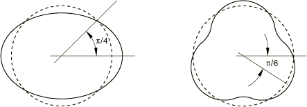

**Figure 1.2.3–3** S4R5 mesh for eigenvalue buckling prediction.

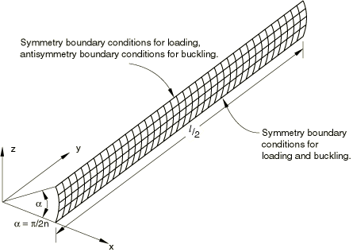

**Figure 1.2.3–4** Critical stress for various buckling modes.

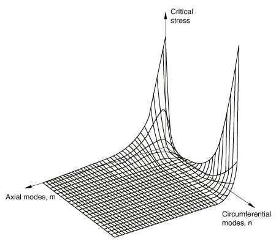

**Figure 1.2.3–5** Buckling mode shape (*m*=1, *n*=4).

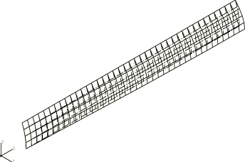

**Figure 1.2.3–6** Critical stress versus subtended angle of quarter-wave model.

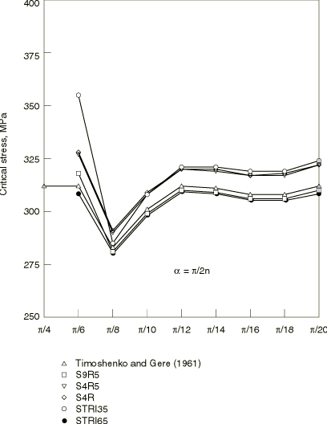

**Figure 1.2.3–7** Applied load (normalized) versus axial displacement of an end node.

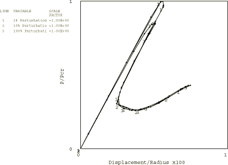

**Figure 1.2.3–8** Postbuckled deformation (initial imperfection of 1% of thickness).

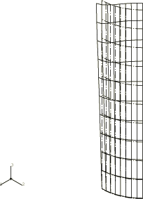

