# 1.2.4 Buckling of a simply supported square plate

**Product: **Abaqus/Standard  

This problem illustrates the use of Abaqus in a geometric collapse study of a stiff, shell-type structure. The problem is that of a square, thin, elastic plate, simply supported on all four edges and compressed in one direction (see [Figure 1.2.4--1](ch01s02ach17.md#sxmsqplate-geom)). The analytical solution for the buckling load for this case (see Timoshenko and Gere, 1961, Section 9.2) is

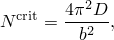

where 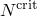 is the critical value of the edge load per unit length of the edge, *b* is the length of each edge of the plate, and 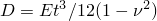 is the elastic bending stiffness of the plate, with Young's modulus *E*, Poisson's ratio , and plate thickness *t*.

The corresponding buckling mode is a transverse displacement of

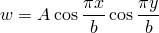

in the coordinate system of [Figure 1.2.4--1](ch01s02ach17.md#sxmsqplate-geom). Here *A* is an arbitrary magnitude.

### Problem description

No particular units are used in this example; the values chosen are taken to be in a consistent set. The length of the edge of the square plate is 2 and the thickness is 0.01, so the plate is rather thin (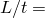 200). Since the solution is known to be symmetric, only one-quarter of the plate is modeled. Meshes of 2  2 or 4  4 elements are used. Since the form of the prebuckled and postbuckled solutions is rather smooth in this case, even these relatively coarse meshes should give reasonably accurate results for the buckling load.

The material is assumed to be isotropic elastic, with a Young's modulus of 108 and a Poisson's ratio of 0.3.

The boundary conditions on the model are

1. Symmetry about 0. This requires 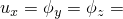0 on that edge of the mesh.
2. Symmetry about 0. This requires 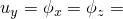0 on that edge of the mesh.
3. Simple support on the edge at 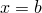/2. This requires 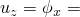 0 on that edge of the mesh.
4. Simple support on the edge at 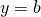/2. This requires 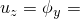0 on that edge of the mesh.

### Loading

Two versions of the problem are used: one in which the plate is loaded in one direction by uniform edge loads, and one in which the plate is compressed by raising its temperature with the plate constrained in one direction against overall thermal expansion.

For the mechanically loaded case the edge loads are given as point loads on the edge nodes. Since the second-order elements (S8R5, S9R5, STRI65) use quadratic interpolation along their edges, consistent distribution of a uniform load gives equivalent point loads in the ratio 1:4:1 at the corner, midside, and corner nodes, respectively (Simpson's integration rule). The first-order elements (S4R5, S4R, S3R, STRI3) are based on linear in-plane displacements so that the uniform edge loading gives equal point loads at the nodes on the edge.

### Eigenvalue buckling prediction

Stiff shell collapse studies are typically begun with eigenvalue buckling estimates. Such estimates are usually accurate in cases of stiff shells—that is, when the prebuckle response is essentially linear; when the collapse is not catastrophic, so the structure is not excessively sensitive to imperfections; and when the response is elastic. As will be seen later, these conditions are fulfilled by this example.

Eigenvalue buckling estimates are obtained by using the eigenvalue buckling procedure (["Eigenvalue buckling prediction," Section 6.2.3 of the Abaqus Analysis User's Guide](../usb/usb-link.md#usb-anl-aeigenbuckling)). Since the eigenvalue buckling procedure is a linear perturbation procedure the size of the load is immaterial because the response is proportional to the magnitude of the load. Abaqus will predict the buckling modes and corresponding eigenvalues. In this case three modes are requested. The lowest buckling load estimates are shown in [Table 1.2.4--1](ch01s02ach17.md#table-sqplate-eigpredict). All of the meshes except the 4  4 mesh of element type S3R give reasonable predictions. The S3R elements give a higher estimate of lowest buckling load because the constant bending strain approximation results in a stiffer response. The most accurate results are those provided by element types S8R5 and S9R5.

### Load-displacement studies on imperfect geometries

The next phase of a typical collapse analysis is to perform a load-displacement analysis to ensure that the eigenvalue buckling prediction already obtained is accurate and, at the same time, to investigate the effect of initial geometric imperfection on the load-displacement response. In this way concerns about imperfection sensitivity (unstable postbuckling response) can be addressed. The eigenvalue analysis is useful in providing guidance about mesh design for these more expensive load-displacement studies: mesh convergence studies can be performed as part of the eigenvalue analysis, which is usually significantly less expensive than the load-deflection analysis.

For the load-displacement analysis the perfect geometry must be “seeded” with an imperfection to cause it to collapse. It is possible that a problem run with perfect geometry may never buckle numerically at reasonable load levels because the model has absolutely no prebuckled displacement in the postbuckled mode and, thus, no ability to switch to that mode. Presumably an imperfection in the form of the buckling mode would be the most critical. In this example, for simplicity, we use instead a bilinear imperfection:

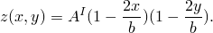

So long as the imperfection contains the mode into which the structure wishes to collapse, it is presumed that any imperfection will provide the necessary perturbation of the solution.

The imperfection magnitude, 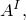 is taken as 0.1%, 1%, and 10% of the plate thickness. Since we expect a buckle at a load of about 90.4, the edge load is applied by requesting that the load be increased monotonically up to a value of 100, starting with an increment of 10. Normally the Riks method would be chosen if the postbuckling response is unstable. It is not necessary for this case.

In all cases where a sudden loss of stiffness is expected (as here, when the imperfection is very small) it is essential that equilibrium be satisfied closely; otherwise it is possible for the solution to fail to switch to the alternate branch of the solution. The default equilibrium tolerances used in Abaqus are rather tight by engineering standards, as experience shows that less demanding equilibrium control may fail to pick up the buckle in the case of almost perfect geometry.

### Results and discussion

The numerical results for the mechanically loaded case are summarized in [Figure 1.2.4--2](ch01s02ach17.md#sxmsqplate-elresults), where the displacement of the center point of the plate is plotted as a function of compressive force. The case with the smallest imperfection (0.1% of the thickness) shows a very sharp loss of stiffness at an applied load of about 90. This is essentially the eigenvalue solution (90.4). As the initial imperfection magnitude is increased, the behavior becomes smoother, as would be expected. The plate shows positive stiffness up to the maximum loading applied, even when the imperfection is very small. Thus, in this case the buckling is not an unstable failure; the plate is, therefore, not very sensitive to imperfection. In cases of unstable postbuckling response it is usually easiest to approach the analysis by studying the larger imperfection magnitudes first, since then the response is smoothest.

The stress just at buckling with the smallest imperfection is about 9000. An interesting alternative case is where the edges parallel to the *y*-axis are restrained in the *x*-direction (that is, 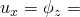0), and the temperature of the plate is raised. This should give the same prebuckled stress field in the plate; and, thus, critical temperature changes should be those that give the same critical stress. To investigate this case, we use a thermal expansion coefficient of 106 (strain per unit temperature rise) so that in the prebuckled state the critical stress should occur at a temperature of 90. The results of such a thermally loaded case for the smallest imperfection studied are shown in [Figure 1.2.4--3](ch01s02ach17.md#sxmsqplate-mecthresults). The behaviors of the mechanically loaded case and the thermally loaded case are quite similar, with the thermally loaded case showing rather less displacement after buckling. This is to be expected, since thermal loading causes strain, whereas mechanical loading requires a specific stress state to retain equilibrium.

The same thermally loaded case is solved using the Riks approach to verify the Abaqus capability for using the Riks algorithm with thermal loading only. The temperature-displacement curves for the incremental static analysis versus the Riks analysis are very similar, with the smoother curve obtained by the Riks approach for strain levels between 0.5  103 and 2  103. The Riks algorithm chooses smaller temperature increments, thus requiring more increments to apply the same total temperature rise.

### Input files

#### S3R elements:

[buckleplate_s3r_buckle.inp](../eif/buckleplate_s3r_buckle.inp)

Eigenvalue prediction of buckling under edge loading.

[buckleplate_s3r_load.inp](../eif/buckleplate_s3r_load.inp)

Edge load-displacement response prediction.

[buckleplate_s3r_thermbuckle.inp](../eif/buckleplate_s3r_thermbuckle.inp)

Eigenvalue prediction of buckling under thermal loading.

[buckleplate_s3r_loadthermal.inp](../eif/buckleplate_s3r_loadthermal.inp)

Thermal load-displacement response prediction.

#### S4 elements:

[buckleplate_s4_buckle.inp](../eif/buckleplate_s4_buckle.inp)

Eigenvalue prediction of buckling under edge loading.

[buckleplate_s4_load.inp](../eif/buckleplate_s4_load.inp)

Edge load-displacement response prediction.

[buckleplate_s4_thermbuckle.inp](../eif/buckleplate_s4_thermbuckle.inp)

Eigenvalue prediction of buckling under thermal loading.

[buckleplate_s4_loadthermal.inp](../eif/buckleplate_s4_loadthermal.inp)

Thermal load-displacement response prediction.

#### S4R elements:

[buckleplate_s4r_buckle.inp](../eif/buckleplate_s4r_buckle.inp)

Eigenvalue prediction of buckling under edge loading.

[buckleplate_s4r_load.inp](../eif/buckleplate_s4r_load.inp)

Edge load-displacement response prediction.

[buckleplate_s4r_thermbuckle.inp](../eif/buckleplate_s4r_thermbuckle.inp)

Eigenvalue prediction of buckling under thermal loading.

[buckleplate_s4r_loadthermal.inp](../eif/buckleplate_s4r_loadthermal.inp)

Thermal load-displacement response prediction.

#### S4R5 elements:

[buckleplate_s4r5_buckle.inp](../eif/buckleplate_s4r5_buckle.inp)

Eigenvalue prediction of buckling under edge loading.

[buckleplate_s4r5_load.inp](../eif/buckleplate_s4r5_load.inp)

Edge load-displacement response prediction.

[buckleplate_s4r5_thermbuckle.inp](../eif/buckleplate_s4r5_thermbuckle.inp)

Eigenvalue prediction of buckling under thermal loading.

[buckleplate_s4r5_loadthermal.inp](../eif/buckleplate_s4r5_loadthermal.inp)

Thermal load-displacement response prediction.

#### S8R elements:

[buckleplate_s8r_buckle.inp](../eif/buckleplate_s8r_buckle.inp)

Eigenvalue prediction of buckling under edge loading.

[buckleplate_s8r_load.inp](../eif/buckleplate_s8r_load.inp)

Edge load-displacement response prediction.

[buckleplate_s8r_thermbuckle.inp](../eif/buckleplate_s8r_thermbuckle.inp)

Eigenvalue prediction of buckling under thermal loading.

[buckleplate_s8r_loadthermal.inp](../eif/buckleplate_s8r_loadthermal.inp)

Thermal load-displacement response prediction.

[buckleplate_postoutput.inp](../eif/buckleplate_postoutput.inp)

[*POST OUTPUT](../key/key-link.md#usb-kws-hpostoutput) analysis.

#### S8R5 elements:

[buckleplate_s8r5_buckle.inp](../eif/buckleplate_s8r5_buckle.inp)

Eigenvalue prediction of buckling under edge loading.

[buckleplate_s8r5_load.inp](../eif/buckleplate_s8r5_load.inp)

Edge load-displacement response prediction.

[buckleplate_s8r5_thermbuckle.inp](../eif/buckleplate_s8r5_thermbuckle.inp)

Eigenvalue prediction of buckling under thermal loading.

[buckleplate_s8r5_loadthermal.inp](../eif/buckleplate_s8r5_loadthermal.inp)

Thermal load-displacement response prediction.

[buckleplate_s8r5_riks.inp](../eif/buckleplate_s8r5_riks.inp)

Thermally loaded plate using the Riks algorithm.

[buckleplate_s8r5_load_bigimp.inp](../eif/buckleplate_s8r5_load_bigimp.inp)

Edge load-displacement response prediction with an imperfection of 10%.

[buckleplate_s8r5_load_smallimp.inp](../eif/buckleplate_s8r5_load_smallimp.inp)

Edge load-displacement response prediction with an imperfection of 0.1%.

#### S9R5 elements:

[buckleplate_s9r5_buckle.inp](../eif/buckleplate_s9r5_buckle.inp)

Eigenvalue prediction of buckling under edge loading.

[buckleplate_s9r5_load.inp](../eif/buckleplate_s9r5_load.inp)

Edge load-displacement response prediction.

[buckleplate_s9r5_thermbuckle.inp](../eif/buckleplate_s9r5_thermbuckle.inp)

Eigenvalue prediction of buckling under thermal loading.

[buckleplate_s9r5_loadthermal.inp](../eif/buckleplate_s9r5_loadthermal.inp)

Thermal load-displacement response prediction.

#### STRI3 elements:

[buckleplate_stri3_buckle.inp](../eif/buckleplate_stri3_buckle.inp)

Eigenvalue prediction of buckling under edge loading.

[buckleplate_stri3_load.inp](../eif/buckleplate_stri3_load.inp)

Edge load-displacement response prediction.

[buckleplate_stri3_thermbuckle.inp](../eif/buckleplate_stri3_thermbuckle.inp)

Eigenvalue prediction of buckling under thermal loading.

[buckleplate_stri3_loadthermal.inp](../eif/buckleplate_stri3_loadthermal.inp)

Thermal load-displacement response prediction.

#### STRI65 elements:

[buckleplate_stri65_buckle.inp](../eif/buckleplate_stri65_buckle.inp)

Eigenvalue prediction of buckling under edge loading.

[buckleplate_stri65_load.inp](../eif/buckleplate_stri65_load.inp)

Edge load-displacement response prediction.

[buckleplate_stri65_thermbuckle.inp](../eif/buckleplate_stri65_thermbuckle.inp)

Eigenvalue prediction of buckling under thermal loading.

[buckleplate_stri65_loadthermal.inp](../eif/buckleplate_stri65_loadthermal.inp)

Thermal load-displacement response prediction.

### Reference

Timoshenko, S. P., and J. M. Gere, *Theory of Elastic Stability*, 2nd Edition, McGraw-Hill, New York, 1961.

### Table

**Table 1.2.4–1** Eigenvalue buckling predictions. (Analytical solution: 90.38)
| Mesh and element type | Edge load | Thermal load |
| --- | --- | --- |
| 2 2, S8R5 | 90.52 | 90.52 |
| 2 2, S8R | 95.32 | 95.32 |
| 2 2, S9R5 | 90.52 | 90.52 |
| 2 2, STRI65 | 89.64 | 89.64 |
| 4 4, STRI3 | 90.47 | 90.47 |
| 4 4, S3R | 115.92 | 115.92 |
| 4 4, S4R | 92.80 | 92.80 |
| 4 4, S4R5 | 92.76 | 92.76 |
| 4 4, S4 | 92.35 | 92.35 |

### Figures

**Figure 1.2.4–1** Square plate buckling study.

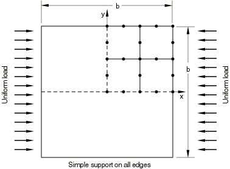

**Figure 1.2.4–2** Square plate elastic buckling results.

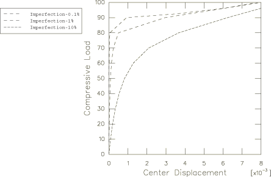

**Figure 1.2.4–3** Comparison of mechanical and thermal loading results.

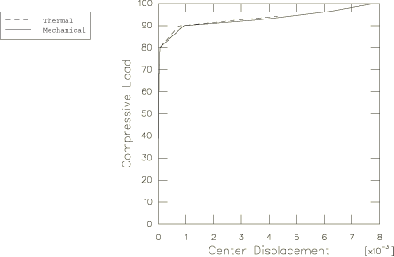

