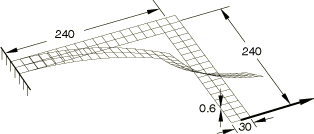
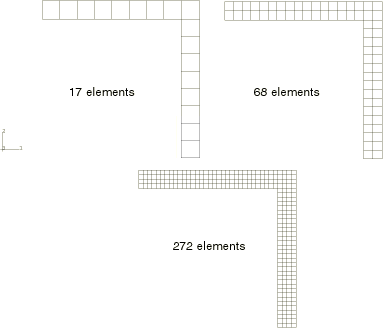
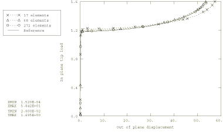
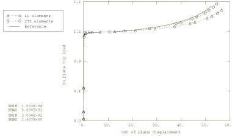

# 1.2.5 Lateral buckling of an L-bracket

**Product: **Abaqus/Standard  

This problem considers the nonlinear postbuckling behavior of an aluminum “L” bracket plate that is clamped on one end and subjected to an in-plane load on the other. This problem has been used to assess the behavior of various shell elements intended for use in geometrically nonlinear analyses (see Argyris et al., 1979; Simo et al., 1990). Here, the solution illustrates the postbuckling capabilities of the S4 element when subjected to in-plane bending.

### Problem description

The bracket is shown in [Figure 1.2.5--1](ch01s02ach18.md#sxmlbracket-geom). It is 240 mm long and 30 mm wide, with a thickness of 0.6 mm. The material is linear elastic with Young's modulus *E*=71240 MPa and Poisson's ratio =0.3. As shown, the bracket is loaded in tension.

The problem is modeled using fully integrated S4 shell elements with three different meshes: 17, 68, and 272 elements, as shown in [Figure 1.2.5--2](ch01s02ach18.md#sxmlbracket-mesh). For comparison, the finer meshes are also run with reduced-integration S4R shell elements. The reference solution is obtained with a refined mesh of second–order continuum elements. This continuum mesh uses 272 C3D20R elements in-plane and two through the thickness.

To trigger the lateral buckling mode of the bracket, a linear eigenvalue buckling analysis is performed for each model, with the resulting fundamental eigenmode added as an imperfection to the geometry for the nonlinear postbuckling analysis. For this geometry and loading the first eigenmode corresponds to out-of-plane buckling of the bracket when loaded in compression, opposite to the direction shown in [Figure 1.2.5--1](ch01s02ach18.md#sxmlbracket-geom); the second buckling mode corresponds to tension, the relevant fundamental mode for this analysis. By default, Abaqus calculates both positive and negative eigenvalues, in ascending order of absolute value. To calculate only the positive eigenvalues, use the Lanczos eigensolver and restrict the range of eigenvalues of interest to positive values by setting the minimum eigenvalue of interest equal to zero. This method is particularly useful if the eigenmode is selected as an imperfection for a full geometrically nonlinear analysis; it ensures that the imperfection is appropriate for the direction of loading.

### Results and discussion

The nonlinear buckling load predictions are compared with published results in [Table 1.2.5--1](ch01s02ach18.md#table-lbracket-compareloads). [Figure 1.2.5--3](ch01s02ach18.md#sxmlbracket-response-s4) and [Figure 1.2.5--4](ch01s02ach18.md#sxmlbracket-response-s4r) show the postbuckling behavior for S4 and S4R elements for each of the meshes considered. These results compare well with the published results. Even the coarsest mesh (17 elements) produces reasonable results. However, a 17-element model with S4R elements (that is, with one element across the width of the bracket) cannot capture the buckling response due to its inability to represent in-plane bending accurately with a single element across the section. With 68 elements the S4 model has nearly converged on the reference solution obtained with a fine mesh of continuum elements, whereas S4R has not.

### Input files

[lbracket_buckle_17s4.inp](../eif/lbracket_buckle_17s4.inp)

Eigenvalue extraction with the 17-element S4 mesh.

[lbracket_postbuckle_17s4.inp](../eif/lbracket_postbuckle_17s4.inp)

Postbuckling analysis with the 17-element S4 mesh.

[lbracket_buckle_68s4.inp](../eif/lbracket_buckle_68s4.inp)

Eigenvalue extraction with the 68-element S4 mesh.

[lbracket_postbuckle_68s4.inp](../eif/lbracket_postbuckle_68s4.inp)

Postbuckling analysis with the 68-element S4 mesh.

[lbracket_buckle_272s4.inp](../eif/lbracket_buckle_272s4.inp)

Eigenvalue extraction with the 272-element S4 mesh.

[lbracket_postbuckle_272s4.inp](../eif/lbracket_postbuckle_272s4.inp)

Postbuckling analysis with the 272-element S4 mesh.

[lbracket_buckle_68s4r.inp](../eif/lbracket_buckle_68s4r.inp)

Eigenvalue extraction with the 68-element S4R mesh.

[lbracket_postbuckle_68s4r.inp](../eif/lbracket_postbuckle_68s4r.inp)

Postbuckling analysis with the 68-element S4R mesh.

[lbracket_buckle_272s4r.inp](../eif/lbracket_buckle_272s4r.inp)

Eigenvalue extraction with the 272-element S4R mesh.

[lbracket_postbuckle_272s4r.inp](../eif/lbracket_postbuckle_272s4r.inp)

Postbuckling analysis with the 272-element S4R mesh.

[lbracket_buckle_c3d20r.inp](../eif/lbracket_buckle_c3d20r.inp)

Eigenvalue extraction with the 544-element C3D20R mesh.

[lbracket_postbuckle_c3d20r.inp](../eif/lbracket_postbuckle_c3d20r.inp)

Postbuckling analysis with the 544-element C3D20R mesh.

### References

Argyris,  J. H., H. Balmer, J. St. Doltsinis, P. C. Dunne, M. Haase, M. Kleiber, G. A. Malejannakis, H. P. Mlejnek, M. Mller, and D. W. Scharpf, “Finite Element Method – The Natural Approach,” Computer Methods in Applied Mechanics and Engineering, vol. 17/18, pp. 1–106, 1979.

Simo,  J. C., D. D. Fox, and M. S. Rifai, “On a Stress Resultant Geometrically Exact Shell Model. Part III: Computational Aspects of the Nonlinear Theory,” Computer Methods in Applied Mechanics and Engineering, vol. 79, pp. 21–70, 1990.

### Table

**Table 1.2.5–1** Comparison of bifurcation loads.
| Mesh | S4R | S4 | Simo et al. | Argyris et al. |
| --- | --- | --- | --- | --- |
| 17 |  | 1.22 |  |  |
| 68 | 1.19 | 1.20 | 1.137 | 1.155 |
| 272 | 1.18 | 1.19 |  |  |

### Figures

**Figure 1.2.5–1** “L” bracket geometry.

**Figure 1.2.5–2** Meshes used.

**Figure 1.2.5–3** S4 postbuckling response.

**Figure 1.2.5–4** S4R postbuckling response.

