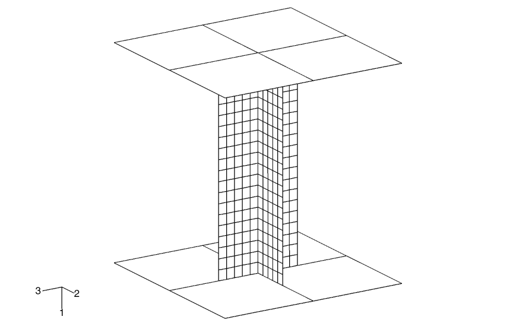
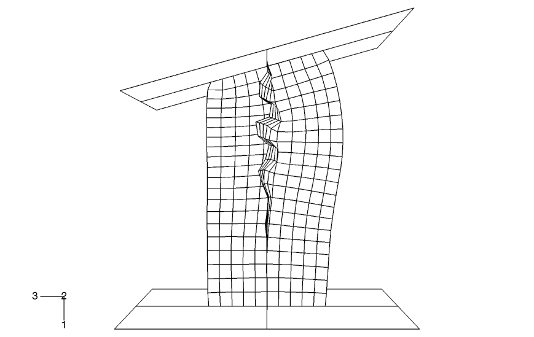
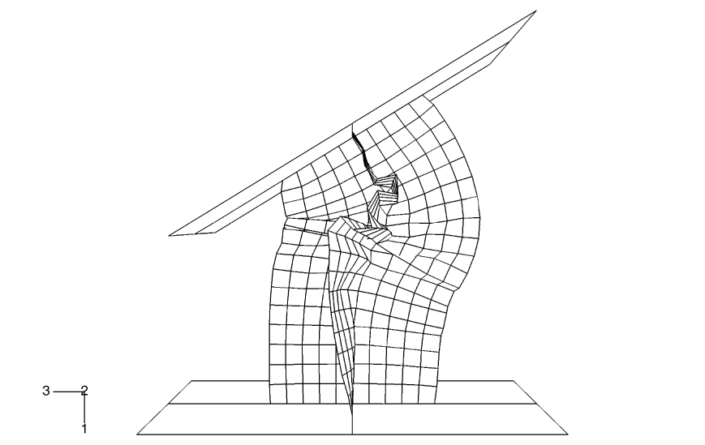
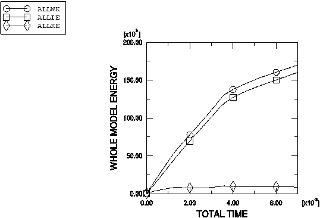
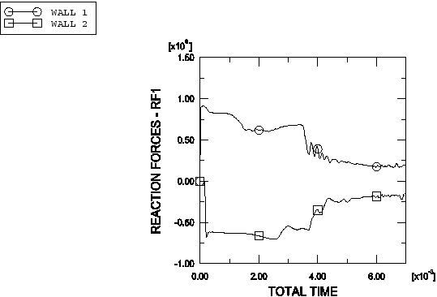
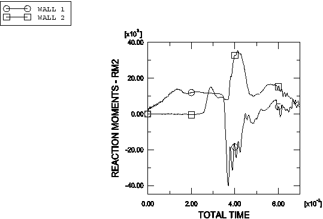
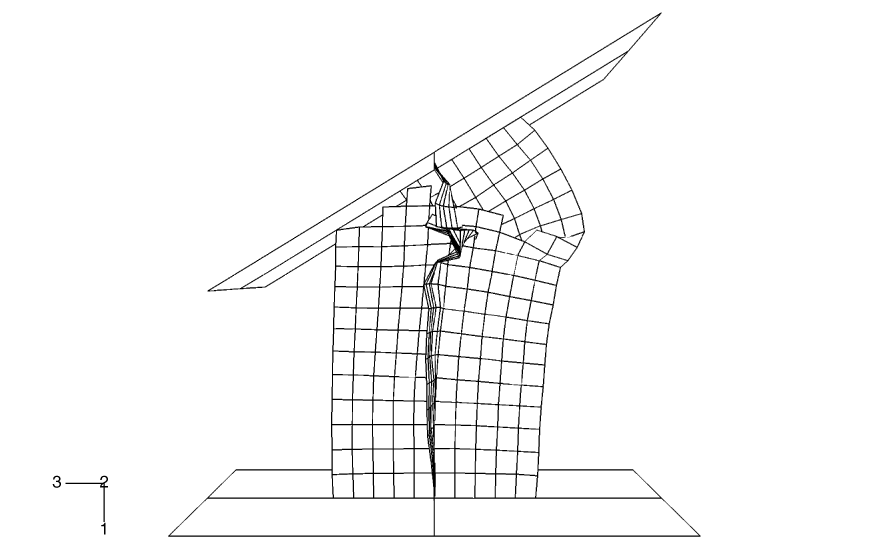
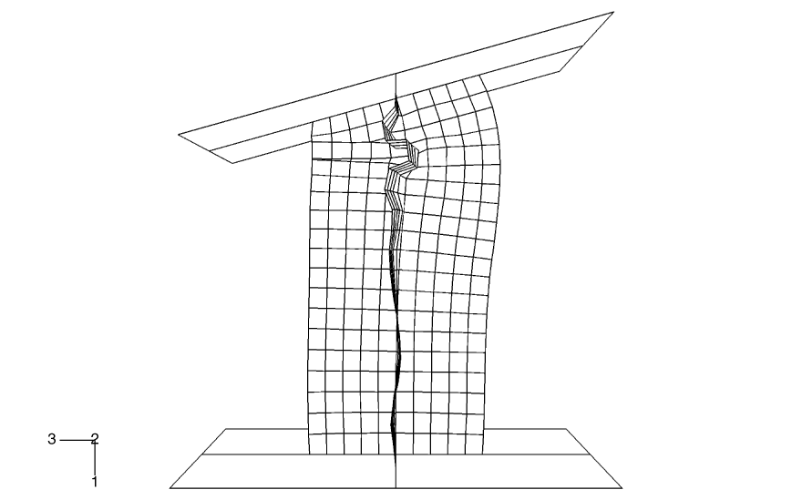
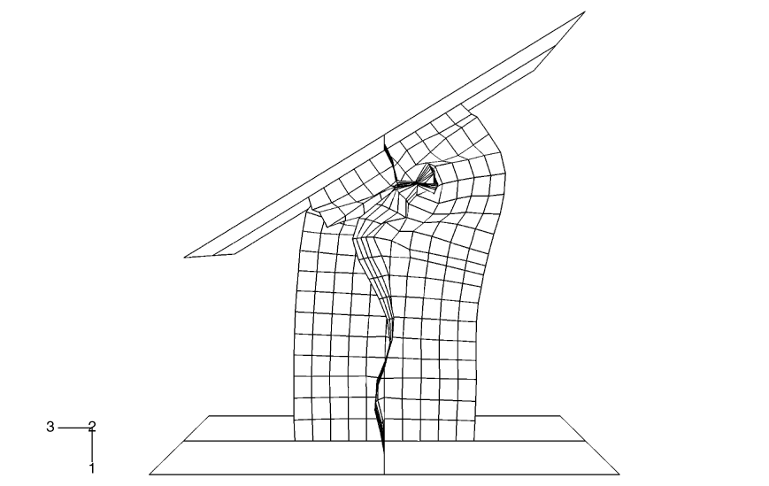
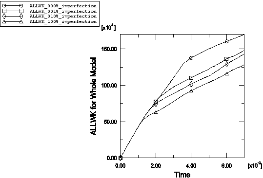

# 1.2.6 Buckling of a column with general contact

**Product: **Abaqus/Explicit  

### Problem description

This example illustrates the buckling of a column between two rigid platens. The column has an X-shaped section. The ends of the column are attached to two rigid platens. One of the platens is fixed in space, while the other is pushed and rotated 31 during 7 msec to buckle the column. The column has a height of 1.0 m, and each of the four flanges of the column is 0.2 m wide and 0.003 m thick.

Two node-based surfaces consisting of nodes at each end of the column are defined. Each node-based surface is attached to the appropriate rigid platen using a tie constraint.

In the primary analysis the general contact capability is used. The general contact inclusions option to automatically define an all-inclusive surface is used and is the simplest way to define contact in the model (see ["Defining general contact interactions in Abaqus/Explicit," Section 36.4.1 of the Abaqus Analysis User's Guide](../usb/usb-link.md#usb-cni-acontactgeneral)).

Additional models using penalty contact pairs and both penalty contact pairs (for all contact pairs involving rigid surfaces) and kinematic contact pairs (for all other contact pairs) are provided. The contact pair algorithm cannot use surfaces that have more than two facets sharing a common edge, so for these analyses self-contact of the column is modeled by defining double-sided contact surfaces on each of the four legs of the cross-section; each leg can contact itself and the adjacent legs. The contact definition is more straightforward with the general contact algorithm.

The column is made of steel, with a Young's modulus of 200 GPa and a Poisson's ratio of 0.3. The density is 7850 kg/m3. A von Mises elastic, perfectly plastic material model is used with a yield stress of 250 MPa. Material failure is not considered in the primary analysis or the analyses that use contact pairs. An additional general contact analysis in which material failure is considered is provided to demonstrate the shell erosion capability in the general contact algorithm. The shear failure model is used in this test to specify that elements should be removed once their equivalent plastic strain reaches 40%.

The effects of initial geometric perturbations are also studied in this example. In a numerical buckling analysis of a configuration with a high degree of symmetry, buckling often does not initiate immediately when the bifurcation (branching) point in the equilibrium path is reached; small imperfections help to trigger buckling. When buckling does initiate in an explicit dynamics analysis with a high degree of symmetry (even under quasi-static conditions), the buckling mode often has a wavelength that spans only a few elements (a much shorter wavelength than would occur in reality). Geometric imperfections can be introduced into a model in Abaqus to achieve a more realistic solution. This seeding of imperfections is usually not necessary for cases without a high degree of symmetry. Designers may purposely introduce imperfection shapes that promote certain buckling modes to maximize energy absorption; for example, for car crash analysis.

In this example we first compute the buckling modes of the column by running a linear buckling analysis in Abaqus/Standard and store these modes in the results (`.fil`) file. We then use geometric imperfections in Abaqus/Explicit to read the buckling modes corresponding to the lowest eigenvalues, scale them, and use them to perturb the nodal coordinates of the column. The linear buckling analysis in Abaqus/Standard is performed in the presence of only an axial load to mimic the loading during the early part of the dynamic analysis when the buckling should initiate. When choosing the perturbation magnitudes, the goal is to seed the mesh with a deformation pattern that will allow the postbuckling deformation to proceed correctly. Under quasi-static conditions one would expect the postbuckling deformation to resemble the eigenmode corresponding to the lowest eigenvalue, unless the lowest eigenvalues are closely spaced, in which case the postbuckling deformation is likely to be some combination of the lowest eigenmodes. Higher eigenmodes will tend to play an increased role in the postbuckling shape as the loading rate increases. An eigenmode number and a scaling factor to be applied to the corresponding eigenmode are given. Abaqus/Standard normalizes the eigenmodes such that the maximum deformation in the length units of the analysis (meters in this case) is 1.0. The first three eigenmodes are used in the seeding for this example, with the scaling factor monotonically decreasing as the mode number increases. Three separate input files, which are the same as the primary input file except for the use of geometric imperfections, are provided, with the lowest eigenmode scaled to 1%, 10%, and 100% of the shell thickness, respectively.

### Results and discussion

All models that do not include material failure or initial imperfections give similar results, indicating that these results are not sensitive to the choice of contact algorithm. [Figure 1.2.6--1](ch01s02ach19.md#exxsscxsec-initconfig) shows the original configuration of the column. [Figure 1.2.6--2](ch01s02ach19.md#exxsscxsec-deform-35) shows the deformed shape of the column after 3.5 msec. [Figure 1.2.6--3](ch01s02ach19.md#exxsscxsec-deform-70) shows the deformed shape of the column after 7.0 msec. [Figure 1.2.6--4](ch01s02ach19.md#exxsscxsec-energyhists) shows the time history of the total kinetic energy, the total work done on the model, and the total internal energy. [Figure 1.2.6--5](ch01s02ach19.md#exxsscxsec-rxnforces) shows the magnitude of the vertical (*x*-direction) reaction forces at the reference nodes of the top (`WALL1`) and bottom (`WALL2`) rigid platens. [Figure 1.2.6--6](ch01s02ach19.md#exxsscxsec-rxnmoments) shows the magnitude of the reaction moments about the *y*-axis at the reference nodes of the two rigid platens.

[Figure 1.2.6--7](ch01s02ach19.md#exxsscxsec-removed) shows the final deformed shape of the column for the analysis with material failure and surface erosion (only the elements that have not failed are shown). In this analysis the bottom half of the column has less deformation in comparison to the analyses that do not consider material failure. Facets of failed elements do not participate in contact in this analysis; slave nodes can be observed to pass through failed elements without generating contact forces.

[Figure 1.2.6--8](ch01s02ach19.md#exxsscxsec-imperf010halftime) and [Figure 1.2.6--9](ch01s02ach19.md#exxsscxsec-imperf010) show the deformed shapes of the column with a 10% seeded imperfection at 3.5 msec and 7.0 msec, respectively. Small initial imperfections significantly affect the results. The flange in the positive *z*-direction shows some buckling at 3.5 msec only when an initial imperfection is present. The postbuckling mode has a fairly short wavelength even with the seeded imperfections, due to dynamic effects. If the loading rate were decreased, the wavelength of the postbuckling mode would tend to increase. The incorporation of imperfections in the column also leads to a reduction in the work performed during its deformation. [Figure 1.2.6--10](ch01s02ach19.md#exxsscxsec-imperfwork) shows plots of external work as a function of time for the column without any imperfection and for the column with imperfections of 1%, 10%, and 100%, respectively. The external effort needed to deform the column reduces as the amount of imperfection in the column increases, and even a small imperfection on the order of 1% introduced as a seed significantly reduces the energy spent in the buckling and crushing of the column.

The problems presented here test the features mentioned but do not provide independent verification of them.

### Input files

[sscxsec.inp](../eif/sscxsec.inp)

Primary analysis using the general contact capability.

[sscxsec_cpair.inp](../eif/sscxsec_cpair.inp)

Model using a combination of penalty and kinematic contact pairs.

[sscxsec_pnlty.inp](../eif/sscxsec_pnlty.inp)

Model using penalty contact pairs.

[sscxsec_erosion.inp](../eif/sscxsec_erosion.inp)

Model considering surface erosion due to material failure. This model uses the general contact capability.

[sscxsec_bkl.inp](../eif/sscxsec_bkl.inp)

Eigenvalue buckling analysis.

[sscxsec_imperf001.inp](../eif/sscxsec_imperf001.inp)

Model using 1% imperfection.

[sscxsec_imperf010.inp](../eif/sscxsec_imperf010.inp)

Model using 10% imperfection.

[sscxsec_imperf100.inp](../eif/sscxsec_imperf100.inp)

Model using 100% imperfection.

### Figures

**Figure 1.2.6–1** Initial configuration of the column.

**Figure 1.2.6–2** Deformed shape at 3.5 msec.

**Figure 1.2.6–3** Deformed shape at 7.0 msec.

**Figure 1.2.6–4** Time histories of the total kinetic energy, work done on the model, and internal energy.

**Figure 1.2.6–5** Magnitude of the vertical reaction forces on the rigid platens.

**Figure 1.2.6–6** Magnitude of the reaction moments about the *y*-axis on the rigid platens.

**Figure 1.2.6–7** Deformed shape at 7.0 msec for the model with material failure and surface erosion.

**Figure 1.2.6–8** Deformed shape with 10% imperfection at 3.5 msec.

**Figure 1.2.6–9** Deformed shape with 10% imperfection at 7.0 msec.

**Figure 1.2.6–10** Time histories of external work for the column without any imperfection and for the column with imperfections of 1%, 10%, and 100% of shell thickness.

