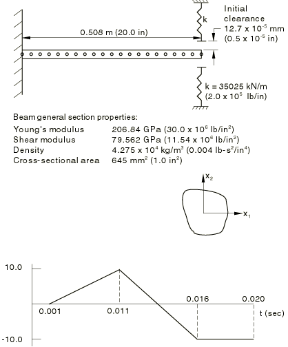
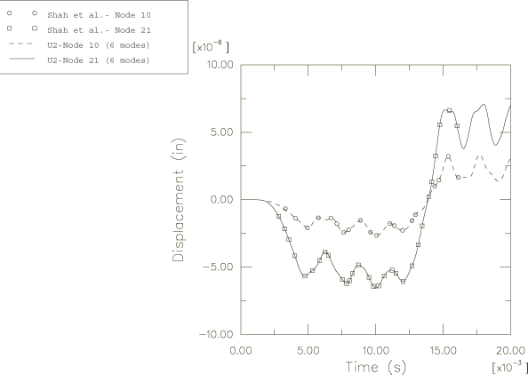

# 1.3.1 Subspace dynamic analysis of a cantilever beam

**Product: **Abaqus/Standard  

This example is intended to provide basic verification of the “subspace projection” procedure provided for solving mildly nonlinear dynamic problems. The method uses the eigenmodes of the system in its state at the start of the dynamic analysis as a set of global interpolation functions for the nonlinear problem. The discretized equations of motion are projected onto these eigenvectors and solved for the generalized modal accelerations, which are integrated by the central difference operator. The advantage of the subspace projection method in solving nonlinear dynamic problems is the relatively low cost of performing the analysis. However, the method is effective only if enough eigenmodes of the initial system can be extracted to provide a good basis for modeling the system's response throughout the dynamic event. This consideration usually limits the use of this method to mildly nonlinear cases, or to relatively small systems from which enough modes can be easily extracted to provide an accurate solution.

The example deals with the dynamic response of a cantilever beam subjected to a time varying base acceleration. The beam is rigidly supported at one end and has nonlinear elastic supports at the other end, as shown in [Figure 1.3.1--1](ch01s03ach20.md#sxmsubspace-geom). The only nonlinearity in the problem is the contact between the beam and the elastic supports: geometric nonlinearity is neglected, and the response of the system is purely elastic. The problem has been analyzed by Shah et al. (1979) using a similar modal superposition method, with many modes, so that an accurate prediction of the response is available. The problem is also analyzed here using the standard direct, implicit integration method provided in Abaqus.

### Problem description

The dimensions and material properties for the beam are given in [Figure 1.3.1--1](ch01s03ach20.md#sxmsubspace-geom). The beam is modeled with 20 equal-sized linear beam elements (B21). One ITSUNI element models the nonlinear elastic supports at the end of the beam. The material definition of this element is given with the spring definition and describes an initial clearance on both sides of the beam in the vertical direction of 12.7  105 mm (0.5  105 in) and a spring rate of 35025 kN/m (2.0  105 lb/in).

Since the relative motion of the beam with respect to the base is required, the base acceleration is introduced as a vertical distributed load applied to the entire length of the beam. The load changes with time, reaching its minimum of 7.005 N/m (0.04 lb/in) at 0.011 sec and maximum of 7.005 N/m (0.04 lb/in) at 0.016 sec. This corresponds to an acceleration of 0.254 m/sec2 (10.0 in/sec 2) at 0.011 sec and 0.254 m/sec2 (10.0 in/sec2) at 0.016 sec. The load is varied using the amplitude curve shown in [Figure 1.3.1--1](ch01s03ach20.md#sxmsubspace-geom).

### Analysis

The problem is analyzed using both the subspace projection method and the standard implicit integration method provided in Abaqus, using a fixed time increment. The subspace projection uses six eigenmodes. The choice of the number of eigenmodes used as the basis of the subspace solution determines the accuracy of the dynamic solution and is a matter of judgment on the part of the user, similar to choosing the number of finite elements in the mesh. If very few eigenmodes are specified, the solution will miss the high frequency response or will fail to represent nonlinearities accurately. The only reliable method of determining how many modes are needed is to repeat the analysis with more modes and observe the change in response. In this example only a small difference is noted between the solution obtained with two eigenmodes and that obtained using six eigenmodes.

The first step extracts the eigenmodes of the unloaded structure. The second step begins the dynamic analysis. The amplitude curve specifies that no load is applied until 0.001 sec. The analysis up to that time could be performed in one increment since the structure is at rest over this time period. However, in this example two steps are used to reach 0.001 sec, the first of these two steps being over a very short time period, 106 sec. The purpose of this step is simply to obtain a solution point for plotting purposes at a time close to 0 sec. The second of these preliminary dynamic steps brings the analysis to 0.001 sec.

### Results and discussion

Both analyses are run for 0.019 seconds of response with a time increment of 3.125  105 seconds. The calculated vertical displacements at node 10 (near the midspan of the beam) and at node 21 (at the supported end) are stored on the results file and are plotted as functions of time using the Abaqus postprocessing capability. This plot is shown in [Figure 1.3.1--2](ch01s03ach20.md#sxmsubspace-disphist) and shows the results agreeing very closely with those obtained by Shah et al. (1979).

### Input files

[subdyncanti_itsuni.inp](../eif/subdyncanti_itsuni.inp)

Subspace procedure.

[subdyncanti_itsuni_direct.inp](../eif/subdyncanti_itsuni_direct.inp)

Direct, implicit procedure.

[subdyncanti_itsuni_fvdepspring.inp](../eif/subdyncanti_itsuni_fvdepspring.inp)

Identical to subdyncanti_itsuni.inp, except that field-variable-dependent nonlinear spring properties are used in the ITSUNI element.

[subdyncanti_itscyl.inp](../eif/subdyncanti_itscyl.inp)

Identical to subdyncanti_itsuni.inp, except that the ITSCYL element is used.

[subdyncanti_itscyl_direct.inp](../eif/subdyncanti_itscyl_direct.inp)

Identical to subdyncanti_itsuni_direct.inp, except that the ITSCYL element is used.

[subdyncanti_itscyl_fvdepspring.inp](../eif/subdyncanti_itscyl_fvdepspring.inp)

Identical to subdyncanti_itsuni_fvdepspring.inp, except that the ITSCYL element is used.

### Reference

Shah,  V. N., G. J. Bohm, and A. N. Nahavandi, “Modal Superposition Method for Computationally Economical Nonlinear Structural Analysis,” ASME Journal of Pressure Vessel Technology, vol. 101, pp. 134–141, 1979.

### Figures

**Figure 1.3.1–1** Beam geometry and amplitude curve of applied load.

**Figure 1.3.1–2** Cantilever displacement history.

