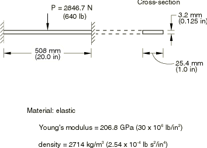
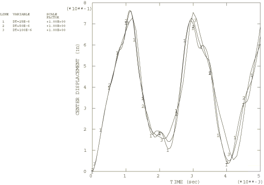
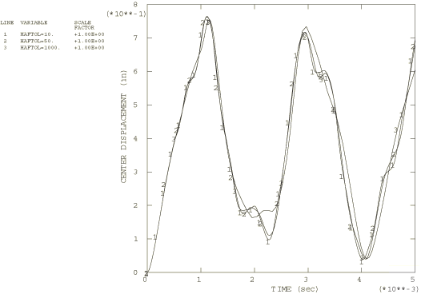
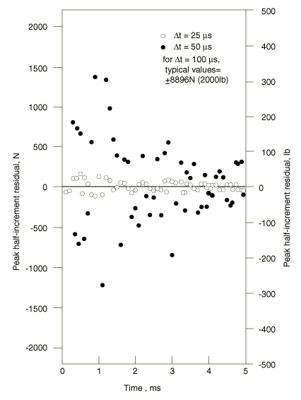

# 1.3.2 Double cantilever elastic beam under point load

**Product: **Abaqus/Standard  

This example concerns the response of an elastic beam, built-in at both ends, subject to a suddenly applied load at its midspan (see [Figure 1.3.2--1](ch01s03ach21.md#sxmdoublebeam-geom)). The central part of the beam undergoes displacements several times its thickness, so the solution quickly becomes dominated by membrane effects that significantly stiffen its response. The purpose of the example is to illustrate the effect of time step choice on solution accuracy, to compare direct and automatic time stepping, and to verify that the standard Newton and quasi-Newton solution techniques provide the same results in a relatively nonlinear case.

A number of factors are involved in controlling solution accuracy in a nonlinear dynamic problem. First, the geometry must be modeled with finite elements, which involves a discretization error. In this example the beam is modeled with five elements of type B23 (cubic interpolation beam for planar motion). Since a 10 element model gives almost the same response, we assume that this model is reasonably accurate. Second, the time step must be chosen. This source of error is studied in this example by comparing results based on different time steps and different tolerances on the automatic time stepping scheme. Third, convergence of the nonlinear solution within each time step must be controlled. This aspect of solution control is common to all nonlinear problems.

The quasi-Newton solution technique can be less expensive in terms of computer time than the standard Newton technique because it avoids the complete recalculation of the Jacobian. Each newly computed Jacobian is based on the current Jacobian. This savings becomes significant in large models, in cases when the Jacobian is expected to vary smoothly over time. This example is too small for the quasi-Newton method to show significant savings in computer time, but it demonstrates that, with correctly chosen tolerances, the quasi-Newton method solves the nonlinear system with no loss in accuracy.

### Problem description

The double cantilever beam has a span of 508 mm (20 in), with a rectangular cross-section 25.4 mm (1 in) wide by 3.175 mm (0.125 in) deep. The material is linear elastic, with a Young's modulus of 206.8 GPa (30  106 lb/in2) and a density of 2710.42 kg/m3 (2.5362  104 lb-s2/in4). Five elements of type B23 (cubic interpolation, beam in a plane) are used to model half the beam. The boundary conditions are that all displacements and rotations are fixed at the built-in end, with symmetry conditions (0) at the midspan. A beam section is used with a 3-point Simpson rule for the cross-section integration. This integrates the section exactly since it is rectangular and remains linear elastic. Since the material response in this case is entirely linear, a general beam section would be preferred in a practical example, since it reduces the cost of the computation by avoiding numerical integration across the section.

### Results and discussion

Nine different cases are run: fixed time steps of 25 s, 50 s, and 100 s and automatic time stepping with half-increment residual tolerances of 44.48 N (10 lb), 222.4 N (50 lb), and 4448 N (1000 lb) using both the standard Newton and quasi-Newton solution techniques (the methods give almost identical results, as must occur since the default equilibrium tolerances are fairly stringent). Results for the displacement at the midspan are shown in [Figure 1.3.2--2](ch01s03ach21.md#sxmdoublebeam-fixedtimestep) for the fixed time step cases and in [Figure 1.3.2--3](ch01s03ach21.md#sxmdoublebeam-autotimestep) for the automatic time step cases. All of the results are based on the default integration operator in Abaqus: Hilber-Hughes, with  0.05 (slight numerical damping). The loss of high frequency response with coarser time stepping and the generally high quality of the automatic time stepping solutions can be recognized, even for the case with the most coarse tolerance on the half-increment residual (with a value of about three times the load). [Figure 1.3.2--4](ch01s03ach21.md#sxmdoublebeam-residuals) shows peak entries in the half-increment residual vector at each time step for the fixed time step cases. This figure illustrates the value of the half-increment residual concept as an error indicator: the larger time increments increase the half-increment residual values dramatically. For the 50 s time increment these residuals are initially large but decay with time because the slight numerical damping introduced in the integration operator removes the high frequency content in the solution with time.

In many nonlinear analyses it is informative to print the energy balance. In this case it allows us to assess how much energy has been lost through numerical damping. [Table 1.3.2--1](ch01s03ach21.md#table-doublebeam-enrgybal-fixed) and [Table 1.3.2--2](ch01s03ach21.md#table-doublebeam-enrgybal-auto) show the energy values at the end of each of these runs and indicates that the most accurate solutions have energy errors of 0.7%, while the least accurate shows an energy balance error of 9.7%. The energy loss values for the automatic time increment runs suggest that these analyses are consistently more accurate than the analyses run with fixed time increments.

### Input files

[doublecant_haftol10_newton.inp](../eif/doublecant_haftol10_newton.inp)

Automatic time stepping (HAFTOL=10) and the standard Newton solution technique. 

[doublecant_dt25_newton.inp](../eif/doublecant_dt25_newton.inp)

Fixed time stepping (DT=25  106) and the standard Newton solution technique.

[doublecant_haftol10_qnewton.inp](../eif/doublecant_haftol10_qnewton.inp)

Automatic time stepping (HAFTOL=10) and the quasi-Newton solution technique.

Note that the restart option is invoked in the above input files. This is almost essential in any significant nonlinear problem. The output edit features are used extensively to control the printed output and to produce a results file. This allows the postprocessor to be used to generate time history plots, such as those shown in [Figure 1.3.2--2](ch01s03ach21.md#sxmdoublebeam-fixedtimestep) and [Figure 1.3.2--3](ch01s03ach21.md#sxmdoublebeam-autotimestep).

[doublecant_haftol50_newton.inp](../eif/doublecant_haftol50_newton.inp)

Automatic time stepping (HAFTOL=50).

[doublecant_haftol1000_newton.inp](../eif/doublecant_haftol1000_newton.inp)

Automatic time stepping (HAFTOL=1000).

[doublecant_dt50_newton.inp](../eif/doublecant_dt50_newton.inp)

Fixed time stepping (DT=50  106).

[doublecant_dt100_newton.inp](../eif/doublecant_dt100_newton.inp)

Fixed time stepping (DT=100  106).

[doublecant_haftol50_qnewton.inp](../eif/doublecant_haftol50_qnewton.inp)

Automatic time stepping (HAFTOL=50) with the quasi-Newton technique.

[doublecant_haftol1000_qnewton.inp](../eif/doublecant_haftol1000_qnewton.inp)

Automatic time stepping (HAFTOL=1000) with the quasi-Newton technique.

### Tables

**Table 1.3.2–1** Energy balance at end of run—analyses with fixed time increments.
| Time increment | Kinetic energy | Strain energy | External work | Numerical energy loss |
| --- | --- | --- | --- | --- |
| N-m | lb-in | N-m | lb-in | N-m | lb-in |
| 25 s | 5.56 | 49.2 | 19.10 | 169 | 24.86 | 220 | 0.8% |
| 50 s | 5.59 | 49.5 | 16.95 | 150 | 23.16 | 205 | 2.7% |
| 100 s | 6.23 | 55.2 | 13.56 | 120 | 21.92 | 194 | 9.7% |

**Table 1.3.2–2** Energy balance at end of run—analyses with automatic time increments.
| Half-increment tolerance | Kinetic energy | Strain energy | External work | Numerical energy loss |
| --- | --- | --- | --- | --- |
| N-m | lb-in | N-m | lb-in | N-m | lb-in |
| 44.5 N (10 lb) | 4.80 | 42.5 | 20.23 | 179 | 25.20 | 223 | 0.7% |
| 222 N (50 lb) | 5.61 | 49.6 | 18.65 | 165 | 24.64 | 218 | 1.6% |
| 4448 N (1000 lb) | 4.77 | 42.2 | 15.49 | 137 | 21.93 | 194 | 7.6% |

### Figures

**Figure 1.3.2–1** Double cantilever elastic beam.

**Figure 1.3.2–2** Fixed time step results for an elastic beam under point load.

**Figure 1.3.2–3** Automatic time step results for an elastic beam under point load.

**Figure 1.3.2–4** Peak half-increment residuals for the elastic beam under point load.

