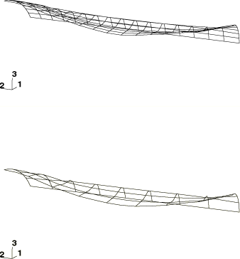
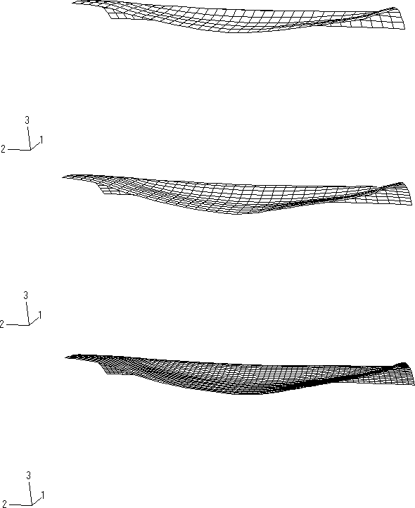

# 1.3.3 Explosively loaded cylindrical panel

**Products: **Abaqus/Standard  Abaqus/Explicit  

A cylindrical shell panel, firmly clamped on all four sides, is exposed to the detonation of a high explosive layer. The problem illustrates the use of initial velocity conditions to model sudden, impulsive loadings arising from the detonation. In the course of the analysis a strong plastic hinge forms along the edge of the detonation area. Both experimental and numerical results for this problem have been reported by Leech (1966) and Morino et al. (1971).

### Problem description

The panel is 319 mm (12.56 in) long and spans a 120 sector of a cylinder, with a midsurface radius of 74.6 mm (2.938 in) and a thickness of 3.18 mm (0.125 in). Only 60 of the panel is modeled because of the symmetry of the problem. Clamped boundary conditions are prescribed on three edges of the model, while the appropriate symmetry conditions are imposed along the remaining edge.

The shell is made from 6061-T6 aluminum alloy with a Young's modulus of 72.4 GPa (10.5  106 psi), a Poisson's ratio of 0.33, and a density of 2672 kg/m3 (2.5  104 lb sec2 in4). A von Mises elastic, perfectly plastic material model is used with a yield stress of 303 MPa (4.4  104 psi).

In the experiment the high explosive layer covers a 60 sector of the panel, extending 259 mm (10.21 in) from one end. Hence, there is no symmetry plane along the *y*-axis. All nodes in contact with the high explosive layer have been grouped in a node set named `BLAST`. The effect of the detonation is simulated by prescribing an initial inward radial velocity of 144 m/sec (5650 in/sec) to the nodes in this set.

All the relevant shell element types available in Abaqus/Standard are used in the simulation for comparative purposes and as a gauge of the relative merits of each element type for this class of problem. An 8  16 mesh is used for first-order elements, and a 4  8 mesh is used for second-order elements.

The Abaqus/Explicit analysis is performed using the finite-strain element, S4R, for three different mesh refinements (8  32, 16  32, and 32  64) and the small-strain elements, S4RS and S4RSW, for a 32  64 mesh. Geometrically equivalent analyses employing a shell offset with a value of 0.5 are performed using each of the quadrilateral shell elements in Abaqus/Explicit for a 32  64 mesh refinement. In addition, an analysis is performed with a 16  32 mesh of S4R elements using ENHANCED hourglass control.

### Controls and tolerances

For the Abaqus/Standard analysis we choose to set the time integration accuracy control parameter (HAFTOL) to a very large (essentially infinite) value. This implies that we are choosing automatic control for the time stepping, but we are not controlling the accuracy of the time integration. The time increments will be limited only by the ability of the Newton scheme to solve the nonlinear equilibrium equations. This is a common technique for obtaining low-cost solutions for highly dissipative, strongly nonlinear cases. It is effective because the nonlinearities limit the time increments, and the high level of dissipation quickly removes the high frequency content from the solution. In practice it is desirable to verify the results with a second, more expensive, analysis in which a realistic value of HAFTOL is used. Default controls are used in Abaqus/Explicit.

### Results and discussion

In both the experimental results and the Abaqus simulations, peak deflection occurs after about 400 s. [Figure 1.3.3--1](ch01s03ach22.md#sxmcylpanel-defconfigs) shows deformed configuration plots for the S4R5 model and the S9R5 model after 400 s of response time. [Figure 1.3.3--2](ch01s03ach22.md#bmkcylpanel-exp-defshapes) shows the deformed shapes at 400 s for the three meshes used in the Abaqus/Explicit analysis.

The calculated values for the maximum deflection at a point midway along the centerline of the panel are reported for each of the analysis cases in [Table 1.3.3--1](ch01s03ach22.md#table-cylpanel-maxdeflect). The experimental result for the maximum deflection reported by Morino et al. (1971) is also included for comparison. The mode of deformation in the problem is predominantly bending, and the second-order element models outperform the first-order element models for similar-cost analyses in Abaqus/Standard. These meshes are quite coarse, and improved performance is observed in Abaqus/Explicit upon mesh refinement. The results suggest that the 16  32 mesh of first-order elements provides a reasonably accurate solution for the maximum deflection. In addition, the results obtained using ENHANCED hourglass control closely match those obtained using the default hourglass control formulation.

### Input files

##### **Abaqus/Standard input files**

[exploadcylpanel_s3r.inp](../eif/exploadcylpanel_s3r.inp)

S3R shell model.

[exploadcylpanel_s4.inp](../eif/exploadcylpanel_s4.inp)

S4 shell model.

[exploadcylpanel_s4r.inp](../eif/exploadcylpanel_s4r.inp)

S4R shell model.

[exploadcylpanel_s4r5.inp](../eif/exploadcylpanel_s4r5.inp)

S4R5 shell model.

[exploadcylpanel_s8r.inp](../eif/exploadcylpanel_s8r.inp)

S8R shell model.

[exploadcylpanel_s8r5.inp](../eif/exploadcylpanel_s8r5.inp)

S8R5 shell model.

[exploadcylpanel_s9r5.inp](../eif/exploadcylpanel_s9r5.inp)

S9R5 shell model.

[exploadcylpanel_stri65.inp](../eif/exploadcylpanel_stri65.inp)

STRI65 shell model.

##### **Abaqus/Explicit input files**

[cylpa32x64.inp](../eif/cylpa32x64.inp)

S4R elements, fine mesh case.

[cylpa8x32.inp](../eif/cylpa8x32.inp)

S4R elements, 8  32 mesh.

[cylpa16x32.inp](../eif/cylpa16x32.inp)

S4R elements, 16  32 mesh.

[cylpa16x32_enh.inp](../eif/cylpa16x32_enh.inp)

S4R elements, 16  32 mesh, ENHANCED hourglass control.

[cylpa32x64_s4rs.inp](../eif/cylpa32x64_s4rs.inp)

S4RS elements.

[cylpa32x64_s4rsw.inp](../eif/cylpa32x64_s4rsw.inp)

S4RSW elements.

[cylpa32x64_offset.inp](../eif/cylpa32x64_offset.inp)

S4R analysis, shell offset.

[cylpa32x64_s4rs_offset.inp](../eif/cylpa32x64_s4rs_offset.inp)

S4RS analysis, shell offset.

[cylpa32x64_s4rsw_offset.inp](../eif/cylpa32x64_s4rsw_offset.inp)

S4RSW analysis, shell offset.

[cylpa128x256.inp](../eif/cylpa128x256.inp)

Additional high mesh refinement case included for the sole purpose of testing the performance of the code.

### References

Leech,  J. W., “Finite-Difference Calculation Method for Large Elastic-Plastic Dynamically-Induced Deformations of General Thin Shells,” Ph.D. Thesis, Dept. of Aeronautics and Astronautics, Massachussetts Institute of Technology, Cambridge, MA, 1966.

Morino,  L., J. W. Leech, and E. A. Witmer, “An Improved Numerical Calculation Technique for Large Elastic-Plastic Transient Deformations of Thin Shells: Part 2—Evaluation and Applications,” Journal of Applied Mechanics, vol. 38, pp. 429–436, 1971.

### Table

**Table 1.3.3–1** Maximum deflection along centerline of the panel at *y*=159.5 mm (6.28 in).
| Code | Element Type | Mesh Size | POISSON | OFFSET | Maximum Deflection |
| --- | --- | --- | --- | --- | --- |
| mm | in |
| Abaqus/Standard | S4 | 8 16 | 0 | 0 | 28.7 | 1.13 |
| Abaqus/Standard | S4 | 8 16 | 0.5 | 0 | 27.4 | 1.08 |
| Abaqus/Standard | S4R | 8 16 | 0 | 0 | 29.0 | 1.14 |
| Abaqus/Standard | S4R | 8 16 | 0.5 | 0 | 27.7 | 1.09 |
| Abaqus/Standard | S4R5 | 8 16 | 0.5 | 0 | 30.5 | 1.20 |
| Abaqus/Standard | S3R | 8 16 | 0.5 | 0 | 31.2 | 1.23 |
| Abaqus/Standard | S8R | 4 8 | 0.5 | 0 | 31.2 | 1.23 |
| Abaqus/Standard | S8R5 | 4 8 | 0.5 | 0 | 31.2 | 1.23 |
| Abaqus/Standard | S9R5 | 4 8 | 0.5 | 0 | 31.5 | 1.24 |
| Abaqus/Standard | STRI65 | 4 8 | 0.5 | 0 | 31.5 | 1.24 |
| Abaqus/Explicit | S4R | 8 32 | --- | 0 | 26.2 | 1.03 |
| Abaqus/Explicit | S4R | 16 32 | --- | 0 | 31.1 | 1.23 |
| Abaqus/Explicit | S4R(enhanced hourglass) | 16 32 | --- | 0 | 30.7 | 1.21 |
| Abaqus/Explicit | S4R | 32 64 | --- | 0 | 30.9 | 1.22 |
| Abaqus/Explicit | S4R | 32 64 | --- | 0.5 | 29.8 | 1.18 |
| Abaqus/Explicit | S4RS | 32 64 | --- | 0 | 31.1 | 1.23 |
| Abaqus/Explicit | S4RS | 32 64 | --- | 0.5 | 29.2 | 1.15 |
| Abaqus/Explicit | S4RSW | 32 64 | --- | 0 | 31.2 | 1.23 |
| Abaqus/Explicit | S4RSW | 32 64 | --- | 0.5 | 29.3 | 1.15 |
| Experimental | --- | --- | --- | --- | 31.8 | 1.25 |

### Figures

**Figure 1.3.3–1** S4R5 and S9R5 deformed configurations at 400 s (Abaqus/Standard).

**Figure 1.3.3–2** Deformed configurations for the 8  32, 16  32, and 32  64 meshes after 400 s (Abaqus/Explicit).

